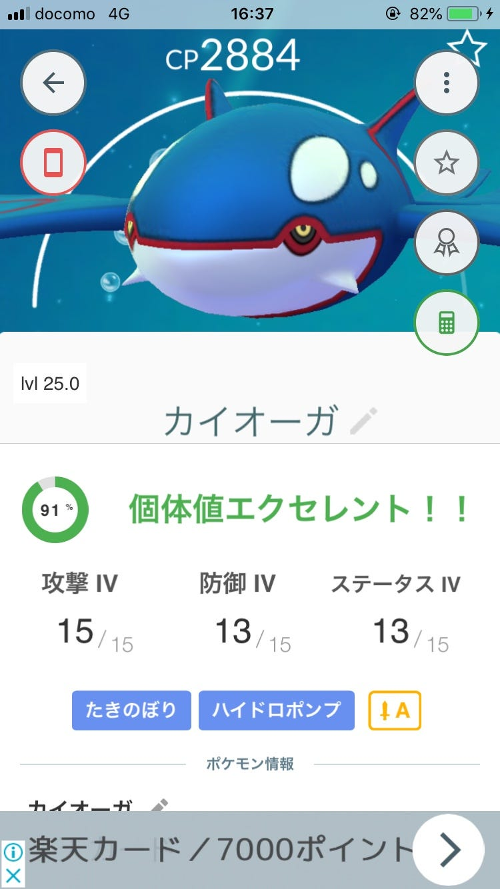

### ポケモンGOで見える地域のつながり

こんにちは！本日カイオーガを南船橋で2体捕まえてしまった渡辺ゆうなです:)

個体値もエクセレント！完璧ですね！！！

私は上野周辺に住んでいるので、レイドバトルも上野周辺のものに参加することが多いのですが、

南船橋では少し違ったレイドバトルの仕方が見れました。

というのも、南船橋では団地が多いのですが、そこでの「ポケモンGOコミュニティ」のようなものがあるらしく

団地のおじさんおばさん方がいつも集まってるかのような感じで集まっていました、

また、「レイドバトルを仕切る人」というのもいて、なにも知らない人たちも声をかけてくれ時間を合わせてレイドバトルに参加することができました。

上野周辺は下町なので人情があつい人が多いというようなイメージがあるかもしれませんが、実際は観光客や最近引っ越してきた若い人が非常にポケモンGOという観点で見るとみんなそれぞれが各自レイドバトルに参加しているという感じです。

そんな上野では見れない、南船橋の「ローカルだからこその地域コミュニティ」をポケモンGOで感じることができました、

知らない人と同じゲームの協力プレイを通して繋がるってなんだか楽しいな、ってことを感じることができました！
