### 人口集中地区(DID)におけるOSMデータ格差

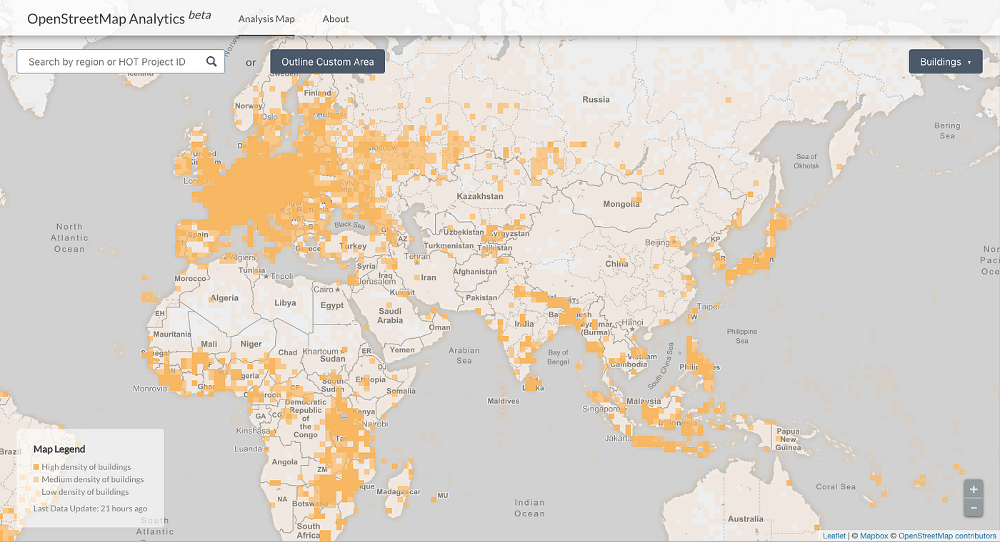

地図は人に使われて初めて価値のあるものとなる。

今回は人がいないエリアは切り捨て、人がいる所には建物があるという前提で、人口集中地区における地図インフラ格差を [OSM Analytics Tool](http://osm-analytics.org/) を用いて分析する。

[OSM Analytics Tools](http://osm-analytics.org/)は [HOT(Humanitarian OpenStreetMap Team)](https://www.hotosm.org/)が開発した OpenStreetMap データの分析ツールである。建物や道路、河川、Amanityタグをそれぞれ密度で可視化できる。

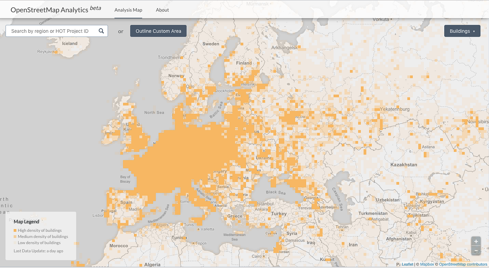

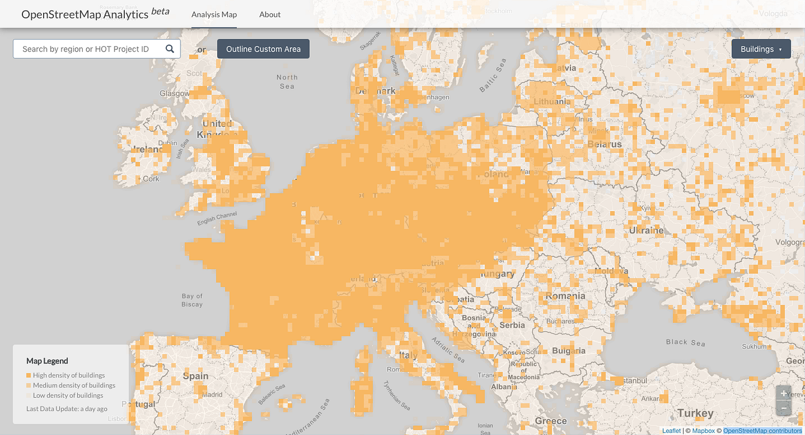

ヨーロッパはOpenStreetMapの発祥の地だけあって、建物のデータ量が他のエリアと比べると目立って多い。
特にフランス、ドイツ、オランダ、ベルギー、チェコ、スロバキアはヨーロッパの中でも非常に建物のデータが詰まっている。

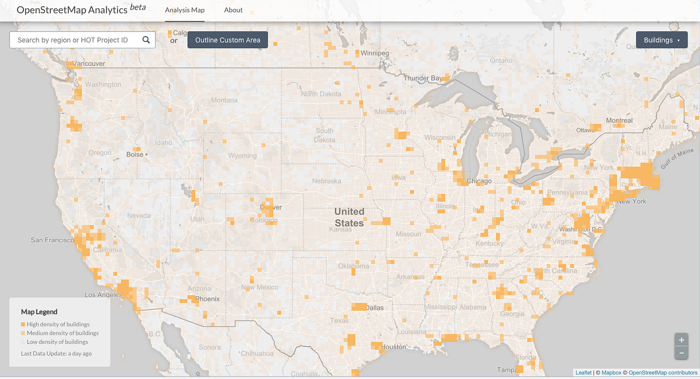

米国はこのように見ると、ヨーロッパと比較すると建物のデータが少ないのがわかる。人口が密集しているカリフォルニア州(西南海岸沿い)やテキサス州、東海岸沿い地域に注目しても、まだまだデータ量としては不十分だろう。

また米国では大きな国道80号などに沿って、建物入力が進んでいることも確認できた。

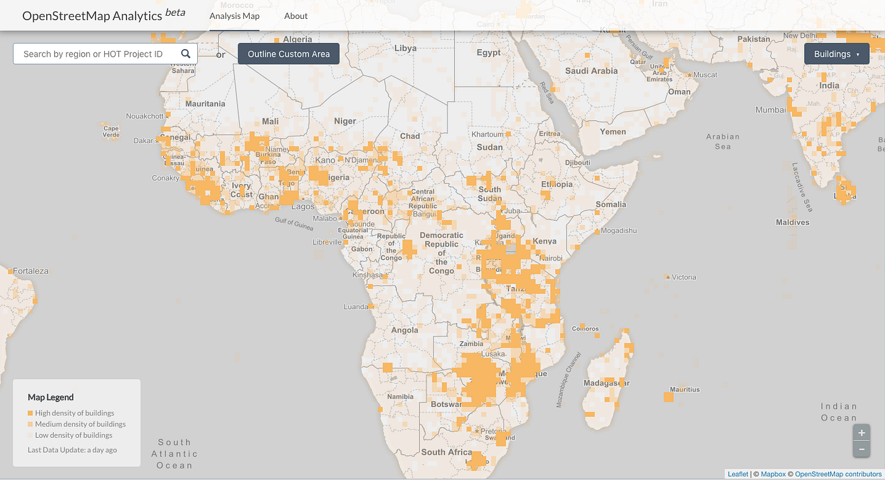

アフリカについては2014年のエボラ出血熱の大流行など、様々な課題に向き合う人たちが世界中からマッピングしている。HOTを含め、人道支援組織が遠隔アームチェアマッピングとしてコミットしている成果が反映されている。

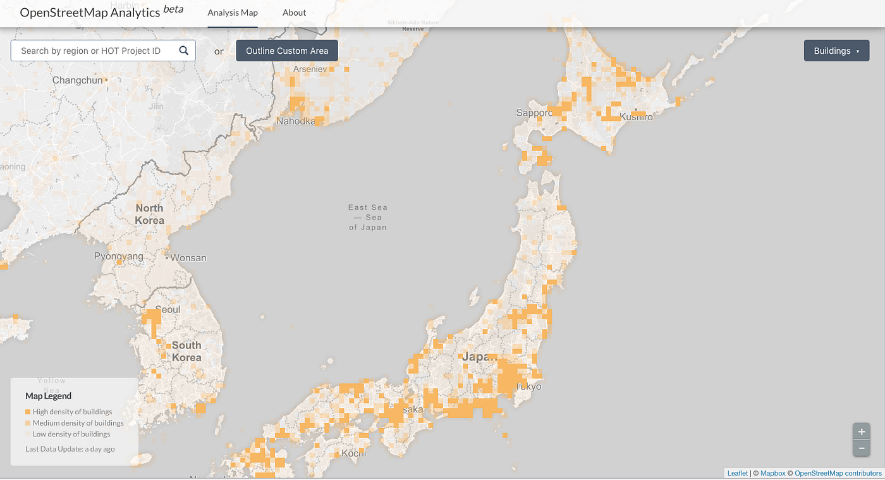

そして今回注目して分析したいのが日本！！！

国土地理院の地理院地図を用いて人口集中地区 平成27年版(総務省統計局)レイヤーを重ねて各地域を比較する。

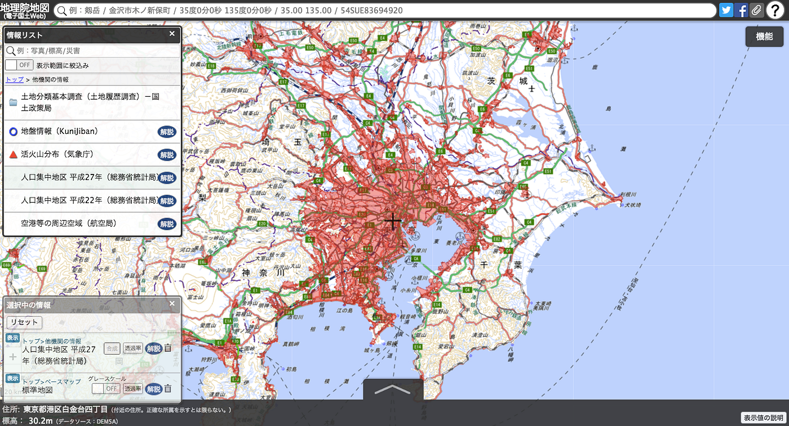

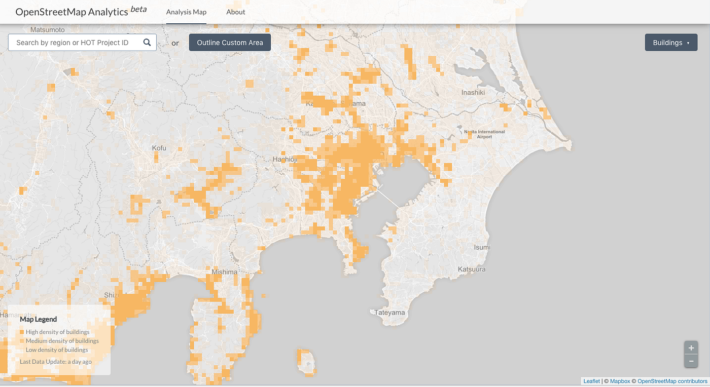

関東首都圏近郊を見ると、横浜市の南エリアや、江戸川区から北に数キロ、そして千葉県の北西海岸沿いに人口に対して建物のデータが少ないことがわかる。

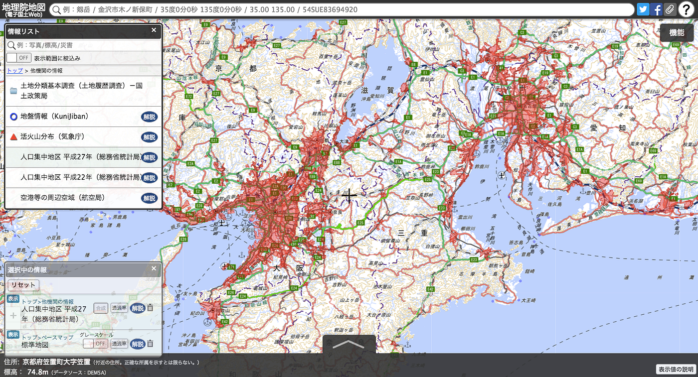

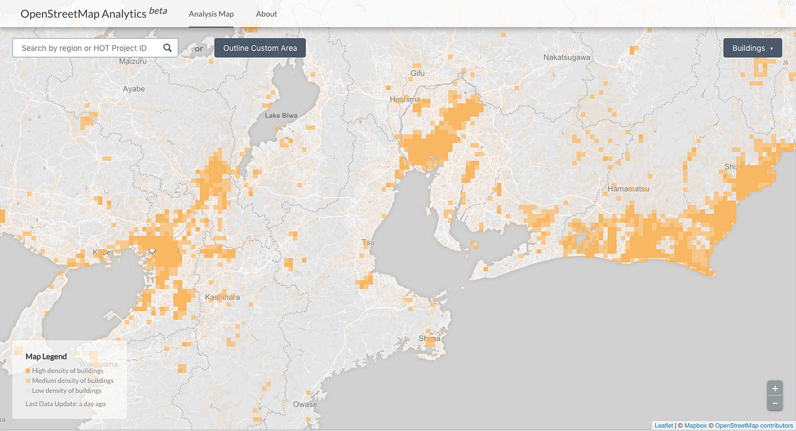

名古屋の南エリアや大阪の南や東側も人口集中地区なのに建物の情報量が少ない。それに比較して意外なことに、静岡県の海外沿いが人口集中地区ではないエリアの建物情報が豊富である。

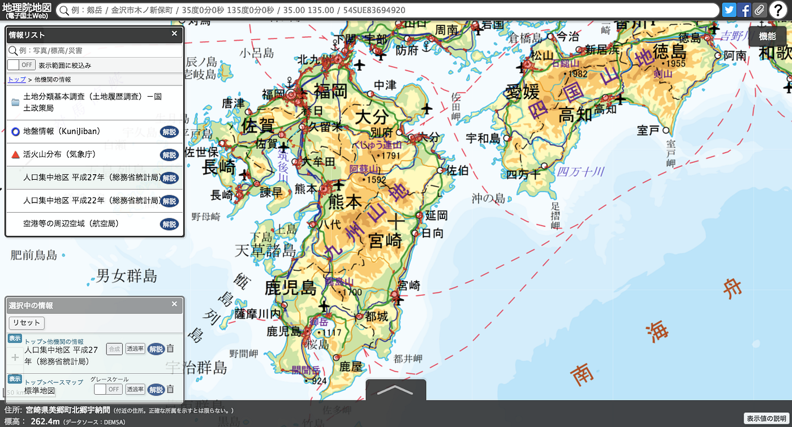

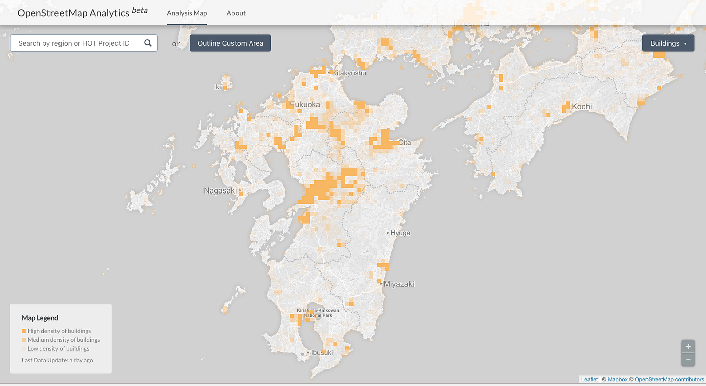

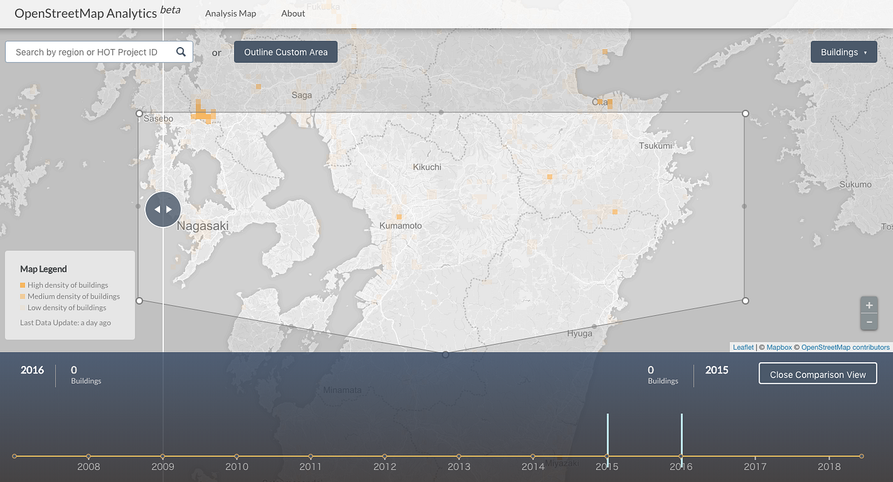

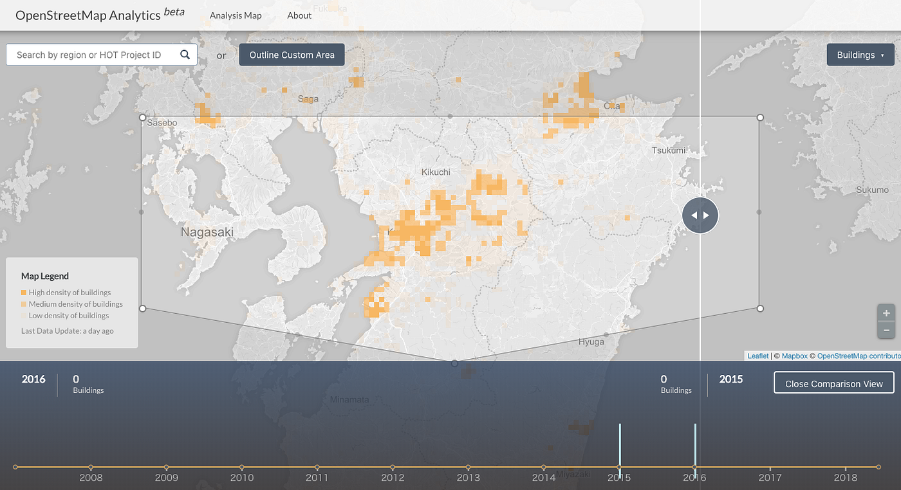

九州、四国エリアは人口集中地区では熊本県の震災の影響が大きかったエリアのマッピングが進んでいるのがわかる。これを[OSM Analytics Tools](http://osm-analytics.org/)の時間軸解析ツールを使って、いつの時期に入力されたのかを確認してみた。 2015年と2016年のデータ量の違いは一目でわかる。これは紛れもなく世界中のマッパーの協力を感じる。

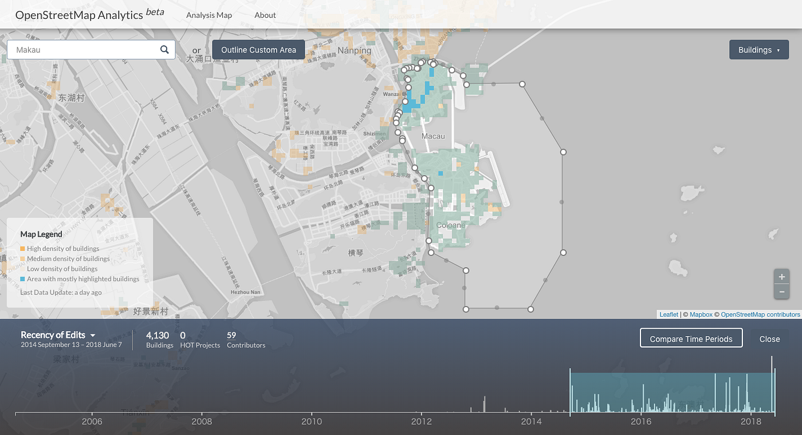

ちなみに、世界の人口密度ランキング一位のマカオはここ3年で建物のデータが非常に増えていた。

今回分析してみてわかったことは、OpenStreetMapにおける建物のデータはヨーロッパが非常に進んでいるということ。また、日本国内の人口集中地区(DID)におけるOpenStreetMapの建物のデータがまだまだ不足している箇所が発見できた。

実際に私もポケモンGOを街中でしていると、建物の情報が足りない所にしばしば出会う。ポケモンGOやIngressの背景地図はOpenStreetMapである。このように感じた経験がある読者も多いのではないだろうか。

今回は人口集中地区におけるOpenStreetMapの建物のデータが不足している箇所を指摘した。次回はOpenStreetMapの編集機能について触れ、私の考える新たなエディタを紹介したい。

(本投稿は [OSMアドベントカレンダー2018](https://qiita.com/advent-calendar/2018/osmjp) に向けて一部修正)
