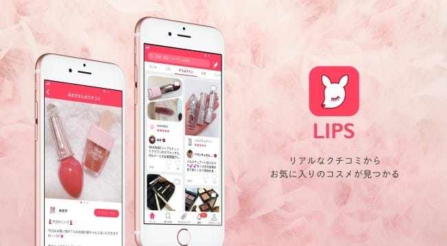

### 今週のおまめ

こんばんわ〜ついに梅雨がやってきましたねえ、わたしは傘を持つと80%くらいの確率で電車に置いてってしまうので、この季節はいつもビチョビチョです☺︎

さて今日は、わたしが卒業作品を作るに当たって重要視している〝口コミ〟について書きたいと思います。

アプリも多く、情報でまみれている現代には、特にネット上で信頼できる情報って少ないと思いませんか？みたくないうざい広告ってたくさんありますよね。そんな中で、ブランドなしに信じてもらえる情報といえば口コミ。そんな口コミを使ってヒットしたアプリを紹介したいと思います！

LIPSという主にコスメを扱うアプリですが、利用者の口コミと共に商品が紹介されているものです。コミュニケーションも可能でSNSに近いものだとか。調達額は5億5000万円にも及び、扱う商品のクライアントもどんどん広がっているようです。

たしかにコスメって、実際に使った人の意見が気になりますよね。そんなニーズに応える素晴らしいアプリです。私も参考にしたいと思います。
