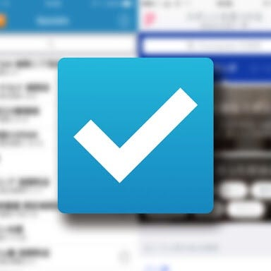

### 先週のおまめ

お久しぶりです〜先週のおまめになってしまいました、申し訳ありません。

先週の私はというと、あんまり記憶がありません、ごめんなさい。やっぱり人間忘れてしまうものです、いかに毎週きちんと投稿することが大切かを今思い知らされています。反省です。

今回はfoursquareのチェックイン機能を利用した特化型アプリとして、QuickinとFastcheckinという２つのものを紹介できればと思います。

foursquareでやればいいじゃん、と思うかもしれませんが、foursquareには多様な機能があり立ち上がるのが遅かったり、チェックインまでに手数がかかるようなのです。簡単にチェックイン機能のみを使いたい方にはこの２つのアプリをおすすめします！

まずはQuickin。

コメントや写真付きで投稿できるメリットがあります。あとはそこに何回チェックインしたかも表示されて、非常にみやすいもののようです。その分少し手間が多い点もあります。

それに比べFastcheckinはお気に入り機能があり、使いやすさが感じられるようです。

人によってはこの２つを使い分けているのだとか。そこまで使いこなせたら、もうfoursquareマスターですね☺︎
