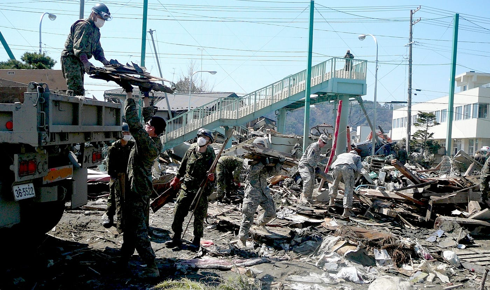

### 意外と大地震が想像できてない？？

今回は、実際に都内で地震災害が起きたらどうなるかを調べてみました。

意外と詳しい被害までは想像できないものですね…

まず都内で考えると一番怖いのは首都直下型地震ですが、これがなんと30年間以内で70%の確率でマグニチュード7レベルが起こるとされているそうです。(http://gendai.ismedia.jp/articles/-/34169?page=2)

東日本大震災がM9とされていて、私は茨城で経験したのですが、 揺れは今までとは全く違う恐怖を感じたし、ライフラインは止まってとても大変でした。

それが建物が密集した地域で起こると

実際にどうなってしまうのだろ…？

- ビル、首都高が倒壊

(直下型地震は建物に大きな影響を与えるため。古い建物に要注意…)

- 火災旋風

(多くの場所から火の手が上がり、早く広がり始めます。木造建築物が多い地域もまだありますし、それ以外の場所でもかなり危険な問題。)

- 津波

- 列車の脱線

- 地下鉄の恐怖…

(地下鉄に人が密集し、出れなくなってしまった場合に酸素が減ってしまう危険も。)

- 帰宅困難者殺到

- 避難所不足

- ライフライン倒壊

これだけではないですが、危険は身近な１つではないです。自分がいる場所では何に気をつけどう動けばいいか。

今回はざっと被害予想を羅列しましたが、次回からは具体的な被害予想等も含め、わかりやすく対策をまとめていきたいと思います。
