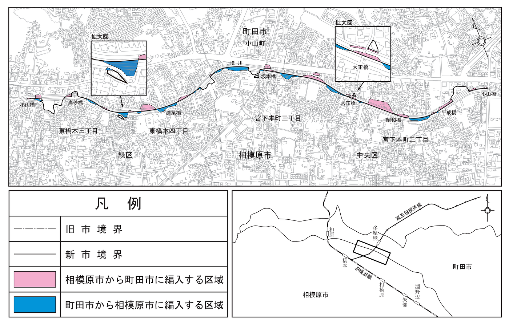
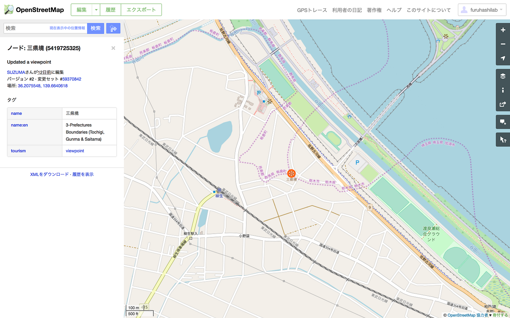

### #書評 西村まさゆき著：ふしぎな県境

[神奈川県町田市](https://www.google.co.jp/search?q=%E7%A5%9E%E5%A5%88%E5%B7%9D%E7%9C%8C%E7%94%BA%E7%94%B0%E5%B8%82)。

東京都の南側に飛び出たこの市は、神奈川県を通らずに東京都心に行くには「通称：多摩山脈」を山越えしなければならないとか、町田市内を走るバスは「神奈川中央交通バス」であるとか、一部のウェブサービスでは本当にそう分類されているとか、時には自虐的に、時には皮肉に、時にはこの愛すべき街と特徴として都県境に位置する町田市を表現している。

地図を愛で、フィールドワークを愉しみ、ブラタモリの録画番組を何度も観返す人々にとって、「県境」はネタの宝庫である。[西村まさゆき著の「**ふしぎな県境**」](https://amzn.to/2sJUN4v)には、**渡良瀬遊水地の[三県境**](https://www.openstreetmap.org/node/5419725325#map=16/36.2078/139.6656)や幅１ｍの細長い稜線「盲腸県境」として名高い**[福島県の飯豊山**（いいでさん](https://www.openstreetmap.org/node/366103279#map=14/37.8406/139.7232)）など、全国１３箇所の県境マニアたちの聖地が生々しいレポートとしてまとまっている。

その一つ一つを紹介してしまうと、「ふしぎな県境」のネタバレになってしまうので、ここでは控えるが、この本の最大の価値は、圧倒的な各地の県境聖地の紹介の後 p.161 から記されてる「**町田市、相模原市の飛び地の解消について担当者に話を聞く**」だと個人的には思っている。

冒頭の神奈川県町田市問題だ。

県境や市境は、河川が担っていることが多く、古橋が勤務している青山学院大学相模原キャンパスは、神奈川県相模原市に位置するものの、少し東側に歩くと段丘崖を下り境川が登場する。東京都と神奈川県、町田市と相模原市の境界を決めている文字通りの境川であり、留学生たちと授業でフィールドワークするときにも、橋を渡って「Welcome to Tokyo!!」と祝ったりしている。

問題は**河川というものはしばしばその流路を変える**ということ。最近はコンクリート化がすすみ、[三面張り](http://www.maff.go.jp/j/nousin/kankyo/kankyo_hozen/k_suiro/pdf/suiro_hyouka_03.pdf)や[多自然型工法](https://ja.wikipedia.org/wiki/%E5%A4%9A%E8%87%AA%E7%84%B6%E5%9E%8B%E5%B7%9D%E3%81%A5%E3%81%8F%E3%82%8A)、[遊水地](https://ja.wikipedia.org/wiki/%E9%81%8A%E6%B0%B4%E6%B1%A0)の組み合わせ方など、その整備の仕方は様々ではあるものの、いわゆる「河床（かしょう）」では今でも大水の後は形が変わり、どこかに県境を引くとなると一意には決めにくい。ましては自然河川の蛇行などの振る舞いに従わざるを得なかった時代に決めた歴史的な境界は、現在の河川との位置のギャップなどで、その名残りである「**[飛び地**](https://ja.wikipedia.org/wiki/%E9%A3%9B%E5%9C%B0)」が今でも点在している。

これを調整して、リアルな神奈川県町田市問題に取り組んでいる相模原市・町田市の両担当者のインタビュー記事がなんとも秀逸である。

実際に、2016年12月1日付けで、相模原市が0.09平方キロ領土(面積)が増えている。現実的に東京都町田市にあったはずなのに引っ越すことなく神奈川県に所属が変わった場所が生まれているのだ（その逆も）。この時の変更で6回目。おおむね3年に1回のペースでこの飛び地解消をすすめている話など、地元で生活している人間にとっては興味津々の話が続く。
[http://www.city.sagamihara.kanagawa.jp/shisei/seido/1004437.html](http://www.city.sagamihara.kanagawa.jp/shisei/seido/1004437.html)

普段地図データを作っている立場としても、県境を含む境界データは非常に扱いが難しい。なにしろ地図要素の殆どはそのモノが存在している地物(Feature)であるが、境界線はほとんどリアルには登場してこない。断片的な看板やマンホール、河川や道路などを通して、確かにここに境界線が通っているということをフィールドで感じ、その歴史を紐解くことで街の成り立ちや土地の変遷、そして空間を理解することにつながる。

まさに空間情報を現地で観察し、発見する目を鍛えるためにも、この本はフィールドワークの導入本として理想的である。

追記：それにしても、[渡良瀬遊水地の三県境がOpenStreetMapの View Point](https://www.openstreetmap.org/node/5419725325#map=16/36.2078/139.6656) として登録されていることに気づいた。マッパーやばい(褒め言葉です)。

