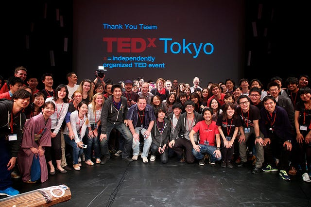

### 東京にもあったんだ！

と言いますか東京が一番歴史が古いのです。
なんの話でしょう。

正解は、TEDxToykoです！
日本での開催は一番歴史が古く、2009年に東京のお台場で開催されました。
当時の会場は日本科学未来館だったそうです。大きい！！

ということで、今回はTEDxAoyamaGakuinUを進めていくと同時に、調べたり参加したことのある各TEDxの紹介をして行こうと思います。
TEDxは全世界に現在2000以上の団体数があるので、中でも国内に絞っていきます。

冒頭で紹介したTEDxTokyoは日本で一番最初に開催されたTEDxカンファレンスだったのと同時に世界で米国以外で開催されたTEDxとしてもTEDxカンファレンスのパイオニア的存在として有名です。

TEDxの公式サイトを開くと、全世界のTEDxイベントの詳細が掲載されています。

[TEDxTokyo | TED
TED.com, home of TED Talks, is a global initiative about ideas worth spreading via TEDx, the TED Prize, TED Books, TED…www.ted.com](https://www.ted.com/tedx/events/32)

ここには各イベントのスピーカーの紹介や、オーガナイザーの紹介も載っています。
上記のリンクは初めて開催された2009年のカンファレンスのサイトです。2009年のTEDxTokyoのオーガナイザーはPatrick Newellさん。
私の勝手な感想は、この方お会いする度にとても陽気な方だなという印象。
しかし今でもTEDx界隈で様々に活動されている方です。
そしてなんと当時は23人もスピーカーの方がいらっしゃったそう！
びっくり！

というのも、多くのTEDxイベントは６人〜１０人ほどのスピーカーを紹介しているからです。私も調べていて驚いてしまいました。

こうして2009年から開催されているTEDxTokyoでは上記のように様々なスピーカーを排出してきました。
その中には、様々な職業の方や、様々な考えを持っている方、そしてここでスピーチをしたことをきっかけに有名になった方などもいらっしゃいます。
まだまだ勉強不足の私ですが、今の所一番のTEDxTokyoの中でのお気に入りの動画はこちら

2014年に登壇された若宮正子さん、この方なんと79歳でアプリを作っちゃった方です。
すごい、、、
様々な記事にも取り上げられているのでぜひ。

[若宮正子さん 人生100年時代、ゆっくりやればいい
「いまはいまのことをやっていればいいんじゃないでしょうか」www.huffingtonpost.jp](https://www.huffingtonpost.jp/kei-kudo/100-2018-0313_a_23383928/)

今回は他のTEDx紹介第一回目ということで大きなTEDxTokyoを紹介させていただきました。
来週はまた別のTEDxを紹介して行こうと思います。

**TEDxAoyamaGakuinU進歩状況！**

現在予定しているのは
１２月１６日にアスタジオで開催予定です。

徐々にSNSで発信していく情報も増やしていますのでぜひチェックをお願いします！

[TEDxAoyamaGakuinU (@tedxagu) | Twitter
The latest Tweets from TEDxAoyamaGakuinU (@tedxagu). 青山学院大学のTEDxAoyamaGakuinU公式アカウントです！［日時］2018年秋［場所］青山学院大学 #春から青学…twitter.com](https://twitter.com/tedxagu)

[TED x AoyamaGakuin U
TED x AoyamaGakuin U. 273 likes. TEDxAoyamaGakuinUの公式Facebookページです 2015年に行われたTEDxAGUから名前を改め、…www.facebook.com](https://www.facebook.com/tedxaogaku17/)
