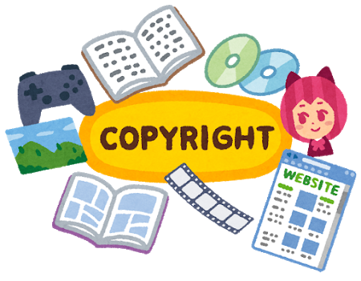

### 漫画村閉鎖、その後。

前回ライセンスに関する内容のブログを更新しましたが、今回は関連ニュースを見かけたのでそのことについて。

漫画村閉鎖から二カ月。
影響は？？ という見出し。

たしかに気になります。

ーー

漫画村とはなんだったのか、簡単に説明しますと、
無料で最新マンガがよめる！！
明らかに怪しいサイトでした。

なぜ無料で公開していたのか？というと、
広告収入が目的だったからです。多くの人からアクセスを集め、サイト上に掲載して広告収入を得ていました。

勿論、無断でマンガをアップデートすることは著作権侵害に値し、りっぱな犯罪です。
しかし現実問題、著作権法は親告罪である為、非常に罪に問われにくいそう。
今の法律の仕組みを利用した悪質なサイトだったんですね〜〜。

私も漫画が大好きでよく読みますが、根っからのオタク気質の為、「作者にお金を落としたい！！」「素敵な作品をありがとうございます課金」などと思う、他人から見るとアホと言われる人間なので、好きな作品は電子で買ってからコミック媒体でも買ってます。
自分では変だと思ってません。笑

無料で読んでファンとか何言ってんの？？？っていつも思ってます。音楽も然り。

ーー

さて、そんな漫画村がいよいよ閉鎖され、二カ月がたちます。

ここからがニュースで見た情報。

結果、電子書籍の売り上げが二倍〜にアップした作品が多かったそうです。
無料じゃないと読んでくれないかも、と心配していた出版社さんや作者さんもいたそうですが、そんなこと無かった。

日本にはステキなマンガがいっぱいあります！！

作者さまが明るい気持ちで創作活動をして頂けるように、利用者は正当なお金を払いましょう。
