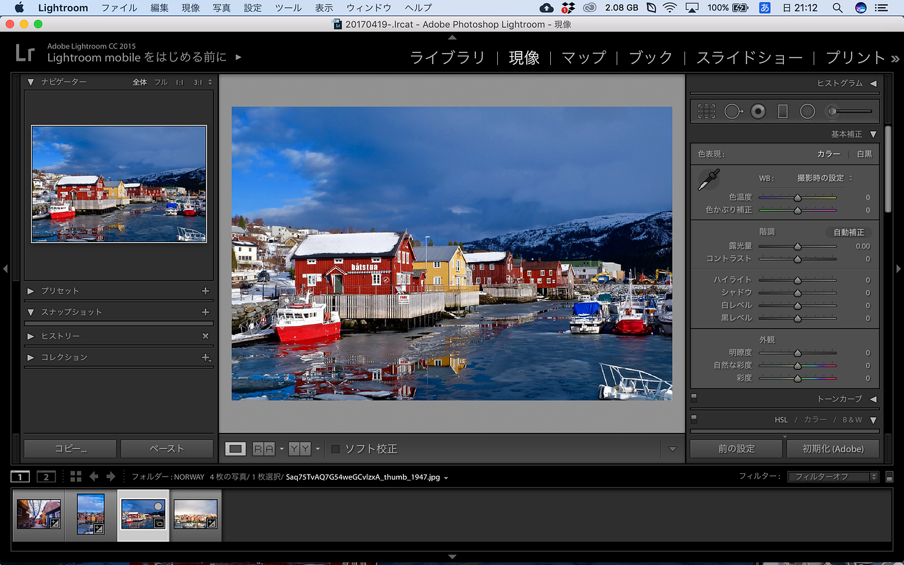
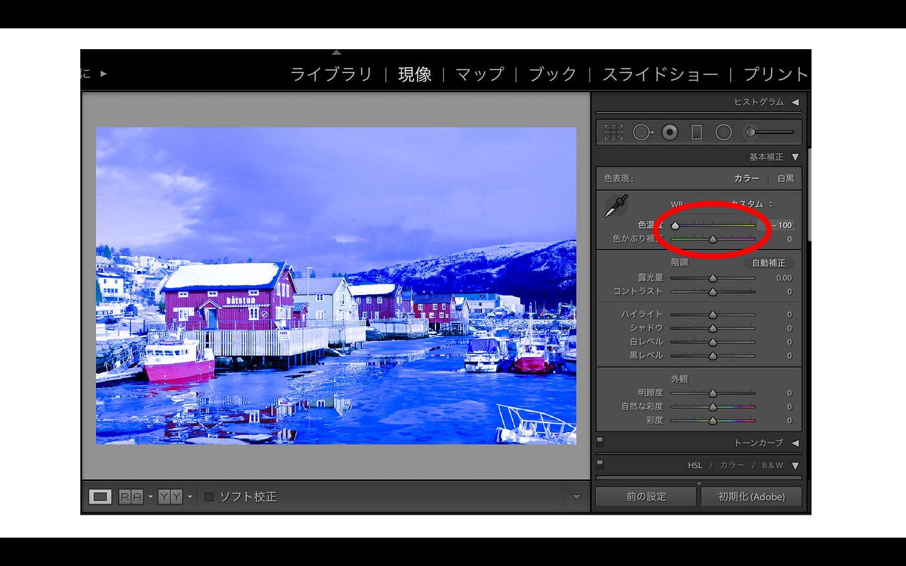
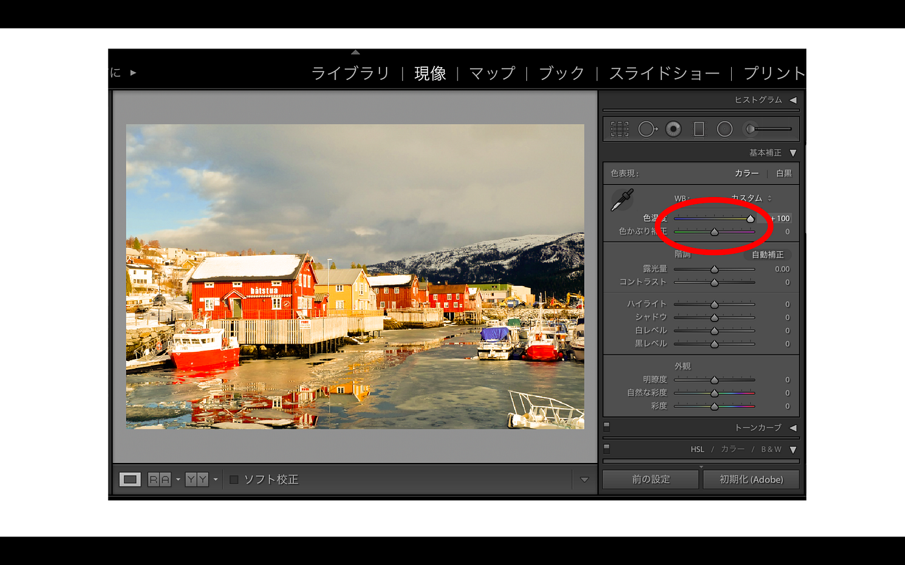
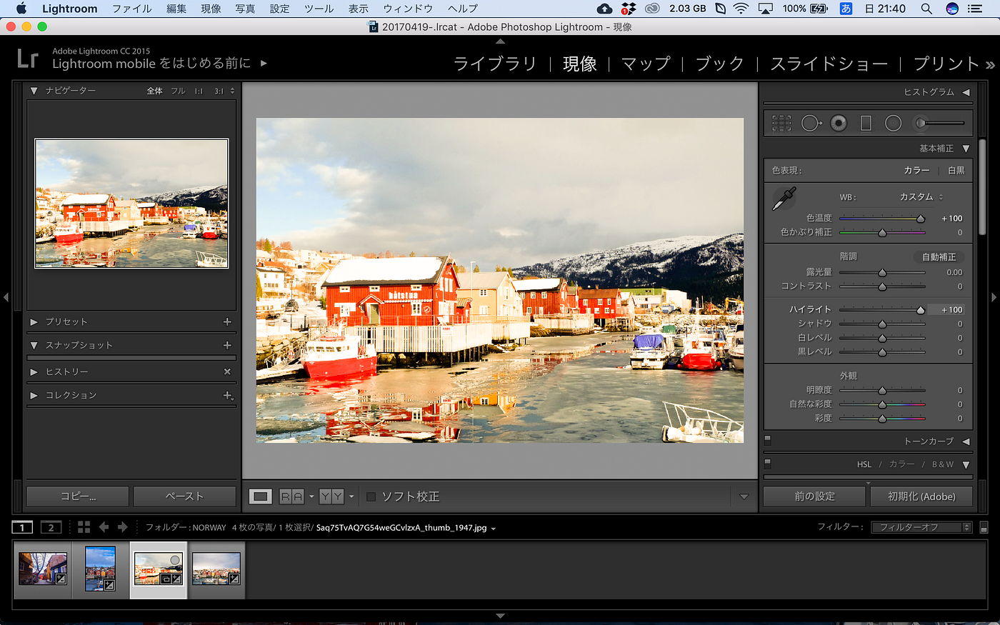
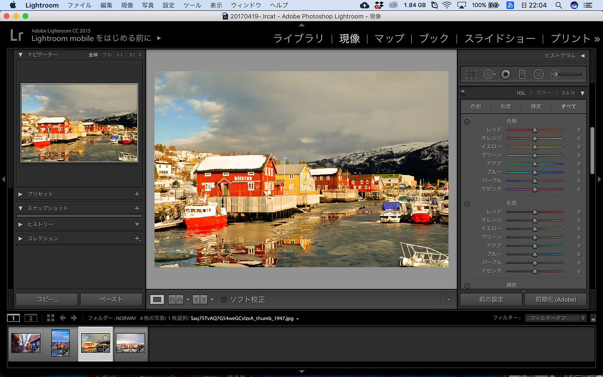
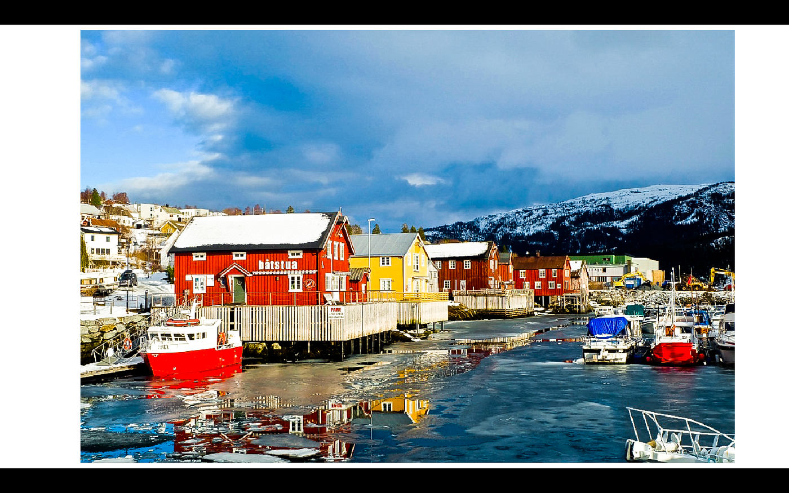
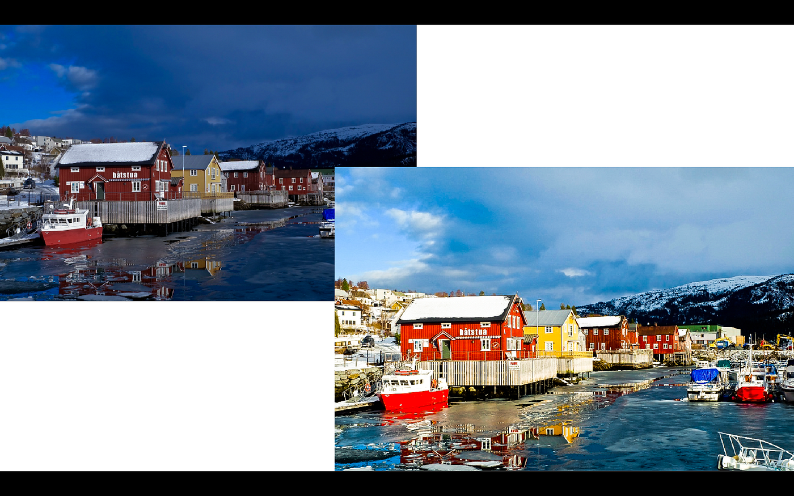

### 美しさを詐欺る？！【Lightroomの使い方②】

さて、今回から写真編集に入ります。素材は、昨年冬に訪れたノルウェーのBjerka（ビヤルカ）という港町です。

編集（現像）するには普通の写真ファイルJPEGではなく、RAWのほうがいいとされています。RAWの状態で編集をしてから、書き出す際にJPEGに書き換えることができます。

今回はそこの作業は省いて、JPEGデータでもある程度いじれるので簡単な色味加工を説明していきます。

# まず写真全体の色味を変える

**〈色濃度〉**で青みがけたり赤みをかけることができます。撮ったものによって使い分けましょう。

**〈色かぶり補正〉**ではピンクか緑味を入れることができます。

# 階調をいじる

これは他のアプリやSNS上でも変えたことがある人もいると思います。

簡単にその効果について説明します。

- 露光量

写真自体を明るくしたり暗くしたりするものです。

- コントラスト

写真の明暗をはっきりさせるものです。

- ハイライト/シャドウ

**ハイライトは写真の「明るい部分」を補正、シャドウは「暗い部分」を補正するもの**です。

ちょっとわかりにくいかもしれないので、画像でその効果を見てみましょう。

私は主に空の色をはっきりさせたいときに使用しますね。建物に焦点を合わせて写真を撮ると空は白くなってしまいがちなので、これを撮影後に暗くすることで青空や雲の情報が明確になります。

**シャドウ**は逆光で撮影して真っ暗になってしまった部分を明るくしたいときなどに主に適していますね。

※白/黒レベルについてはあまり始めは必要ないと思うので割愛。

# 部分の色を好き勝手に変える

空をもっと青くしたい。それよりもっと真っ青な色味にしたい。色飛びを落ち着けたい…など細部にこだわりたい方はここを操作しましょう。

写真内の赤色部分をもっと赤くしたい場合、**「彩度」**をプラスにしていきましょう。赤色を朱色に変えたい場合、**「色相」**を変えます。また、その色を明るくしたい場合、**「輝度」**で好みの色に変換しましょう。

いろいろ加工した結果、

ここまで色鮮やかになりました。インスタ映え間違いなし。

今回のこの画像、もともとJPEGからいじっているので大きな編集を加えると画質が荒くなってしまいましたが…。

編集前と比較すると、

こうなります。色の詳細をいじくるだけでこれだけ印象が変わってしまいます。ぜひ、試してみてください。

先週も述べたように、スマホアプリもあるので、携帯で撮った写真に手を加えてみるところから始めてみましょう。

安藤
