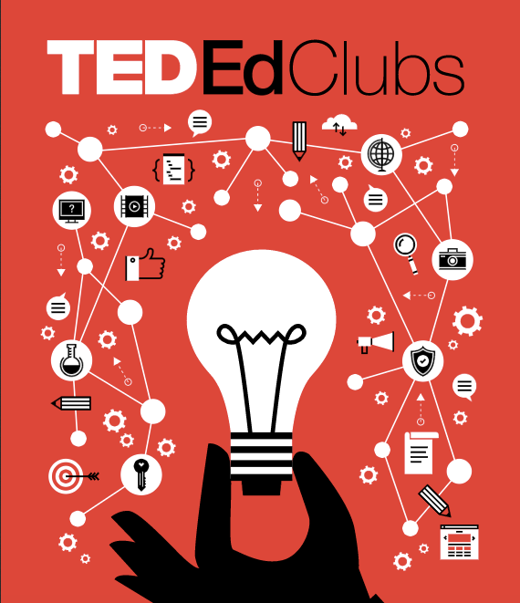

### “How to start a movement”

少しニュアンスは違うと思うのですが、最近特に思い出すのはこの言葉とこのTEDTalkです。
３分しかないのに妙な納得感も味わうことができ、さらに笑えます、お気に入りです。

”How to start a movement” Derek Sivers

Derekさんは何か行動を起こすのは最初に立ち上がったリーダーではなくフォロワーだと説いています。同時にリーダーは最初のフォロワーを大切に扱いなさいとも言っています。

私はTEDxAoyamaGakuinUをやりたいと昨年から手をあげています。
活動を続けていると色々なタイミングで様々な縁をいただきサポートするよと言ってくれる様々な人に出会います。

すごいですねと言われるたびに思い出すのはこのような支えてくれる人たちと、この動画です。
本当にすごいのはこんな計画性のない私の突発的考えに毎度アドバイスやサポートをくれるこの人たちです。
だから私はそういった人たちに常に感謝しながら機会を活かして行こうと思っています。

そして今回はTEDx関係のご縁からTEDEdClubsの授業お手伝いをさせてもらえることになりました！
きっかけはTEDxHimiのマサさん。（ありがとうございます楽しみでっす！！）
7月に南池袋小学校に伺います。

そこで今回のブログはTEDEdClubとはなんぞやをお話していきます。

### TEDEdCulbとは？

TEDEdClubとはTEDが2012年に立ち上げたTED公認の放課後クラブのようなものです。
小学校から中学生くらいの学年の子供達が人前でのプレゼンテーションや講演をする練習が目的です。

TEDTalksを元に、そこからより深く考えた内容を生徒たち、先生たちやアドバイザーを交えディスカッションを繰り返し、計１３回分の教材から一つのプレゼンテーションを作るカリキュラムが構成されています。

そしてこれは参加しなければならない年齢の子供たちや、アドバイザーになることができる年齢などが決まっています。
８〜１８歳の子供が必ず参加しなければならず、その中でリーダーは１３歳以上の子供がなることができます。その子を中心に、ディスカッションでは、より刺激的なアイディアや時にはクリティカルな意見を交えて行っていきます。

現在全世界に約6000の公立、私立の小中学校が参加しており、
その全世界の小中学校を繋げるビデオカンファレンスが行われたりしています。
また参加学校が集まるTEDEd-Weekendがニューヨークで開催されることもあります。

[TED-Ed Clubs
TED's youth and education initiative, TED-Ed, aims to spark and celebrate student ideas around the world. TED-Ed Clubs…www.youtube.com](https://www.youtube.com/c/tededclubs)

TEDxとはのブログで紹介したように、TEDxイベントを開催するためにはライセンスが必要ですが、
このTEDEdClubを開催するためにもライセンスが必要です。
このライセンスは学校や教育委員会が申請することができます。

[TED: Ideas worth spreading
Edit descriptioned.ted.com](https://ed.ted.com/clubs/applications/new)

この機会に感謝し楽しんで行こうと思います。
