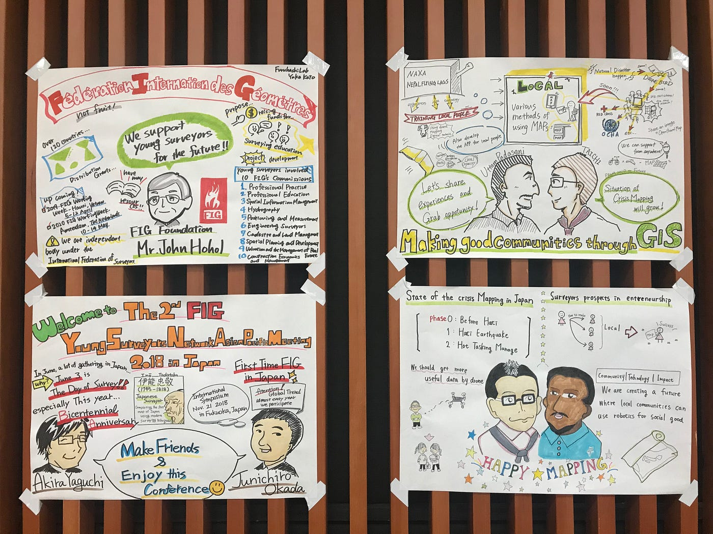
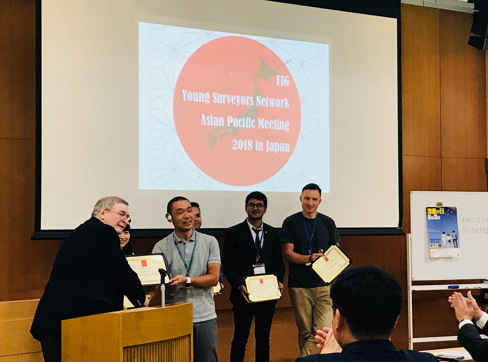
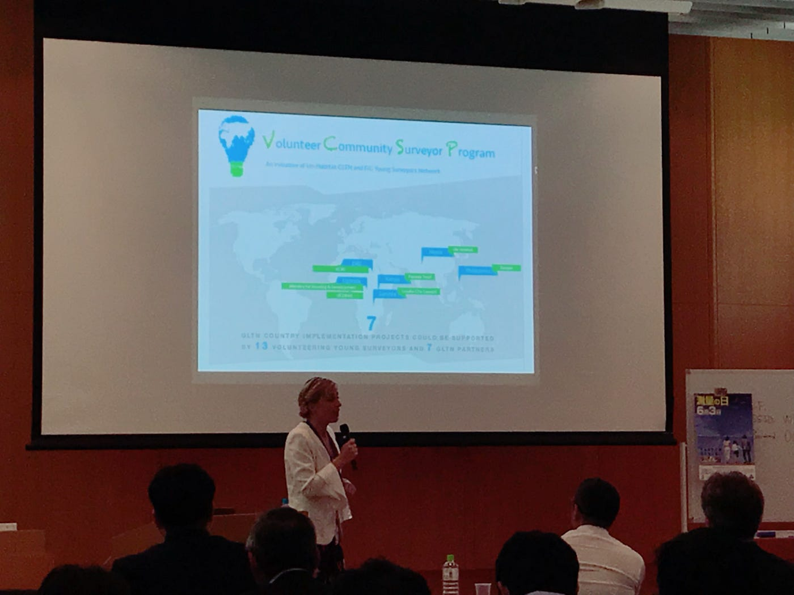
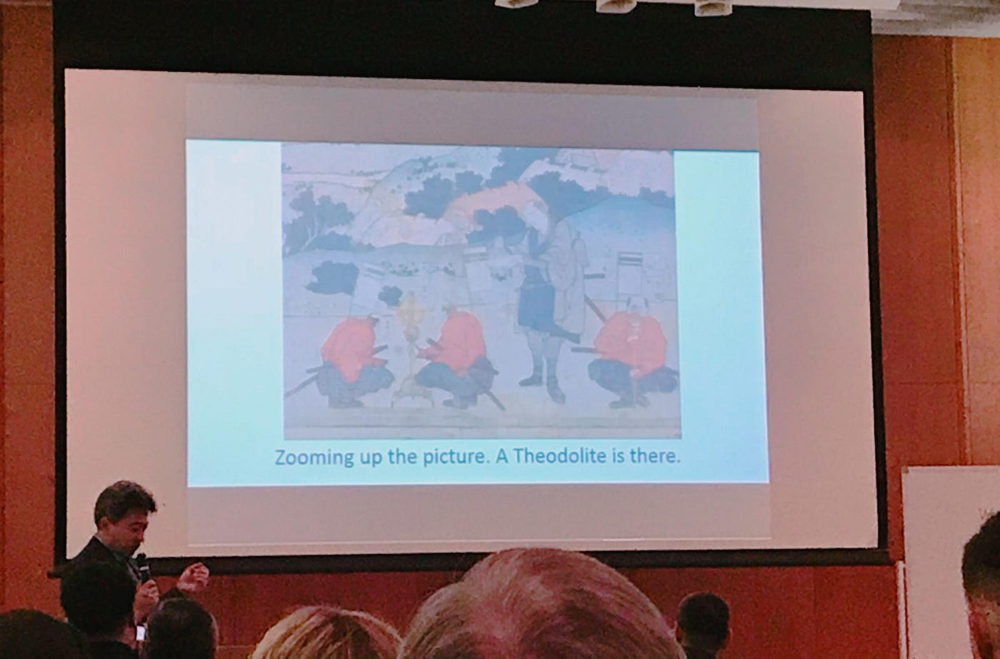
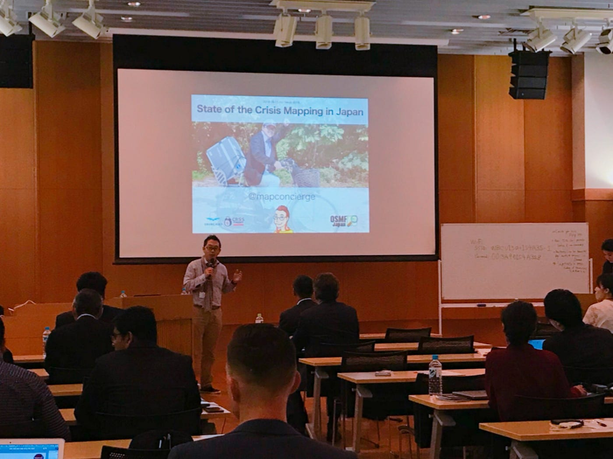
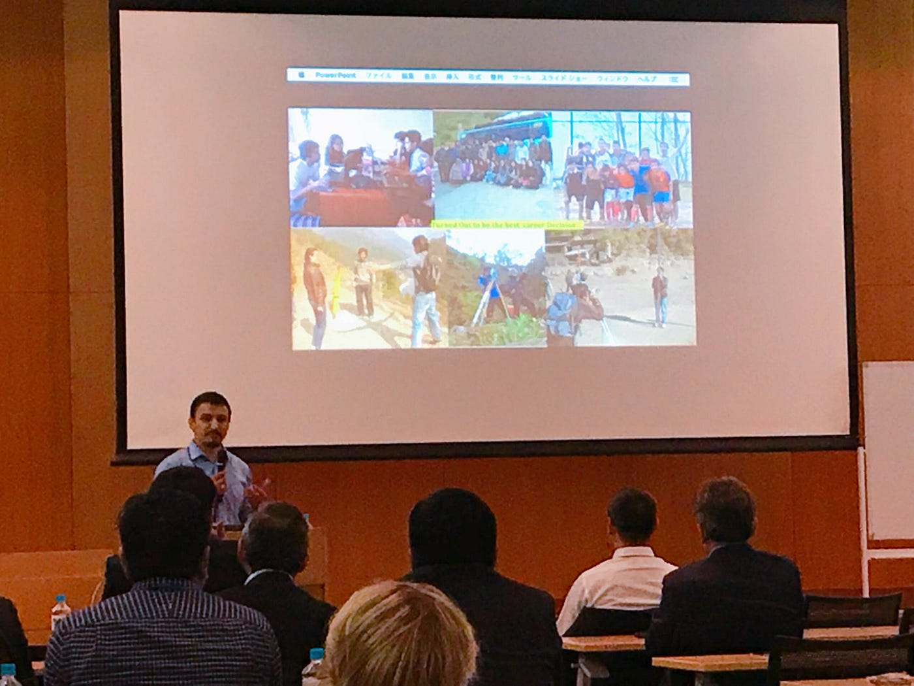
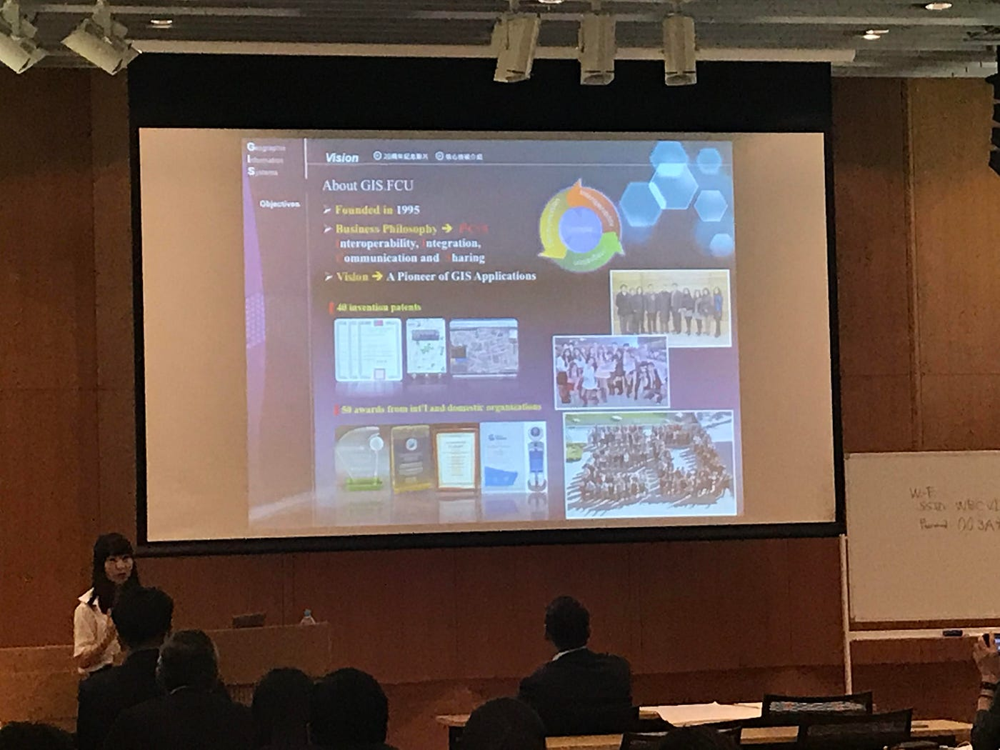
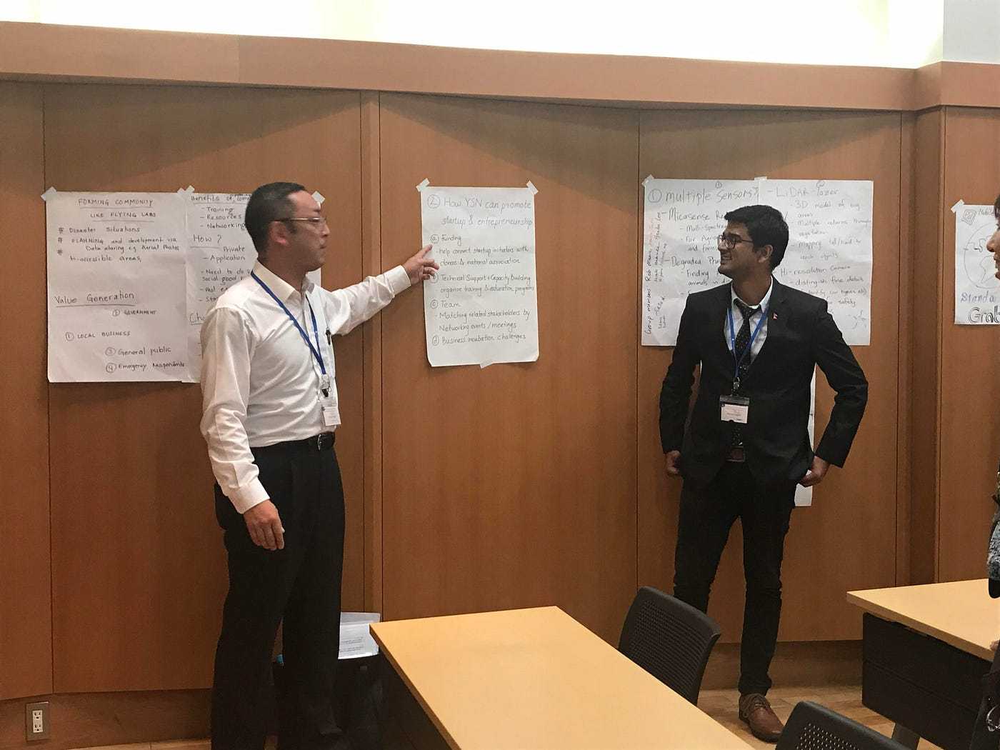
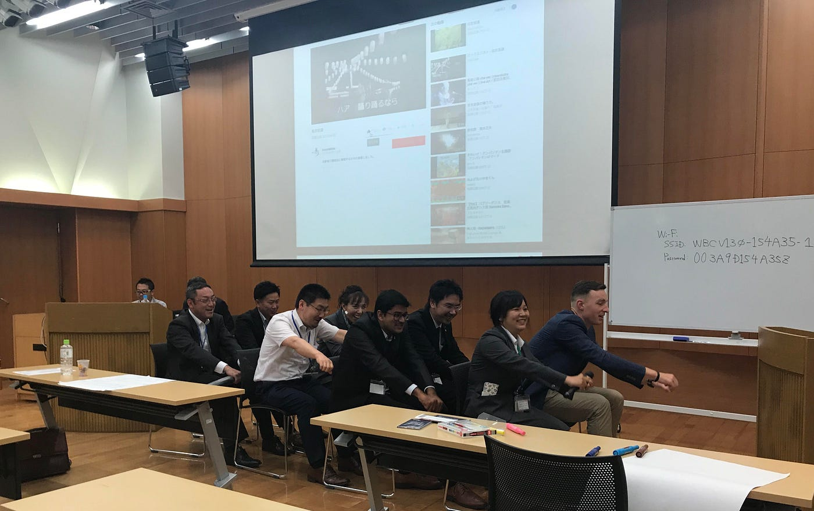

### The 2nd FIG YSNAPM 2018 -day1

The 2nd FIG(国連測量者連盟) Young Surveyors Network Asian Pacific Meeting 2018 in Tokyo -day 1ということで今回のブログは日本で初めて開かれたFIGのカンファレンス、1日目についてお伝えする！

**FIG(国連測量者連盟)**とは、国際的な**非政府組織**であり、その目的は、あらゆる分野とその応用において、**測量**の進歩のために国際的な協力を支援することである。
その他詳しくは< [http://www.jsurvey.jp/jfs/fig.html](http://www.jsurvey.jp/jfs/fig.html) >を参照。

今回のカンファレンスの目的は、自然災害がおきた場合どうするべきか、復興のための知識のシェア、我々の未来について全ての測量者と話合う、これらがサイトに載っている表向きの目的だ。

しかし真の目的は、若い測量者の**国境を超えたネットワークを構築**することだ。このカンファレンスでは、みんながディスカッションで発言し、積極的な交流を試みる姿を見ることできた。

今回のブログで少しでも会場の雰囲気を感じ取っていただき、ぜひ興味を持ってもらえたら光栄だ。

オープニングセッションが行われてまもなく、藤井さん(今回の主催者)とJohnさん(FIG Foundation)の握手シーン！(笑)

一番左に写っているJohnさんは、「将来の若い測量者をサポートする」と主張し、120以上の国がFIGに携わっているということやFIGのこれから開催されるワークショップを紹介。そしてFIGの若い測量者が関わる10の任務について語った。

また岡田さんや山口さんが今回のカンファレンスを楽しんで欲しいと、壇上で語り国際シンポジウムの紹介などを行なった。

EvaさんによるVolunteer Community Surveyor Programの説明と、プログラムの様子やアジア太平洋で行われたアクティビティを紹介してくれた。
そして「様々な機会を掴め！君しだいだ！」と力強いメッセージを会場に投げかけた。

セッション１、松崎さんによる日本の測量の歴史を紹介。行基図という古式の日本地図や、絵画に描かれている昔の測量の様子を紹介した。

私が今回一番驚いたことは、外国からきたゲストが「伊能忠敬は有名だよね」と語っていたことだ。日本を徒歩で17年もかけて測量した偉人は世界でも有名なのか！と感動した。

我らが先生、古橋先生によるCrisisMappingの紹介と自然災害地域をマッピングする学生の様子を見せた。自転車に360°カメラを取り付けて走行しながらストリートビューを作成する企画には、会場から賞賛の声が飛び交った。

ネパールから来たウッタムさんはNAXAやNepal Flying Labsが行なっているローカルな人材育成について紹介した。ロボティクスやデジタル技術を使うことで地域の地図作りの可能性は拡大し、その経験を伝えることで災害時に大きく貢献することができると強調した。

博士号を取得し教授のアシスタントとして働く、ベトナムから来たThanhさんはGIS.FCUという大学での学びを紹介をした。大学名に入っているGISやアプリケーションなど様々な位置情報を活用した取り組みを取り上げ、また次のカンファレンスがベトナムで行われることに胸を高ぶらせている様子だった。

ディスカッションとプレゼンテーションセッションでは、４つのグループに別れて様々なトピックについて話し合い、発表した。

その内容はコミュニティの作成方法や来年のイベントを盛り上げるためのチップスを語り合っていた。

2枚目の写真はみんなで船を漕いでいるイメージらしく、楽しそうプレゼンを繰り広げた。

またベトナムから来たThanhさんがベトナムのラブソングを紹介し、みな聞き入っている様子が見られた。

閉会式の時に炭坑節をみんなで踊りました(笑)

そんな運営側としても見ていて非常に楽しく、新たな気づきの多いカンファレンスでだった。測量者として、また一被災支援人として成長できる場であり、国際交流が盛んに行われる場であることは間違いない。
