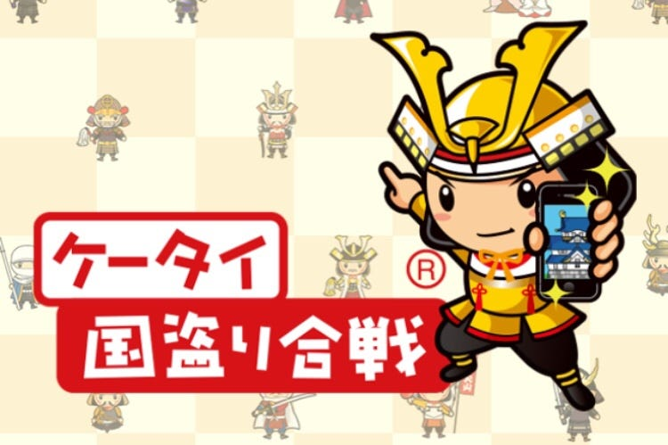
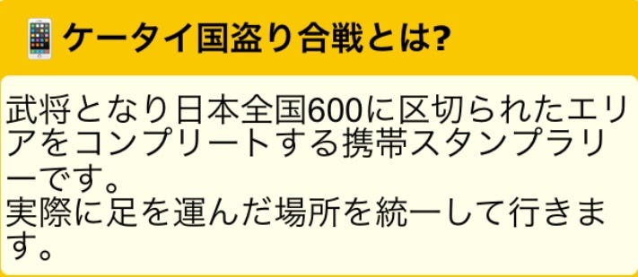
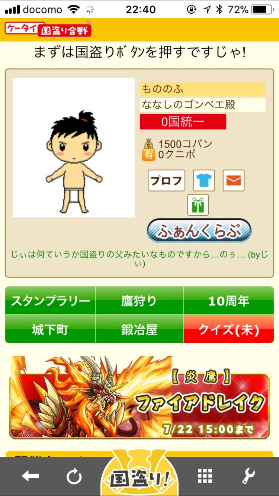
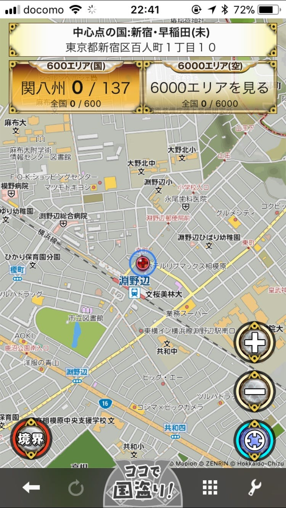
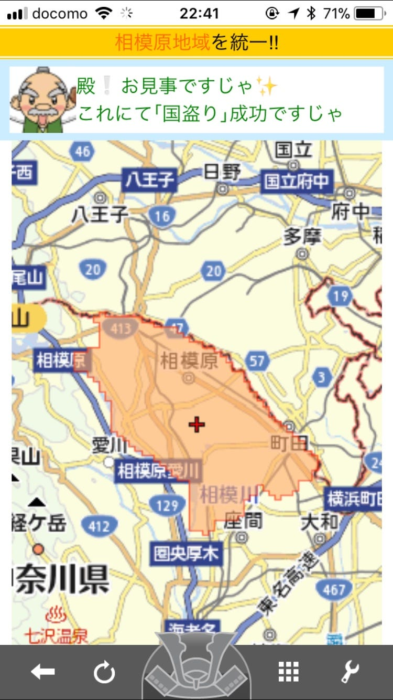
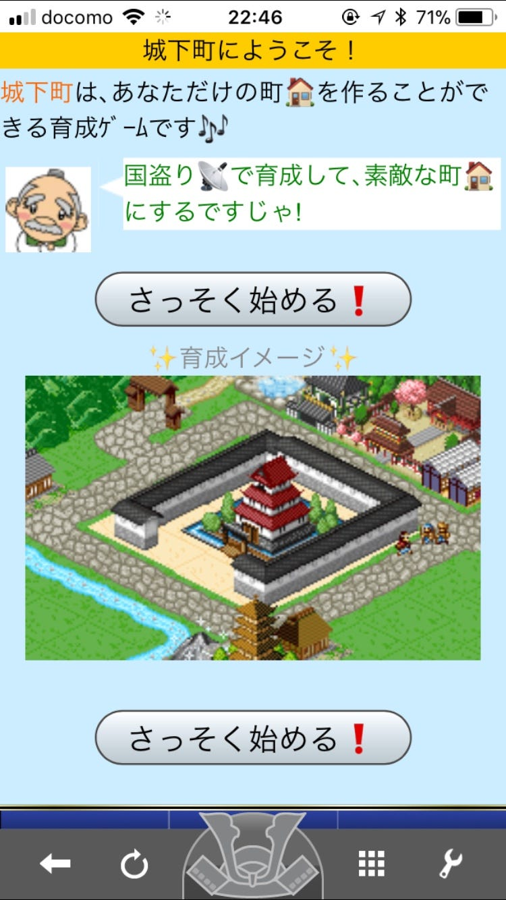
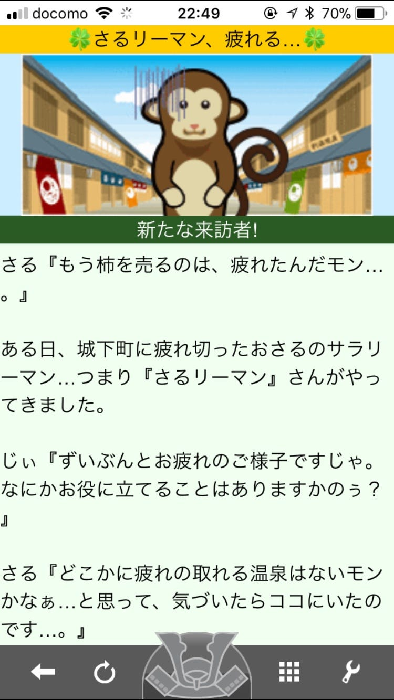
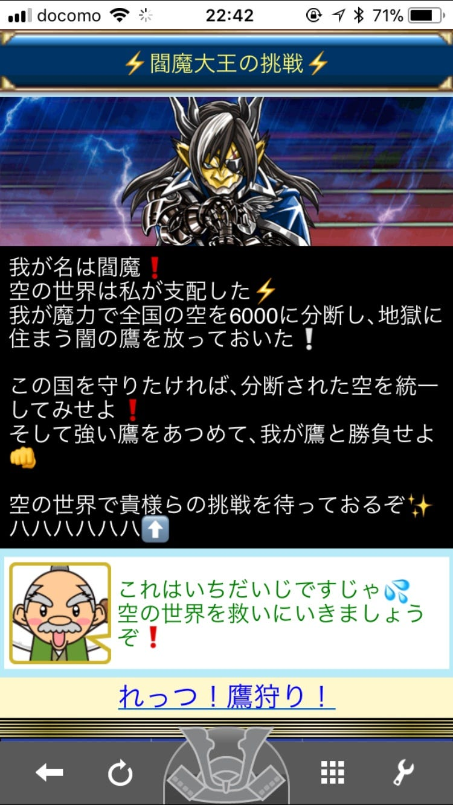
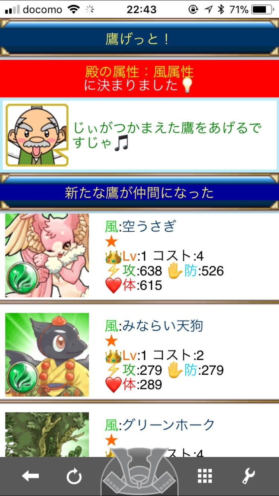
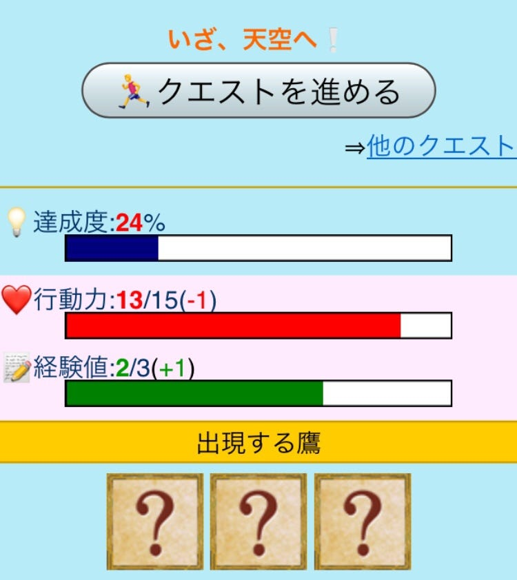

### 国盗り合戦

今週は「ケータイ国盗り合戦」を、

・「ケータイ国盗り合戦」って？

・基本の遊び方

・ここがおもしろい！

の三本立てで紹介していきます！

余談ですが、「国取り」じゃなくて「国盗り」なんですよ！「国取り」だと思って半分以上書いちゃってました！(修正済み)

1. 「ケータイ国盗り合戦」って？

言わずもがな位置情報ゲームです。インストールしたらとりあえずこのゲームが位置情報を使うことを許可してください。

公式の説明がこちら！

つまり、日本全国の600に分かれたエリアに赴いてアプリで記録するゲームってことですね。

ちなみに記録以外にもミニゲームがあるのでイロイロ遊べます。

2. 基本の遊び方

インストールして登録が終わったら早速国取り！

「まずは国盗りボタンを押すですじゃ！」byじぃ

押すとこんな感じになります。

とりあえずココで国盗ります！

相模原をゲットしました！

と、こんな感じで、今自分がいる地域を盗ることができます。

遠方に行ったときの記録にもなって楽しいですね！

やるからにはコンプリートを目指したいところです。

1. ここがおもしろい！

・盗った地域の境界線が視覚化されてる！

私は相模原に住んでいますが、どこからどこまでが相模原なのかなんて意識して過ごしていません。なので、エリアがポンと画面に表示されたとき感慨深いものがありました。

・ミニゲームがおもしろい！

→城下町づくり

町づくりって楽しいですよね。城下町を自分好みにカスタマイズしちゃいましょう！

→イベント

さるも疲れてるみたいです。城下町に温泉を作って癒してあげましょう！

→れっつ！鷹狩り！

空を救うのです！

言ってることはよくわかりませんが、キャラクターが可愛いです。

そしてタップするだけの作業ゲーでした。

こういうの好きです。

#### まとめ

ひとくちに位置情報ゲームといっても色々ありますね。

今回紹介した「ケータイ国盗り合戦」は600に分かれたエリアに入り、「国盗り」という名の記録をするゲームでした。

ミニゲームも充実しているので、位置情報ゲームとして以外にも楽しめます。

一度「国盗り」をするとその後その地域では特にできることもないので、決まった範囲から外に出ない人には遠出をするいいきっかけになるかもしれませんね！
