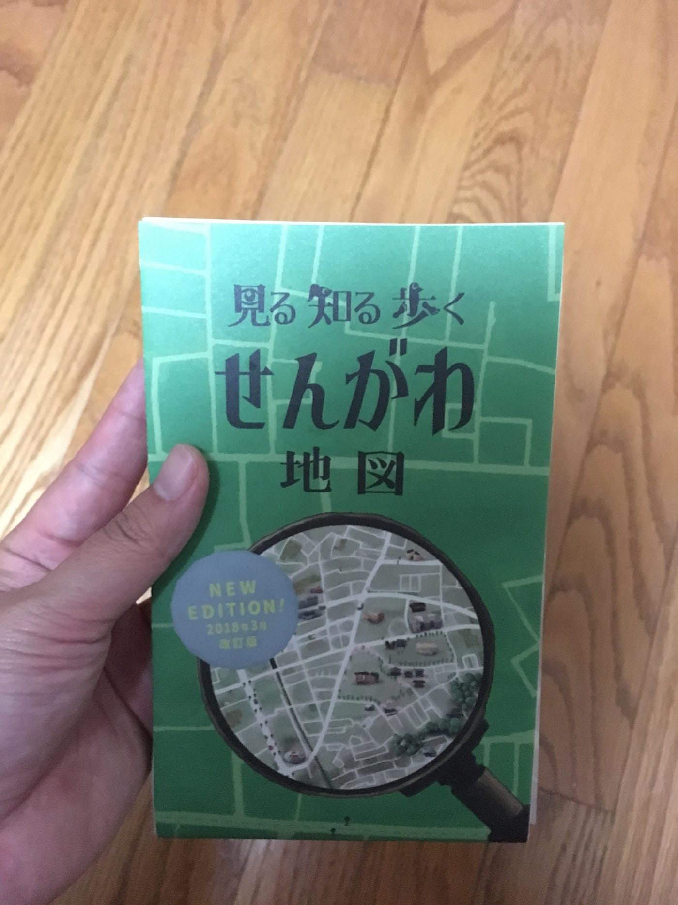
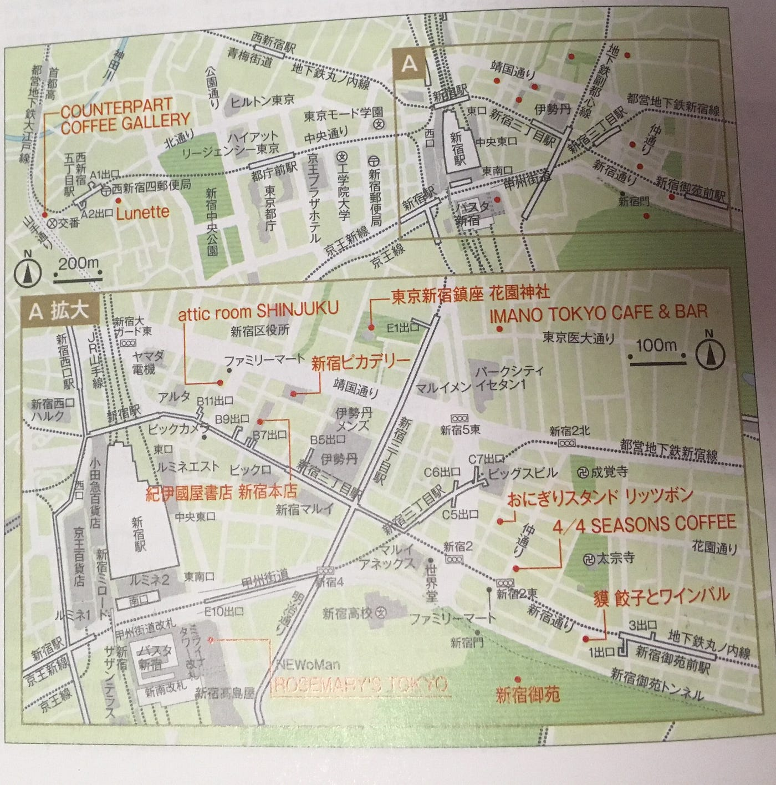
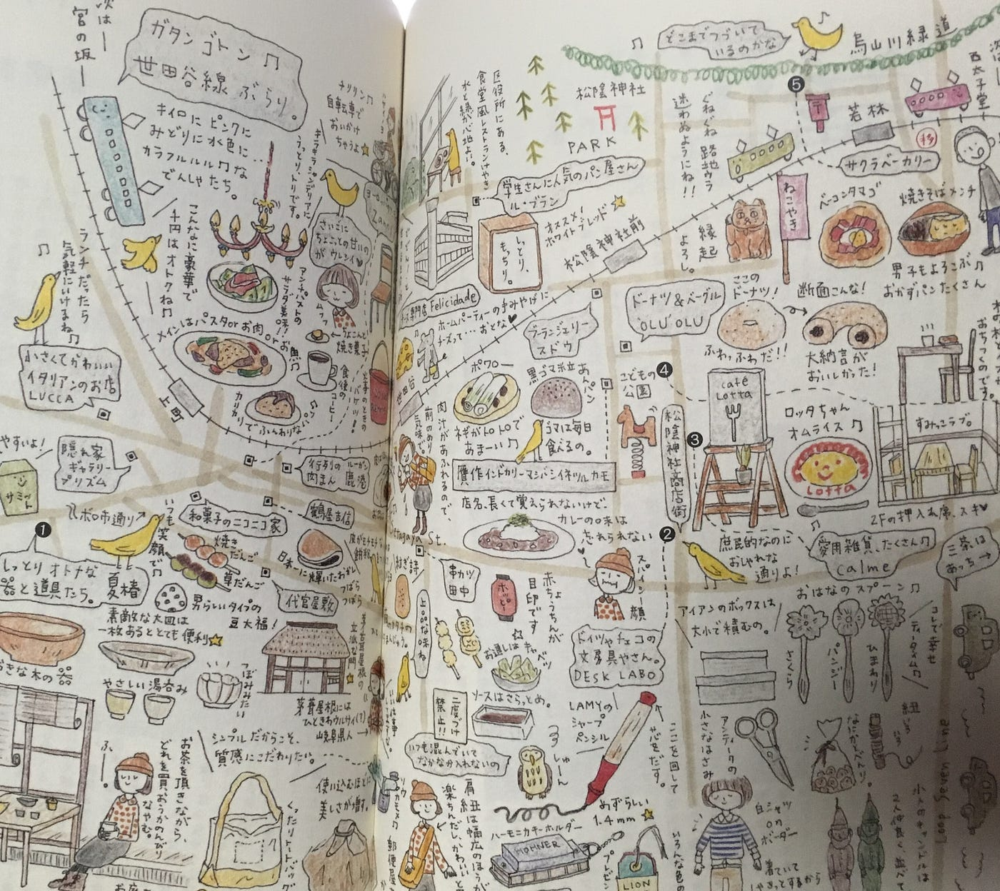
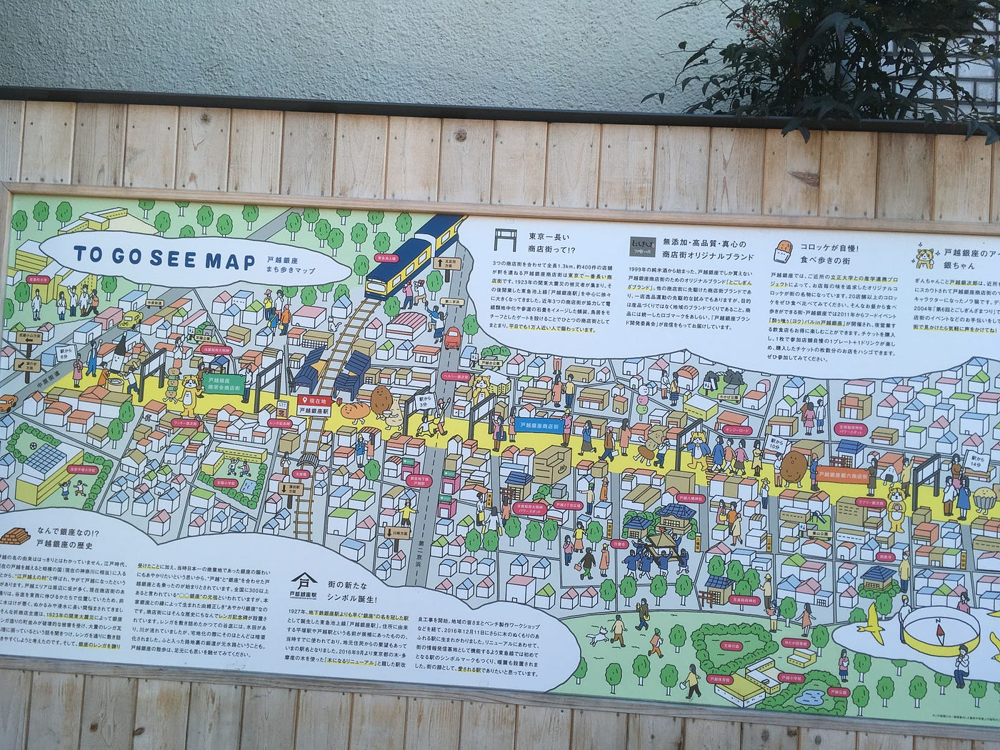
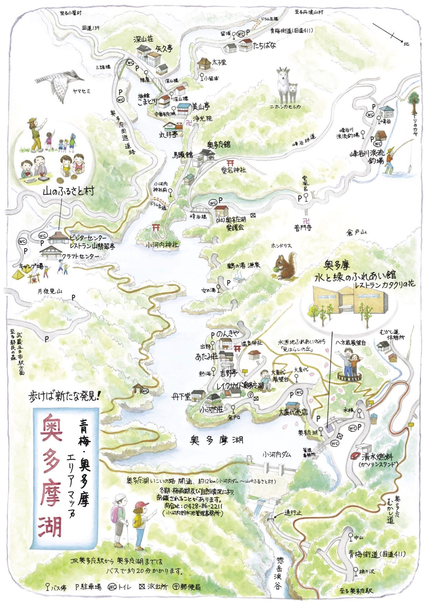

### 地図の意義を変えてみる？！

卒論テーマ進行状況 #3

こんばんは。先日、久しぶりにふらふらと仙川駅を降りたので、

### ででん！

ゼミ1期生のみなさん、覚えていますか？仙川地図研究所の「せんがわ地図」です。これで税込200円なんですよ。しかもなんと2018年3月の改訂版！

### # 地図と卒制…人々にもたらしたいもの

地図ってやはり面白い。私も地図が大好きで、地図帳とかじっと眺めながら地名とか名産品とか覚えました。今も主にカフェ巡りに行くときには地図アプリを開いて町並みを見ながら歩くのが日課です。

卒業制作にあたり、私の大きな軸は

- 写真

- 地図

を自分で1から作ることでした。中心としてはサイトを作って地図や写真情報をいかに見やすく便利なものにするか、ですが、アナログの良さというのもやはりあります。みなさん、スマホでいろんなアプリやサイトを開いていると思いますが、地図情報ってスマホだと見づらくないですか？スマホで他のことやってるんだから、もう事前に決めてある目的地の情報は紙でもいいんじゃないか、むしろそのほうが冒険感があっていいのではないか…と思うことがあるんです。それも折りたたみで広げるのは億劫です。道に迷ったときに通りがかりの人に書いてもらうようなメモ。あれくらいのサイズの地図だったら楽しいのではないかなと思います。目的地にすぐ着いてしまうのはつまらない。「この小道、気になる！行ってみよう。」など新しい発見の機会は、いつまでだってしていたい。ただでさえ、インターネットで自在に検索できると検索したい情報は取得できる。でも他の雑学（？）情報は一切入ってこなくなってしまう。

結構もったいないことだと思いませんか？

急いでいるときはそれでもいいですが、そうでないときくらい視野を広げて街歩きしましょうよ。

人々をそうさせるよう導けるようなプロジェクトにしていきたいなという考えに行き着きました。

### # 地図をきっかけに、楽しそう → 行こう！

観光名所や旅行ガイドブックの地図、形式的な、でも確かに店やホテル、国道などの情報はわかりやすい。しかし、

**面白みがない！**

旅行を決める前に地図を見てここに行こうというモチベーションを作ることだってできると思うんです。魅力的だと思うのです。

極端な例をご紹介しますと、

地図としての役割としては前者のほうが適しているでしょう。必要な情報がありシンプルで見やすいものです。後者はごちゃごちゃしていて道もよくわかりません。

しかし、あくまでも出かける「前」に見る地図では後者のほうが行きたい欲をそそられませんか？

このような地図ってちょっとしたコーヒーショップや雑貨屋さんの入り口やレジに申し訳なく置いていることしかない…こんな素敵な地図なのに…と思ってしまいます。観光案内所にはやはりオーソドックスな地図しかない…。

集客するための地図であればもっと遊んでも良いのではないか！その上で会場できっちりした地図を配布すれば良いではないか！

もっとかわいい、おしゃれな、レトロな地図はないものか。

と意識して生活すれば少し面白いものが見えてきました。

①戸越銀座商店街の例

戸越銀座駅をご存知でしょうか、用もない限りは行ったことない人のほうが多いでしょう。東急池上線の駅です。駅の改札を出ると、こんなのがありました。

商店街なので基本的に一本道。配色も派手さもありつつ抑えた色味との馴染みが良い感じ。戸越銀座のことをあまり知らない人のためにも豆知識が豊富に記載されている。

②奥多摩町の例

「奥多摩のガイドマップ」と検索するとかなりたくさん出てくる。

- 一般社団法人奥多摩観光協会

- 青梅商工会議所

- 奥多摩ビジターセンター

- 奥多摩町

手書き感素敵ですねぇ…奥多摩ならではの山や自然、川の美しさが感じられます。

### # 新しいアイディアと出会えるアプリ知ってますか？

もっと面白い地図が見てみたい、いや地図でなくてもデザインや広告の情報がほしい！

という方に、私最近素晴らしいアプリ見つけちゃいました。

### 【Pinterest】アイデア探しツール

知ってた方すみません。どうにかこの感動を誰かにも伝えてあげたくて…すごい、すごいです。このアプリ。電車の中でもデザインの目を養えちゃいます。

まだ使い始めたばかりなので、まだ大まかなことしかわかっていませんが、

以下のもの :

- レシピ

- 部屋インテリアや収納

- ファッションコーデ

- アート

- 写真

- 広告

- パーティのコンセプト決め

- ヘアアレンジ

など興味のある方は必見です！

GoogleやFacebookのアカウントで入れば、ウェブ上で見つけたお気に入りの記事や画像を保存しておけます。また自分が分けたいカテゴリー別にファイルできます。無料なので、アイデアがほしい人は一度ダウンロードしてみてください！

それでは長々となってしまったので今回はこの辺で失礼します。

安藤
