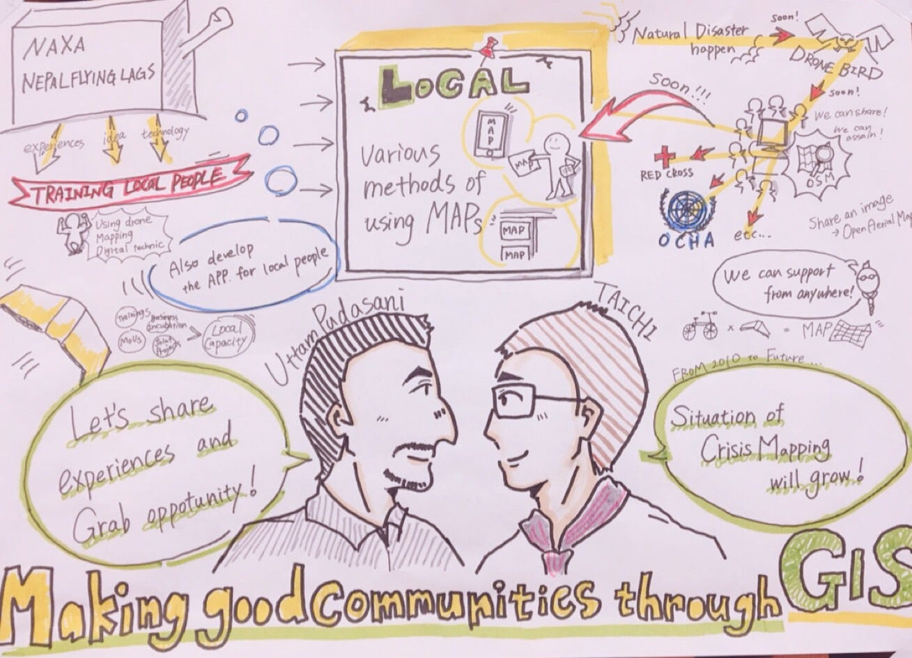

### 若い人のチカラを最大化する未来へ

2018年6月15日〜6月16日
アスタジオにて

【国連FIG×古橋研究室
 young surveyors Asian pacific meeting 2018】

が行われました。

いつでもどこでも起こりうる自然災害に対して、迅速で正確な土地調査は大変重要です。
これから特に土地調査には若いチカラが必要で、その活動が世界中に広がっているということを知る事が出来ました。
また、さまざまな団体や国地域が、若い調査士へのサポートやトレーニングなど、積極的に教育を行っていることを知ることが出来、大変有意義な国際会議だったと感じます。

今回私は
DAY.1 session2のグラレコを担当させて頂きましたので、このブログにて紹介します。

古橋教授(青山学院大学)とウッタムさん(NEXA他)のセッション

今回、おふたりの活動を聴き、アプローチは異なっても目指す共通点【LOCAL】があると感じたので、今回このようなデザインに決定しました。
