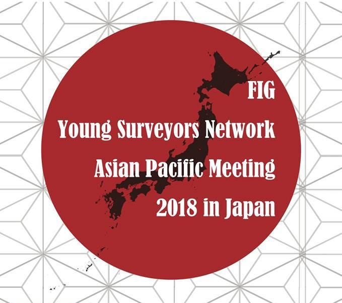
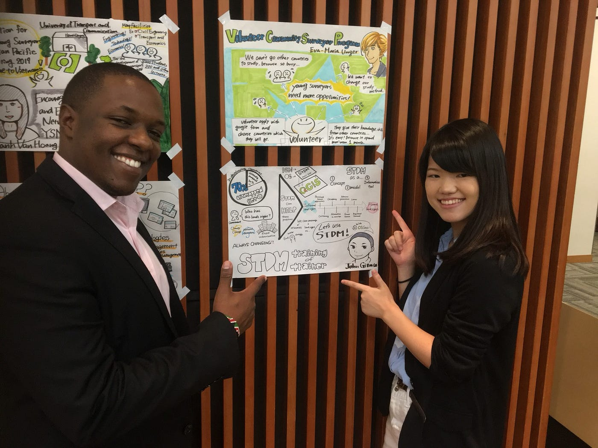
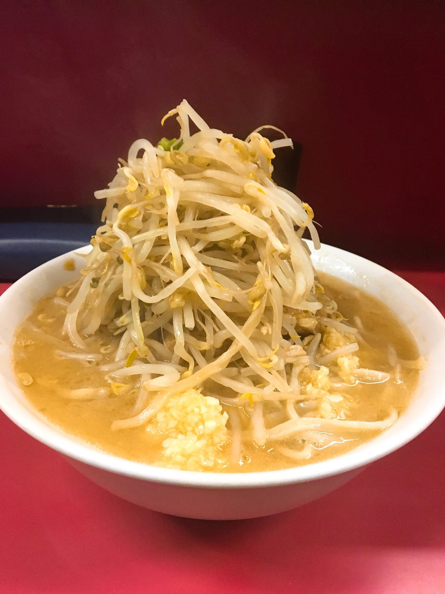

### FIG 2018 2nd day

こんにちは！渡辺ゆうなですー！

今回は先日6月16日にボランティアスタッフとして参加させていただいた

こちらの国際会議に参加させていただきました！

私は２日目のみの参加となりました！この会議の概要については、私の同期である大槻あやめの記事をみるとわかりやすいと思います！（[https://medium.com/furuhashilab/the-2nd-fig-ysnapm-2018-day1-a384ff1f5656](https://medium.com/furuhashilab/the-2nd-fig-ysnapm-2018-day1-a384ff1f5656)）他にも書いている人がいると思うので読んでみてください:)

私は２日目の「STDM trainer of training」についてのグラレコを担当させていただきました！

時間に余裕がなく、色ぬりが間に合わなかった部分がありました・・申し訳ないです。また、グラレコの完成写真も撮り忘れてしまいました・・・後日どこかしらで入手出来次第掲載いたします！

会議の終わり側に、私がグラレコを担当させていただいたJohn Gitauさんとお話することができました！ 「とてもうまくまとめられていていいね！」とお褒めの言葉もいただけて感激でした！

国際会議に参加するたびに思うのは、会議で聞く英語は専門用語や普段の会話で使わなかったような単語がたくさんでてきて理解できなくなってしまうことが多いということです。もう帰国して１年以上経っていることもあり、英語力をなるべく落とさないような工夫も必要なのかなと思いました。

先週お休みしてしまった今週のラーメン:)

今回はひばりヶ丘二郎です！私が一番好きな二郎！

ここのお店はひばりヶ丘駅から徒歩５分ぐらいのところにある二郎です。二郎のなかでもトップ３に入る人気具合で、私のようにひばじ（ラーメン二郎ひばりヶ丘店の略称）が一番好きなジロリアンは多いです。なんといっても乳化したやわらかいようでパンチもあるスープと程よい麺がたまりません。またヤサイも割とクタめでたべやすいです。また海老蔵似の店主さんもとってもノリがよくいい人なので、初心者の方でも安心していけるかと思います！この美味しさは言葉では表きれないのでぜひ足を運んで見てほしいです！
