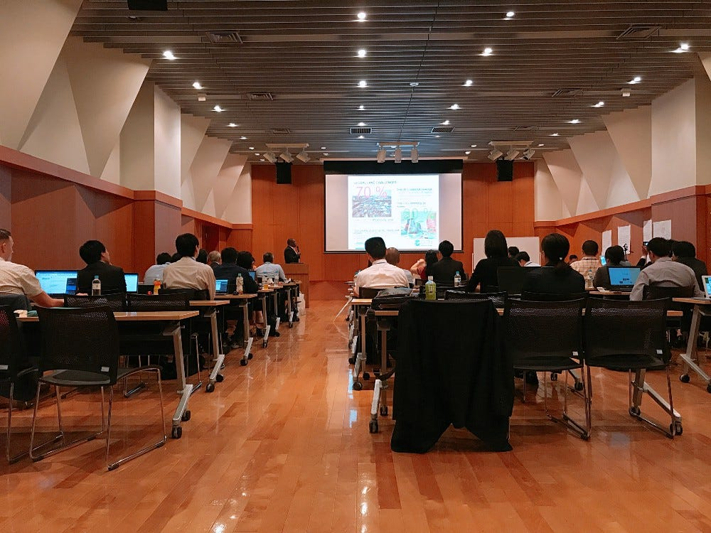
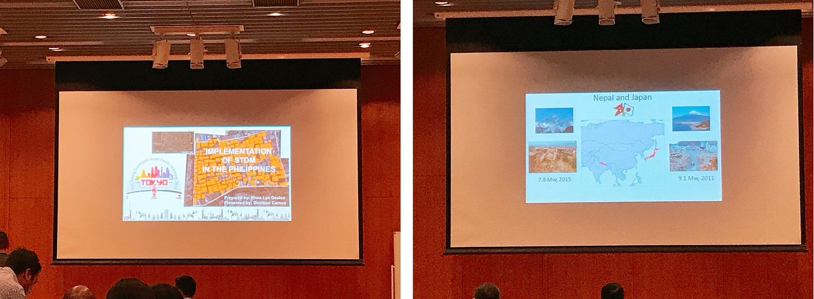
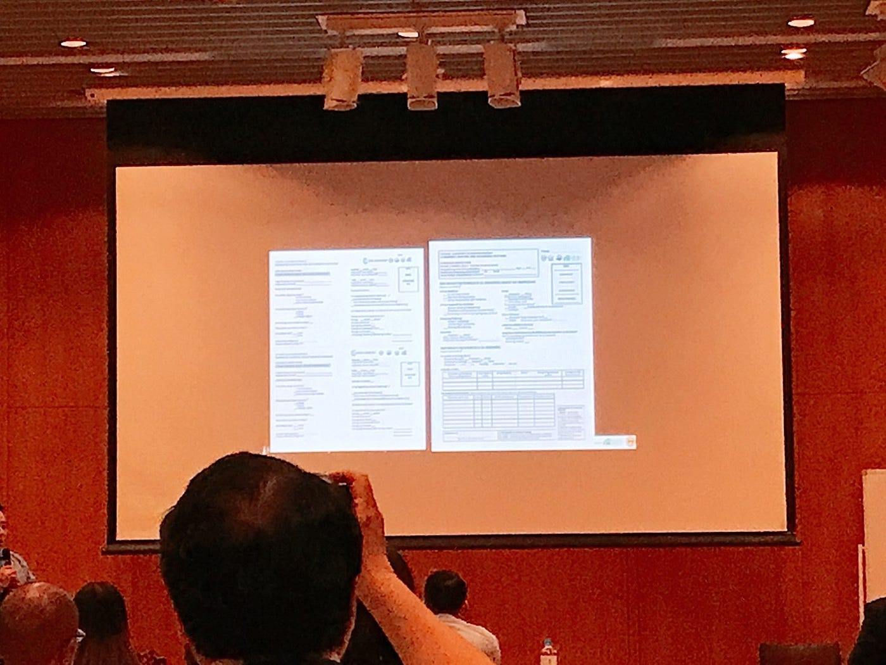
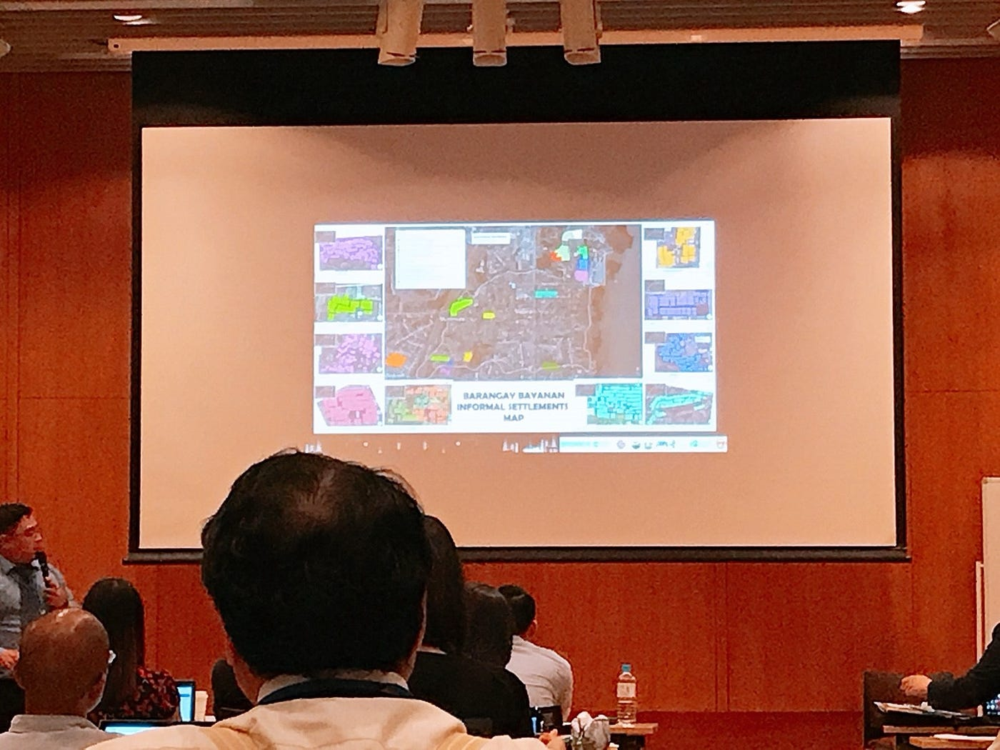
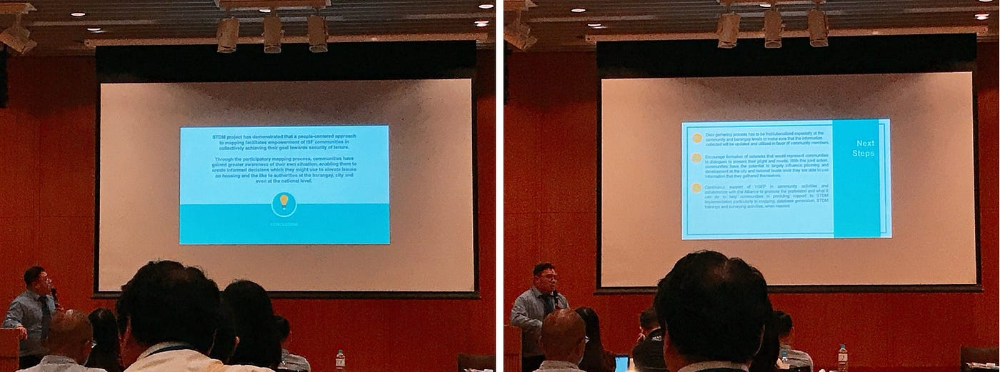

### 国連FIGｘ古橋研究室 Young Surveyors Asian Pacific Meeting 2018 in Japan — day2

こんにちは。青山学院大学 古橋研究室3年 渡辺匠です。

6/15~6/16に渋谷の青山アスタジオでFIG(国際測量者連盟)によって開催されたYoung Surveyors Asian Pacific Meeting 2018 in Japanに会場スタッフとして訪問させていただきました。

_”国際測量者連盟（FIG）は国際的な非政府組織であり、その目的は、あらゆる分野とその応用において、測量の進歩のために国際的な協力を支援することである。”_（引用: 日本測量者連盟 http://www.jsurvey.jp/jfs/fig.html）

> _**このカンファレンスの目的とは？_**

FIGがこのような国際カンファレンスを設けている目的としては、主に、従来の土地行政システムの行き届いていない発展途上国の７０％の地域を補い、インフラ整備の向上を手掛ける若手調査員を育成する指導者の探求である。

> _**カンファレンスの概要について_**

このカンファレンスでは、アジア太平洋地域における若手調査員の会合というテーマを掲げているため、アジア太平洋地域に関する国連FIGによる活動であったりその事例報告をテーマとした講演となっていた。

国連FIGという団体の概要や活動などの講演にはじまり、FIG若手調査員のボランティアとそのコミュニティ調査、日本での調査の歴史、災害を回避するための調査員としての役割、ベトナムでの調査の紹介、STDM指導者の養成、AW3Dの概要説明やインストール、フィリピンやネパール、日本の入り組んだ地図に関する事例報告を扱っていた。

> _**Reporting Cases — Philippines and Nepal_**

私は今回、このカンファレンスでフィリピンとネパールの事例報告の講演を実際に聴取してきました。ここではフィリピンの事例報告のみについて見ていきたいと思います。

フィリピンにおけるこの計画はMuntinlupa Cityという場所で2013年に開始され2017年に終わりを迎えました。この計画の主な目的としては、STDMの認知拡大、コミュニティへの支援、パートナーシップの発展、そしてSTDMに対する理解の向上でした。

事前準備として、地方自治への協力依頼、バランガイ市長への表敬訪問、GPSを用いた国境調査を行い、その後、実際に建造物のマッピングや世帯調査などを通じ、調査後、都市レベルに応じたデータの発表や発展計画が行われました。

この計画のアウトプットは大きく分けて３つ存在するとしていました。1つ目は国連FIGや専門家、そして政府機関の間にいくつかの繋がりができたということです。2つ目はこの計画によって、国内外におけるSTDMやマッピングに対する認識が増えたということ。3つ目は大学と専門家の間に繋がりができたことでした。

そして、最後にまとめと考察をもってフィリピンでのSTDM計画の発表を終えました。

> _**最後に_**

私はこのカンファレンスに出席していたネパール人男性とこの講演について休憩時間に少しお話をすることができました。話の内容に連いてこれているかや、理解できていなかったInformal Settlementの説明を改めてしてくれました。最後に『難しいですよね。』と言って、また講演室に戻っていきました。

残念ながら、その方とセルフィ写真を撮ることを忘れてしまいました。自分に対する課題や反省として、またこのような機会があったら、より積極的に交流を計っていきたい、そしてセルフィ写真を撮ることを忘れないように気を付けたいと思います。

以上、古橋研究室3年 渡辺匠でした。
