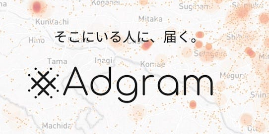
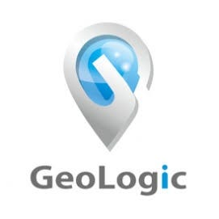

### 今週のおまめ

こんにちは☀︎

今回は位置情報、ジオターゲティング、エリアターゲティング広告と呼ばれるサービスについていくつか事例を紹介できればと思います

Adgram

NTTドコモとヴァル研究所、ジオロックによって開発された位置情報アドネットワークです。チェックイン機能はもちろん、ユーザーのプロファイリング技術や移動に関するあらゆるデータを保有しており、独自のターゲティング手法や入札アルゴリズムを構築しています。

CAR TRACE

自動車統計データを活用した国内唯一の広告配信サービスです。特定の車種所有者が存在しているエリアに特化してWeb広告アプローチをしていくもので、通常のプロモーションに比べてピンポイントで配信することができます。

モバイルチラシ

店舗近くに来た人に対してリアルタイムで広告を配信していくもの。配信半径も設定できます。

インバウンド集客×位置情報

訪日外国人観光客へのダイレクトマーケティングとしてWi-fiスポットを無料提供し、その上で明確な位置情報と連動した観光情報やお役立ち情報を随時配信していくもの。日本に興味がある外国人にターゲットを置き、加えて場所や時間や言語なとのターゲットも追加することができる。

GeoLogic Ad

独自のアルゴリズムをコアとする位置情報アドネットワーク。スマートフォンの位置情報をもとに「子育てマイホーム」や「都心のセレブ高層マンション」など独自のセグメントを指定して配信するもの。鉄道路線など過去の履歴を利用した配信も可能。

次回は今回の続きをお届けしますね☺︎
