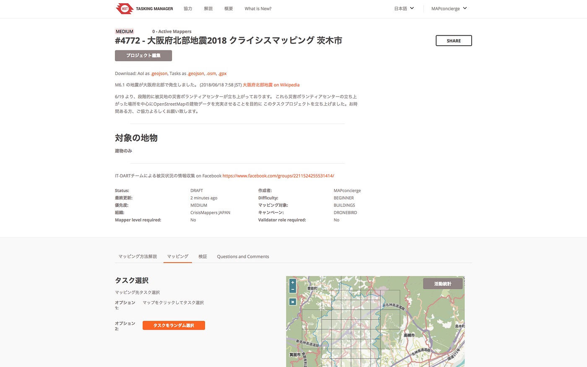

### 大阪地震クライシスマッピング始動！

災害ボランティアセンターが立ち上がったエリアを中心に大阪府北部地震クライシスマッピング活動開始いたしました！まだ十分でない建物入力を中心にライセンス気にせず自由に印刷・二次利用可能なOpenStreetMapを充実させてまいります。

印刷地図が必要な場合はこちらからPDFの自動生成可能です。

＞ フィールドマップ： [http://fieldpapers.org/](http://fieldpapers.org/)

＞ まち歩きマップメーカー： [https://www.netfort.gr.jp/~saka/accessmap/](https://www.netfort.gr.jp/~saka/accessmap/#6/38.290/138.988)

災害情報ボランティア IT-DART からの情報を参考に５市町村に絞って行います。災害ボランティアセンターの拡大に合わせて順次追加してまいります。

* 高槻市

[HOT Tasking Manager
HOT Tasking Manager is a mapping tool designed and built for the Humanitarian OSM Team collaborative mapping.tasks.hotosm.org](https://tasks.hotosm.org/project/4773)

* 茨木市

[HOT Tasking Manager
HOT Tasking Manager is a mapping tool designed and built for the Humanitarian OSM Team collaborative mapping.tasks.hotosm.org](https://tasks.hotosm.org/project/4772)

* 吹田市

[HOT Tasking Manager
HOT Tasking Manager is a mapping tool designed and built for the Humanitarian OSM Team collaborative mapping.tasks.hotosm.org](https://tasks.hotosm.org/project/4774)

* 豊中市

[HOT Tasking Manager
HOT Tasking Manager is a mapping tool designed and built for the Humanitarian OSM Team collaborative mapping.tasks.hotosm.org](https://tasks.hotosm.org/project/4775)

* 摂津市

[HOT Tasking Manager
HOT Tasking Manager is a mapping tool designed and built for the Humanitarian OSM Team collaborative mapping.tasks.hotosm.org](https://tasks.hotosm.org/project/4776)

情報シェアなどどうぞよろしくお願いいたします！

#DRONEBIRD #CrisisMapping #古橋研究室 #AOYAMAVISION
