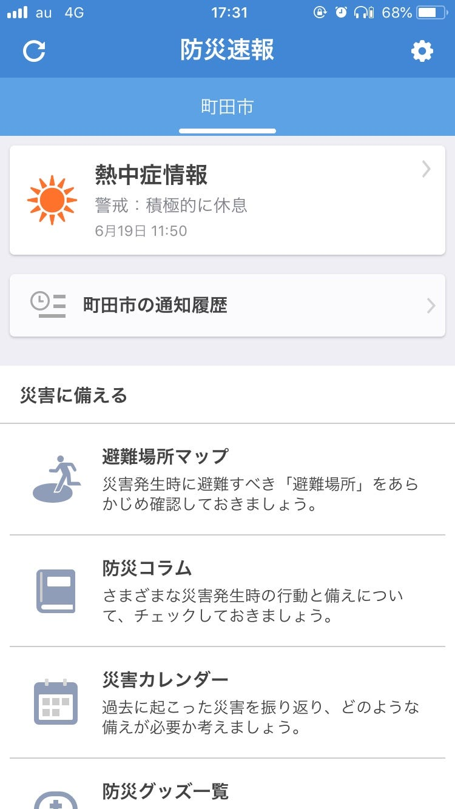
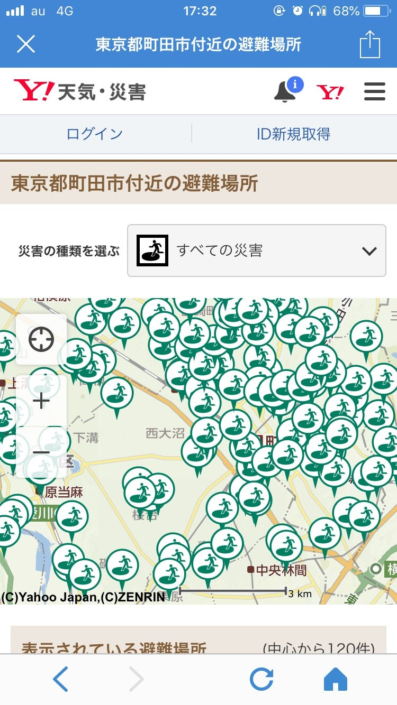

### 災害時はこのApp!

今回紹介するのは「yahoo!防災速報」です！

個人的にすごい使えそうと思ったのですごい推してます

まず自分のいる地域を細かく市ごとに設定します。(3個程できる)

とりあえず町田市に設定したのですが、アプリを開くと写真通り災害情報がすぐに見れる！

避難場所や災害時用のコラムが見れますね。

避難場所は「全ての災害」で検索するとこんな感じですが、災害毎の避難場所で細かく検索ができるのでそこがとても良いと思いました！

地震、津波、土砂災害、火災等の8つのカテゴリーで調べられます。

また、今は熱中症注意がでていますが、状況により土砂災害警戒情報などが一番上にでるようです。

災害が起きたときの次の被害を知るのは重要だし、その際とても活用できそうですね…！

ぜひ入れてみて下さい
