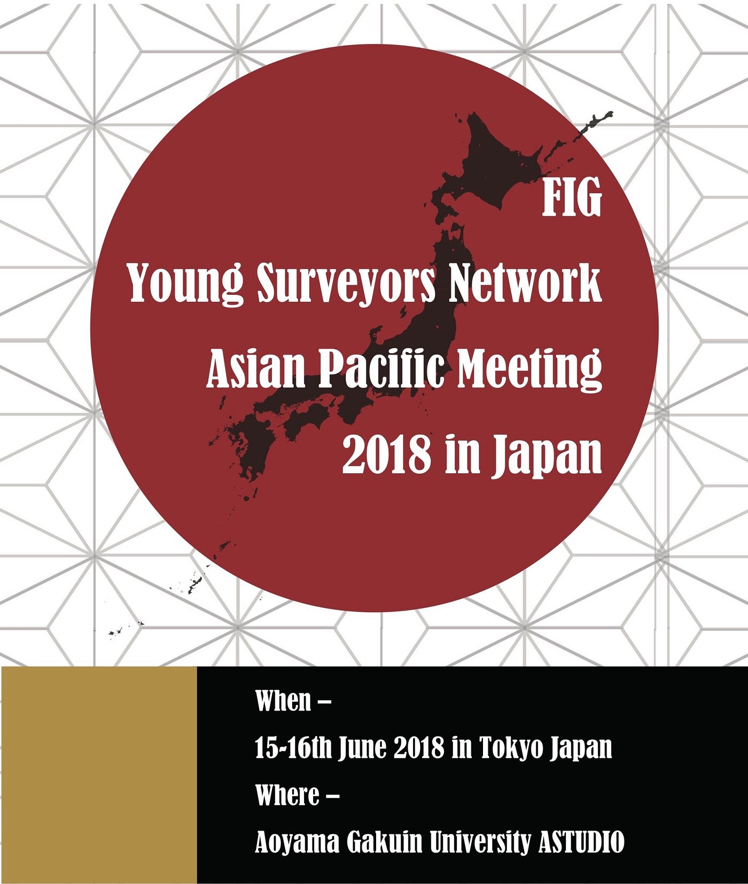
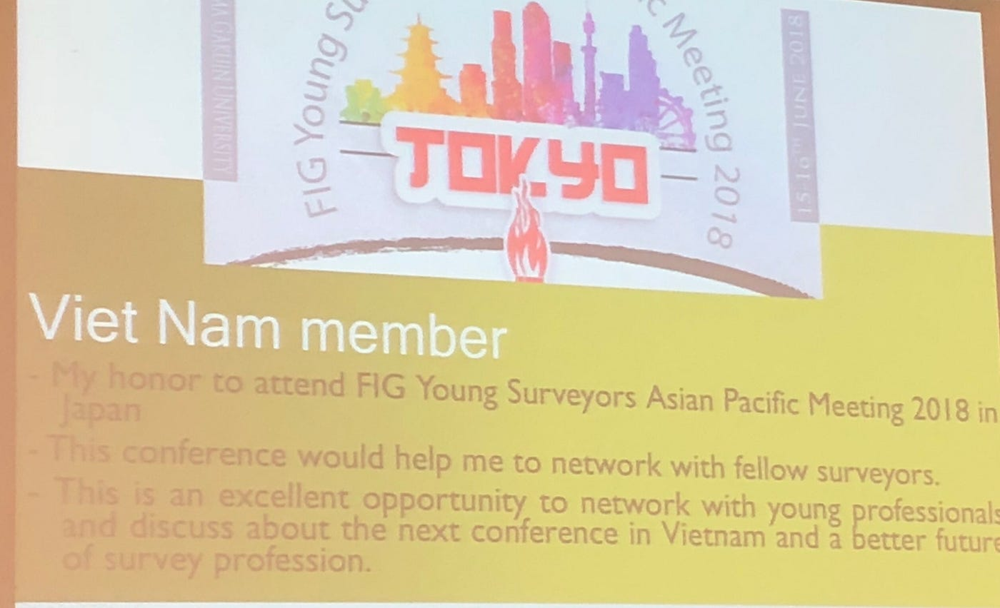
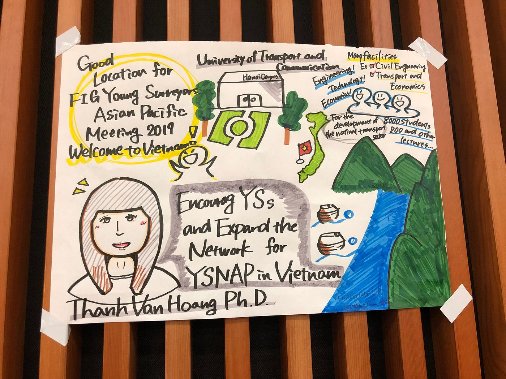

### **FIG 2018 1st Day**

こんにちは！多賀谷美里です！

2018年6月15日にボランティアスタッフとして参加した国連FIGｘ古橋研究室 Young Surveyors Asian Pacific Meeting 2018 in Japan 1日目の報告をさせていただきます！

### Encourage YSs and Expand the network for YSNAP in Vietnam

私が参加したsession 3についてですが、Thanh Van Hong Ph.Dさんにより、ベトナムについての説明がされました。

ベトナムのPR動画や大学が紹介され、今回日本で行われたこの会議が、来年2019年を行うのに、ベトナムがとてもよいこと、ネットワークを広げることを目的としたセッションでした。

こちらは研究室の先輩のグラレコです！私も次の会議ではグラレコに挑戦したいです！

受付係をしていた際に、外国人の方とつたない英語ではありますが、お話しする機会がありました。会議の内容は深くお話しすることはできませんでしたが、雨がすごいとおっしゃっていました。日本の梅雨、世界の気候の話ができてとても楽しかったです。時間の関係で写真を撮る事は出来ませんでした。英語力向上も課題であると感じた1日でした。
