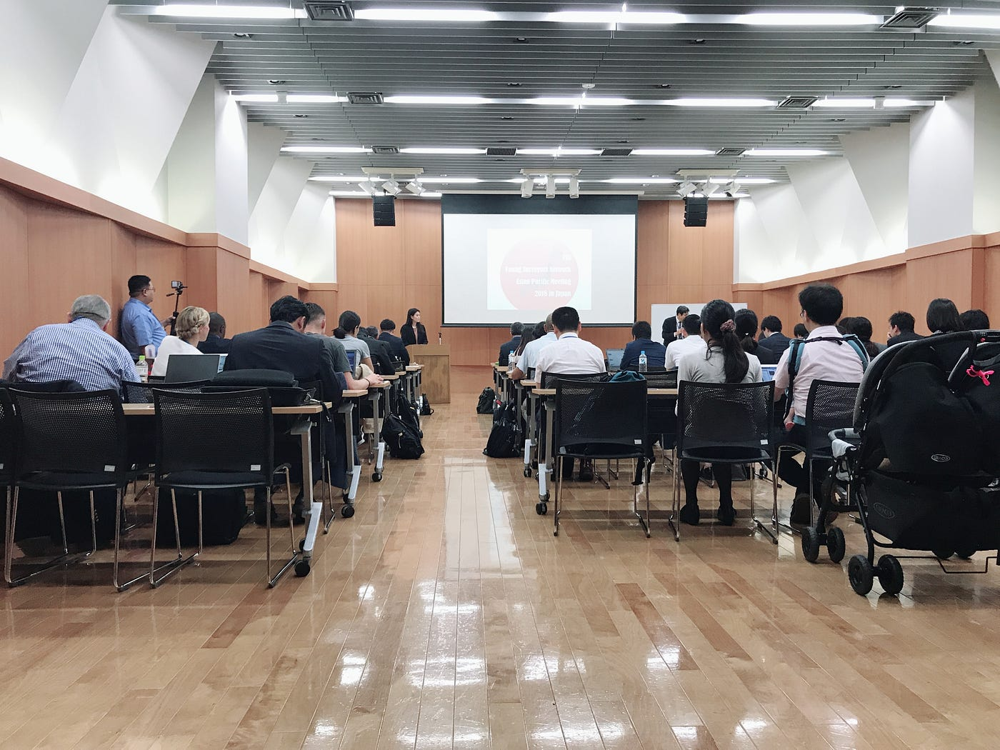
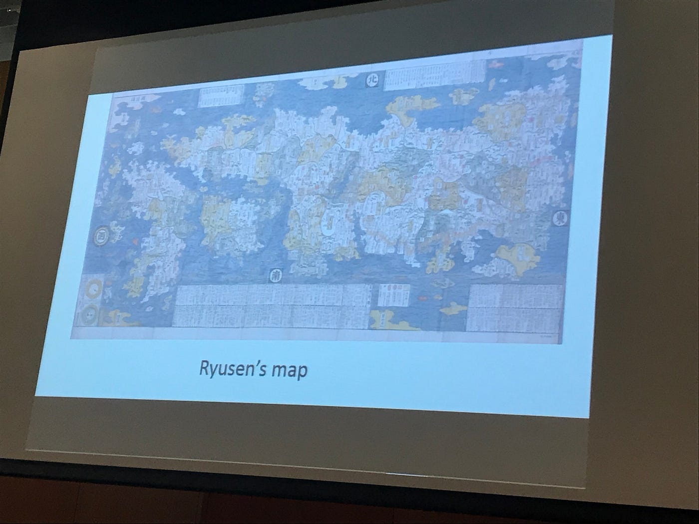
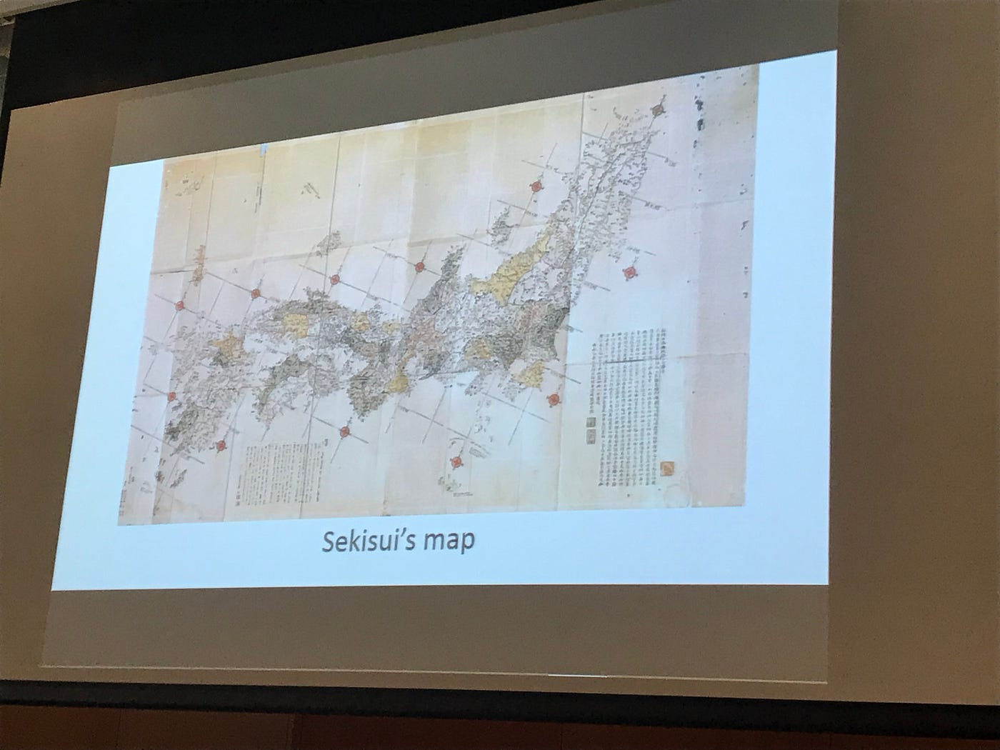
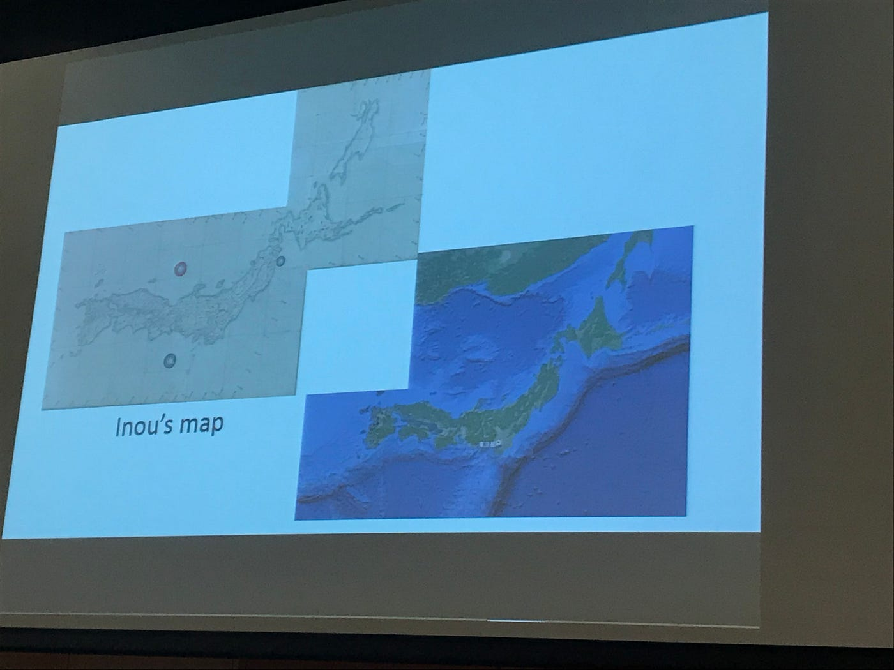

### FIG 2018 6/15

３年の城田由紀乃です。初めてMediumを使うので間違い等あるかもしれませんがよろしくお願いします。

ボランティアスタッフとして参加した国連FIGｘ古橋研究室 Young Surveyors Asian Pacific Meeting 2018 in Japan 1日目の11:30から行われたマツザキコウタロウさんのSurveying History in Japan についての報告をさせていただきます！

この回は日本の地図に関する歴史が紹介されました。伊能忠敬以前にも様々な方が地図を作っていたことを知りました。

受付の係りをしたりしたことで、多くの外国人の方と接することができました。しかし、自分の英語のスキルや、どの国の方なのかわからない不安からなかなか積極的に会話ができませんでした。セルフィーも撮っていないので、反省点がたくさんあります.....

これからこのような機会がまだあると思うので、次はもっと頑張りたいと思いました！

他の発表も聞きましたが、私の担当した歴史の回は昔の資料が見られたり、内容も興味深くてとても面白かったです！

最後まで読んでいただきありがとうございました！
