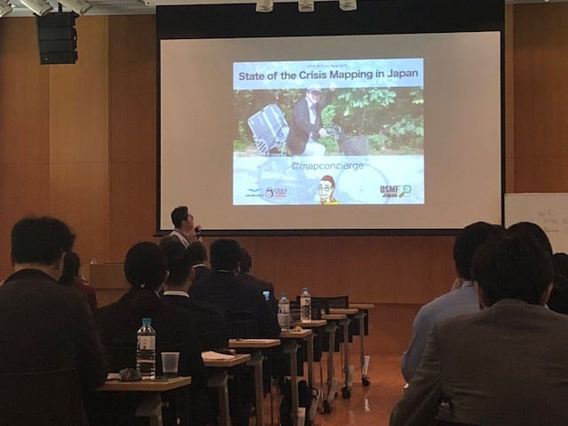
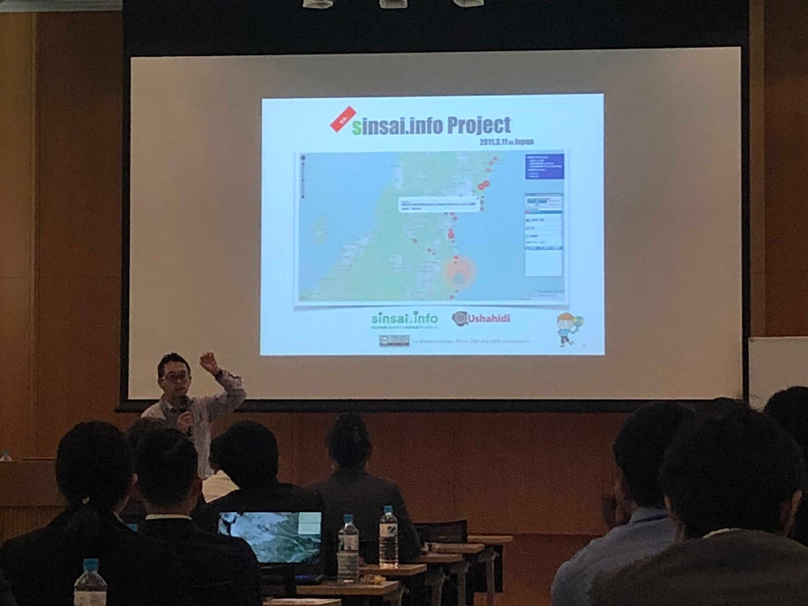
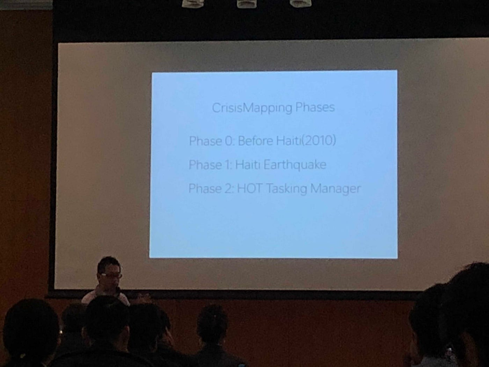
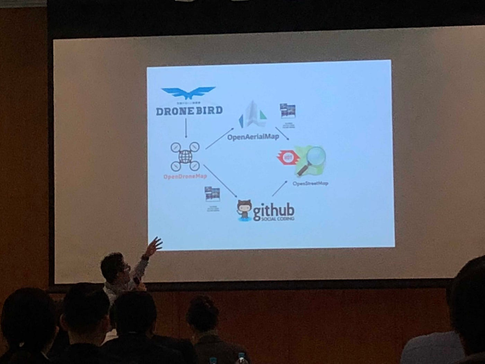
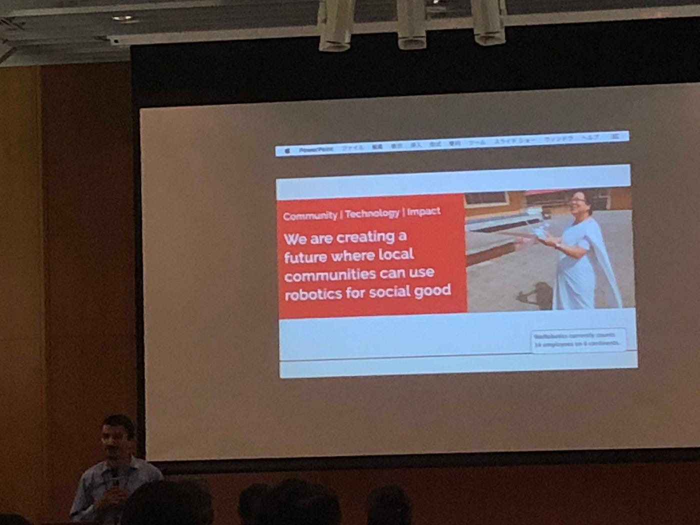
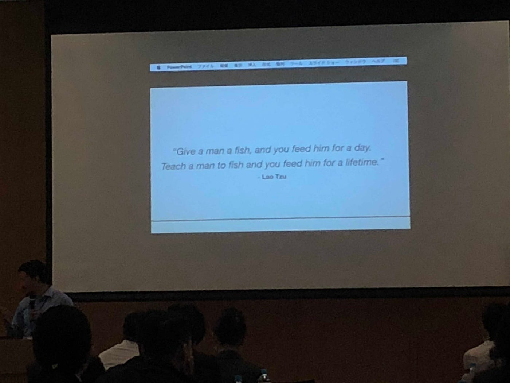

### FIG 2018 Day1 ＠表参道Astudio~Session 2~

夜分遅くにお送りいたします。お初お目にかかる関街です。今回は6/15に青山学院Astudioでおこなわれた[Fig Young Suveyors Asian Pacific](http://www.jsurvey.jp/jfs/FIGposter_jp-2.pdf)のSession 2についてレポート！我らの古橋先生の取り組みとネパールのダンディなオジサマの試みについてお伝えいたしましょう。

＃State of the Crisis Mapping in Japan

まずは古橋先生から。2010年に発生したハイチでの地震の際にスタートされた上記プログラム、[Open Street Map](https://openstreetmap.jp/)を用いたクライシスマッピングは当初40人弱で活動していたとか。翌年に”仮により大きな地震が起きるとしたら…クライシスマッピング作成のメソッドは必要不可欠になる。”と思ってたところ2013年に福島で大地震が発生。事実は小説より奇なり、と言わんばかりのタイミング。この時僕は中学の教室の机の下で半笑いガチビビりをかましてたのは別の話… 古橋先生はこれを機にOSMを用いてProjectをLaunch、多くのマッパ―が参加しました。

その後、伊豆大島でタイフーンが発生。その際にはヘリコプターによる航空写真によってクライシスマッピングを作成。インターネット上でたった一日で実用的な地図情報を提供することが可能になりました。めっちゃ技術進歩。自分はこれ書くのに一週間かかってるのに。

フィリピンで同様のことが起きた時には自分たちの航空写真と国が持つ既存のものとを比較できるよう地図情報を提供、エボラ出血熱の流行時にもクライシスマッピングを行いました。2015年のネパールでの地震時には生徒を動員してより多くのマッパ―を協力者に。古橋先生絡みのモノだけで世界地図作れるようになったりするんですかねって規模。

”これらの活動の更なるフェーズへの移行、それはドローンによるより精密な航空写真の提供である。”と古橋先生。あの先輩方が参加しているドローンバードプロジェクトがその一つです！

それと関連して[Fukushima Wheel Project](https://fukushimawheel.org/)も紹介、自転車による360度パノラマカメラを装着し駆け巡る。クライシスマッピングメソッドの作成はここまで来ているわけですね。ちなみにドローンバードはあのサンダーバードをモチーフにしてるそうな、あのムービーは子供心が刺激されてエモさ感じてました。

#Digitize mapping process

今度はネパールの方のターン。割とアナログが主流なネパール、ローカル地域をデジタル化する様々なプロジェクトについて説明。こう考えると日本はぬるっとデジタライズしたんやなと…NACSAによるプライベートコミュニティでのマッピング、GSIトレーニングプロジェクト、電子アプリによるローカルとのデジタライズギャップの縮小を具体的なものとして紹介。ドローンについても”地形学的計測を行う手段の一つとして考え、建設的にも役立てている。”とおっしゃっていました。

Flying Labsによるドローン利用などの説明も行い、Session 2はディスカッションへと移っていきました。

かたく長いブログになってしまった…最後までご拝読ありがとうございました。留学中にも感じましたがいろんな英語の話され方があって順応力が求められますね。ドローンのプロジェクトやマッピングに関しては、今地理に授業は中学や高校ではとても隅に追いやられているわけで。若い人たちをうまくゲーム感覚的に引き込み、可能性や独自性、将来性を理解してもらえるかはこれからの発展にかかわってくるのかなと感じました。

以上、丑三つ時の関でございました。いい夢を。
