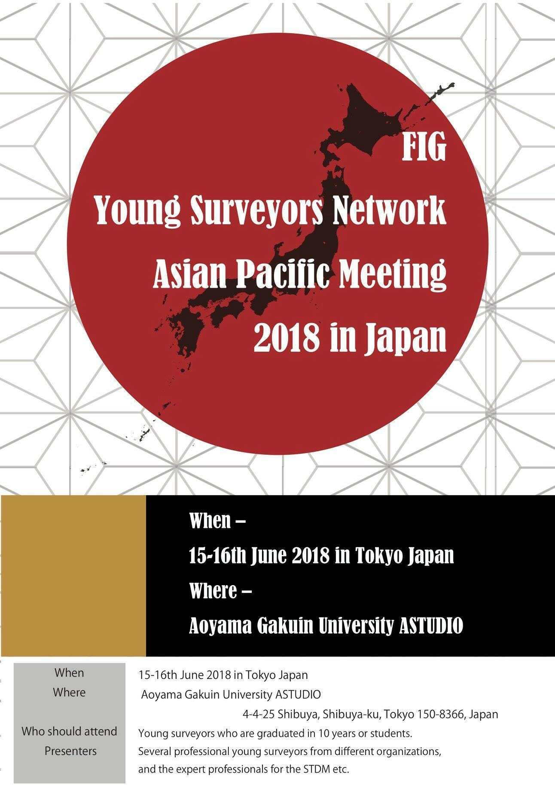
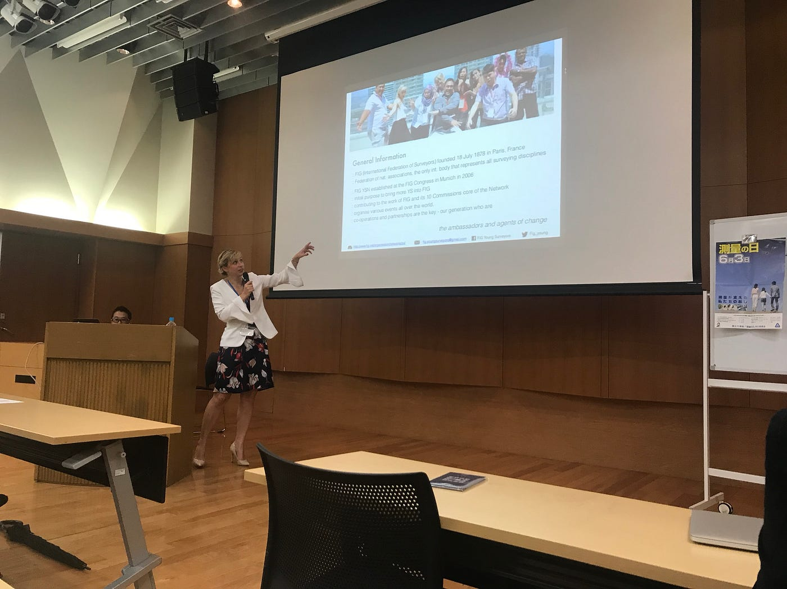
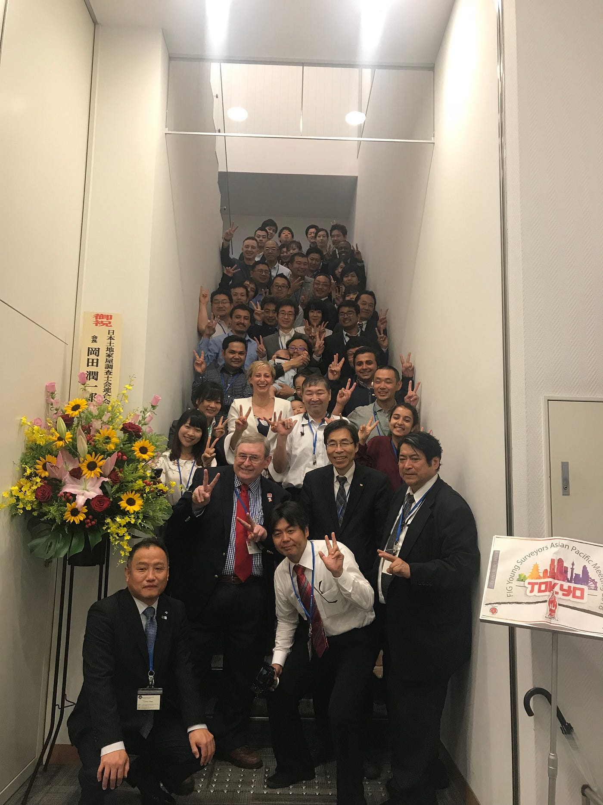

### FIG ×古橋研究室 2018 1st day

#### 初めまして、3年の末光香織です。

今回2日間に渡って開催された、FIG Young Surveyors Network Asian Pacific Meeting 2018 in Japan の1日目に参加させて頂きました！

Primary Sesionの Eva-Maria UngerさんによるFIG Young Surveyors Network Volunteer Community Surveyor Programについて報告します！

#### 開催目的

FIG財団は途上国の若手調査員を招待する会合を支援している。東北大震災から7年を迎えた今、災害からの復興するための知識や災害時に何をすべきかを分かち合い、若手測量者の育成やネットワークを強めることである。

まず最初に基本的な約10個あるFIGの任務についての説明。これらの活動は全て自分自身の取り組み次第だと言う。「自分から動きだして私たちの活動に参加しよう！！」と語りかけていた。

そしてvolunteer community surveyors programについての説明。プロジェクトにはイベント、教育方法の一つであるメンタリング、政策問題がある。

その課題のいくつかとして、70パーセントの文書化されていない土地や気候変動の影響の増大、人口増加の促進、限られた土地資源に対する紛争の増加が挙げられる。

このような問題はどうしたらいいのか、、。

「そう！私たちにはツール、技術、知識があるではないか！明日の測量者、世界に変化をもたらすのは私たちである！」

最後に

「あなたの考える情熱とはなんですか？」

参加者の方々にマイクを向けて聞きに行く姿が見られた。Evaさんに当てられた人もこの時は少年に返った様に元気に答えていた。

終始熱く語っており、我々にもその情熱が深く伝わった時間であった。

#### 集合写真

参加者の集合写真を撮らせて頂いた。

受付の仕事もしていたので、一言二言ではあるが数名の方達が

「この様なカンファレンスは初めて？是非参加してみて！」「ありがとう、お疲れ様」などと仰ってくださった。

次回またこの様な機会があれば積極的に参加しそれまでに英語力をさらに上げなければと痛感した良い1日であった。
