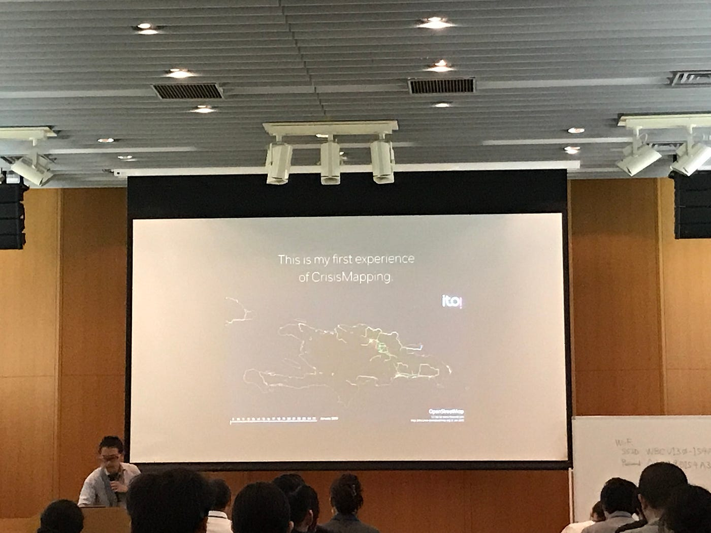
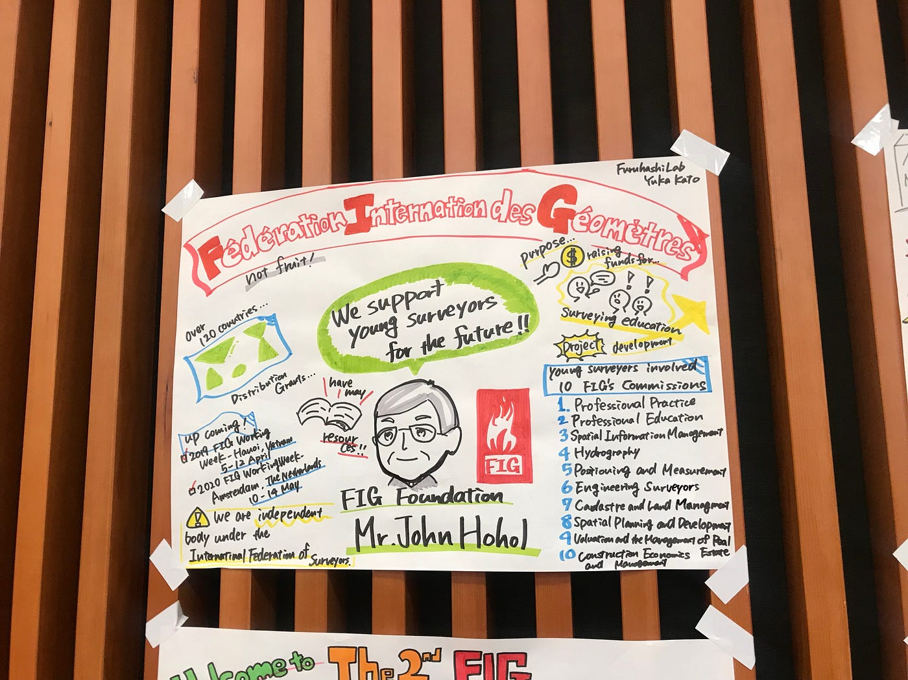

### 「英語って難しい…。」

そんなことを改めて感じた、大津綾乃のレポートです。

私は、6/15(金)に国連FIGと古橋研究室の合同ゼミのYoung Suveyors Asian Pacific Meeting 2018 in Japan 1日目のみに参加させていただきました。

ゼミ生は、国際会議への最低一回以上の参加が絶対条件です。このイベントの機会を逃すと、次は海外での参加しかないという状況下で、まだ一度も未参加の私は、お金がかかるので、海外には行きたくないという思いで、このイベントに参加した正直な理由です。当日まで、ほんとのところを言うと、このイベントがどんなことをするのか分からずに渋谷へ向かってました。

そんな気持ちの中向かったこのイベントで、前半は受付を担当しました。一気に来場者が来られた時は、パニックになりながら名刺を渡していました。また、4割の方が外国人で、留学帰りにも関わらず、受付の際にパッと英語が出てこず、困った一面もあり、もう少し英語の勉強を徹底しなければと思いました。

またイベントの講演の際には、古橋先生のお話とネパール人のUttamさんのお話を聞く機会をいただきました。古橋先生のはじめてのマッピングのお話や、クライシスマッピングをしなければいけない理由などを説明してくださり、とてもタメになりました。

### 裏で行われていたこと

この講演の行われていた裏では、リアルタイムで、グラフィックレコードという作業も行われていました。通称グラレコとも呼ばれるこの作業では、いろんな方が喋っていた内容を理解し、重要な点をイラスト化することで、よりわかりやすくすることができます。先輩方が中心となり、この作業を行なっていましたが、英語力が不十分な自分には到底できないことだと思いましたが、自分の番は必ずやってきます。それまでには英語力を上げます。写真は、先輩のグラレコです。

留学4ヶ月を経て、英語に慣れたのではと感じていた私ですが、このイベントでのオールイングリッシュの講演は、とても難しかったというのが第一印象でした。しかしその中でも、自分がゼミの中で行なっているクライシスマッピングの作業の重要性に気づかされた1日でもありました。
