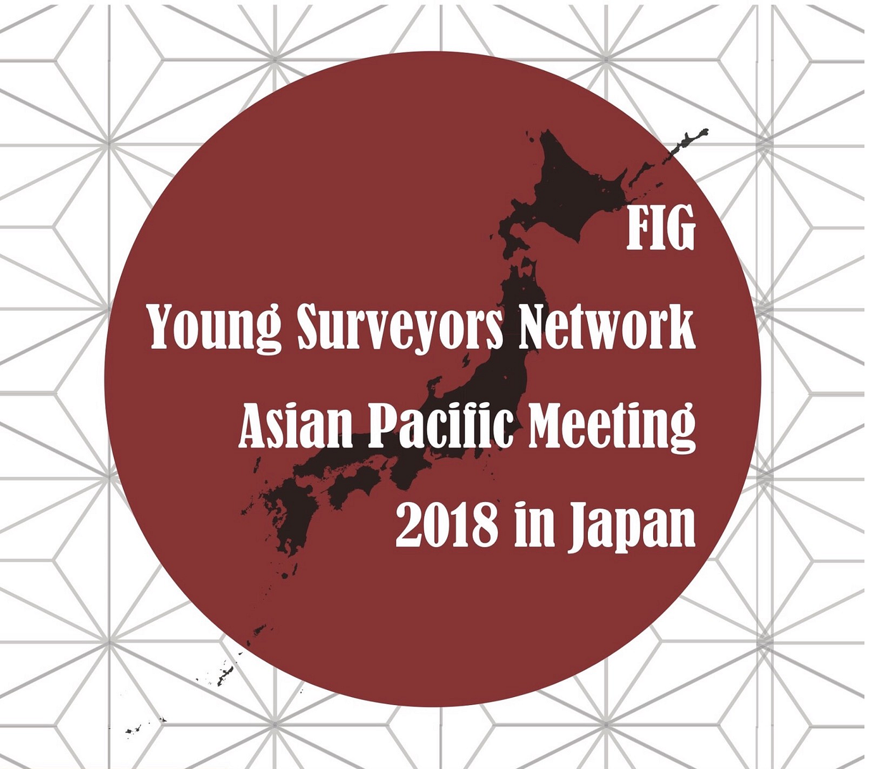
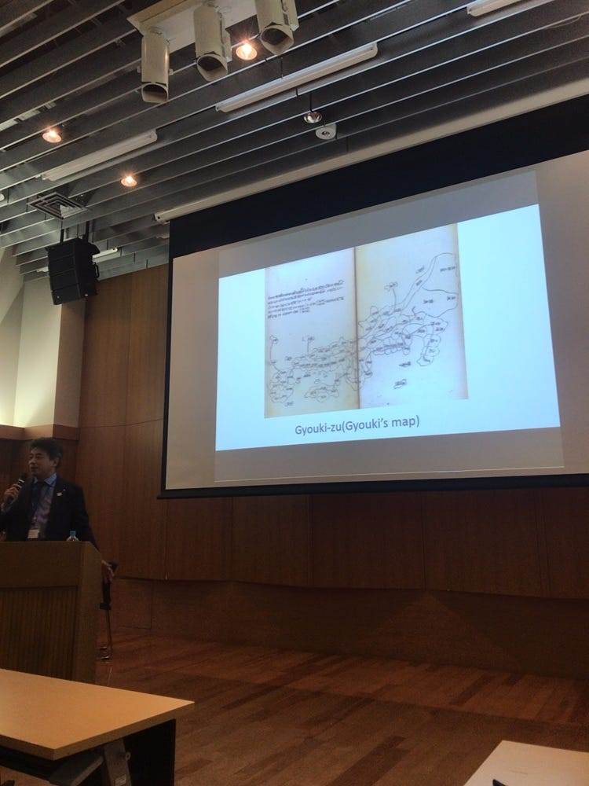
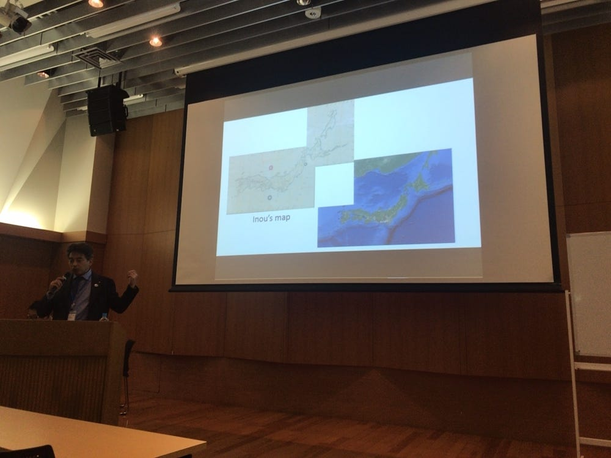
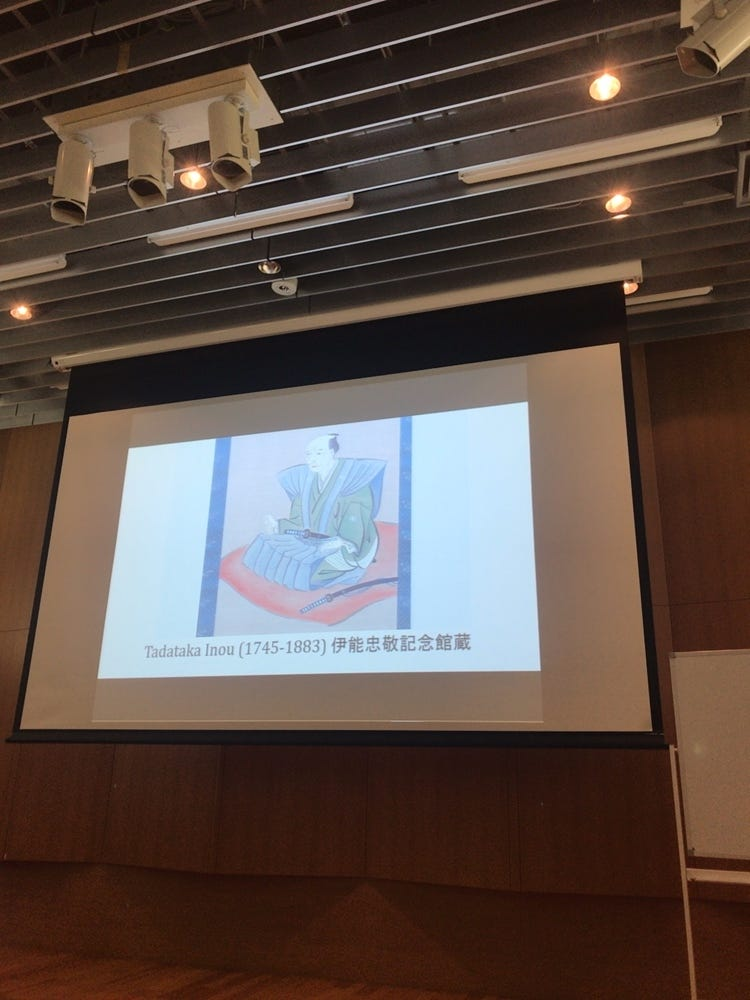
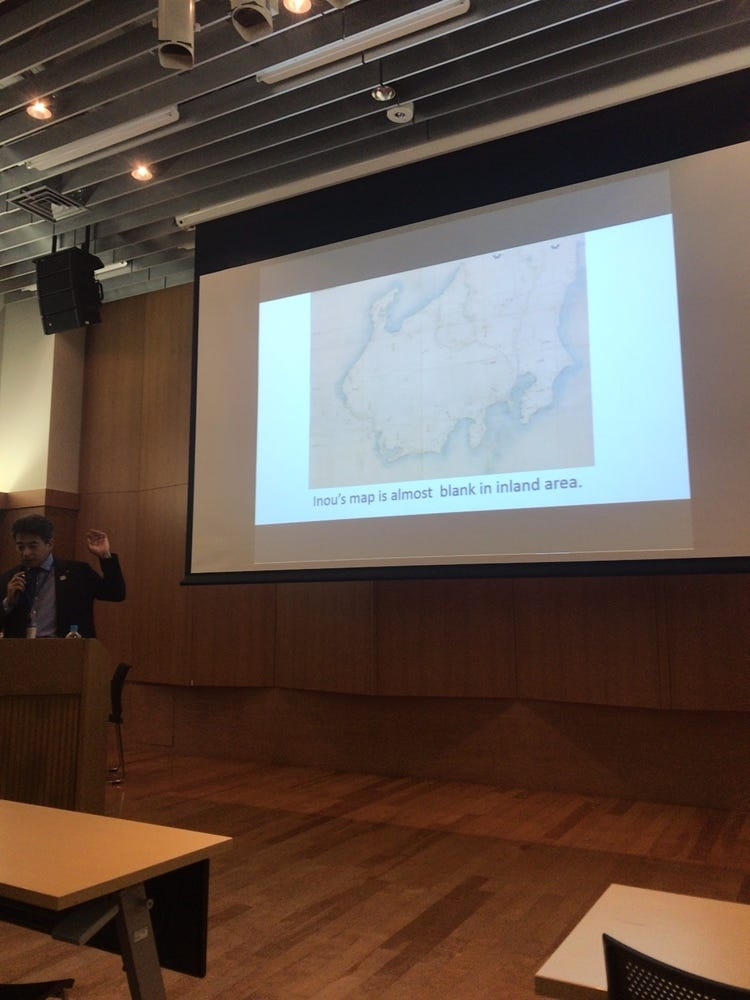
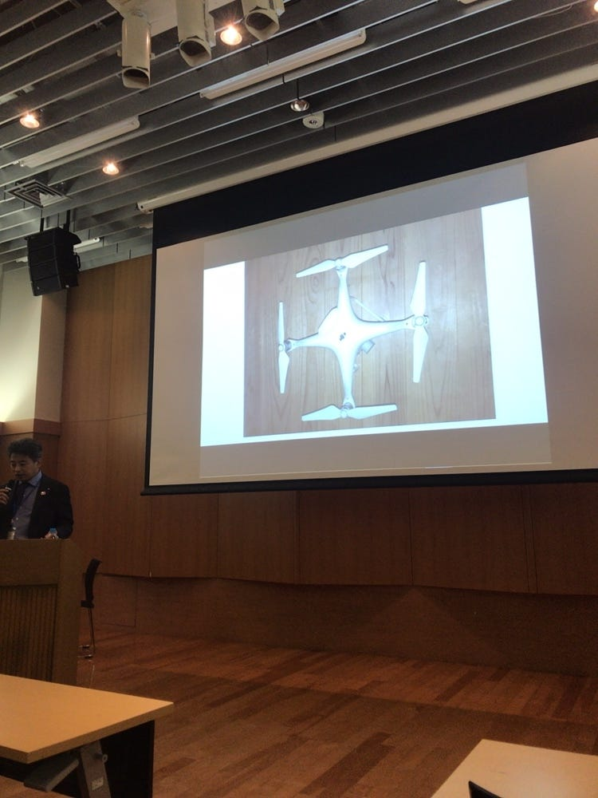

### 国連FIG × 古橋研究室 2018 Day1

初めまして、松本洲です！今回初めてゼミ生の一人として国連FIGｘ古橋研究室 Young Surveyors Asian Pacific Meeting 2018 in Japanという国際カンファレンスに参加させていただきました。そこでの収穫をまとめていきたいと思います！

1,まずはこの会議はどういうものなの？という点ですが、簡単に言うと地図の在り方についてです！今までの地図の在り方、現在の地図が我々に与えている影響、そして抱えている地図の問題をどう捉え解決していくかということです。

2,私はマツザキコウタロウさんのSurveying History in Japan に参加させていただきました。ざっくり申しますと、「地図の歴史」についてです。日本で最初の地図がつくられたのは17世紀だそうです。意外と最近。。ぎょうき図というもので、マツザキさん曰く、「not creative」。地図のない日常なんて考えられませんよね。それまでの人たちは迷うことはなかったのかな？

19世紀初期になるとついにあの有名な伊能忠敬さん登場です！しかし、50歳を過ぎてから地理学の勉強、調査、地図作りをするなんてすごいですよね。。沿岸部は正確だったんですが、内陸部には欠点もあったんです。

現在私たちの住む世界では技術が進み、ＧＰＳやドローンが使われより優れた地図ができあがっています。また、今私たちに課されている課題は「必要性を考えた地図」を作ること、「未来を考え調査を続けること」の二点にあります。まだまだ地図作りは発展途上ということですね！

3,最後に、このカンファレンスで私は案内係を外でしていたのですが Thanh Van Hoangさんにどこに会場があるのですかと聞かれたので英語で道案内をしました。このような会議に参加でき、自分自身少し成長できたと感じています。このような貴重な経験をこれからもできると思うとすごく楽しみです！

以上、古橋研究室3年の松本でした。ありがとうございました！
