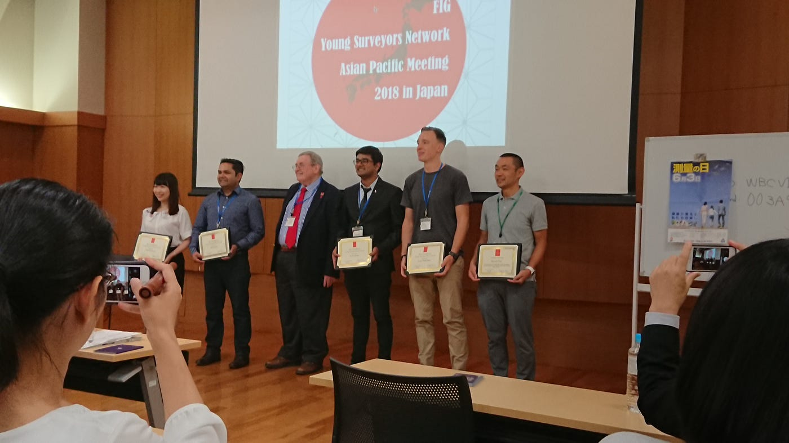
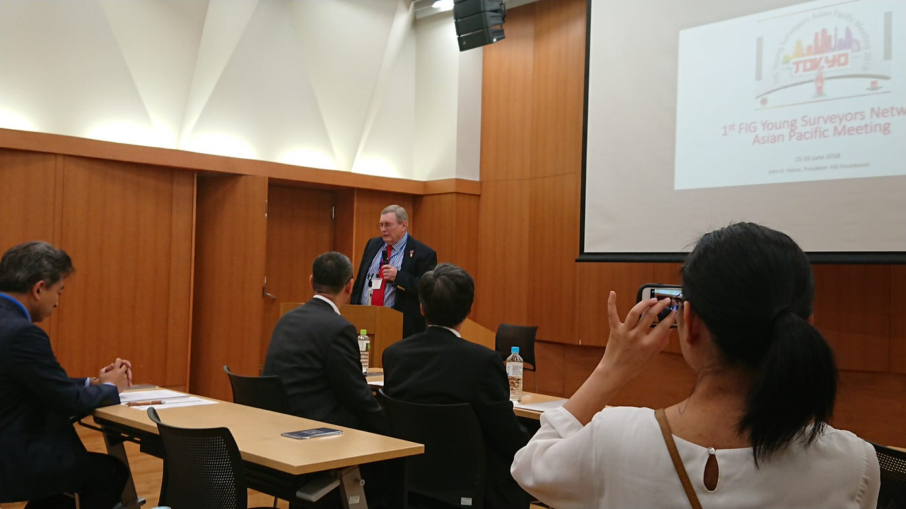

### FIG 2018 1st Day

こんにちはもしくはこんばんは、古橋ゼミ所属３年田村康介です。

6月15日（金）、16日（土）の2日間にわたり、The 2nd FIG Young Surveyors Network Asian Pacific Meeting 2018 in Tokyo が開催された。私は今回、会議1日目に参加させていただいた。

今回行われたカンファレンスの主目的は、世界中のSurveyor,つまり測量者の自然災害における必要性、及び若者へ向けて測量という分野を浸透させる手段を検討する目的で開催された。

このカンファレンスがアジアで行われるのは２度目、そして日本にて開催する事例は、今回が初めてである。測量分野における日本の技術は世界レベルでも注目を集めているということになる。

私が担当したスピーチは、初日の最初に行われた Primary Guest Speech だ。このスピーチでは、FIG Foundation 勤務の Mr. John Hohol, そして日本土地家屋調査士連合会に加盟する岡田潤一郎氏が壇上に上がった。

スピーチの内容は、まずFIG Foundationにの概要と、当組織の活動目的についてHohol氏から説明があり、FIG がパリにて発足し現在に至るまで、多くの測量者の育成に成功したことが語られた。また、近年測量者の平均年齢が上昇しつつあり、Young Surveyors を掲げている以上、若者へ測量を浸透させる必要性を検討しているとのことだ。

次に、日本土地家屋調査士連合会所属の岡崎氏が日本語によるスピーチを行った。スピーチでは、日本の測量分野の開拓者ともいえる伊能忠敬を例に挙げつつ、日本における地理空間情報分野の活動やシンポジウムの開催といった、発信を行っていると語った。堅苦しさのない語り口であり、「測量の日」といった豆知識も交えながらのスピーチを行った。

お昼休み、カンファレンス参加者がサンドウィッチやうまい棒をほおばる中、彼らとの交流の機会があった。彼は大学でも測量を専攻しており、今回のカンフェレンスは非常に刺激になると語った。話の流れの中で、私自身の専攻についても話す機会があり、GSCにおいて自分がなにを学んでいるか、アピールすることができた。それを聞いた彼は笑顔で、「応援しています」と激励を送ってくれた。また、カンファレンスの内容についても少々話し合いをしたのだが、専門知識の乏しい私相手ではいささか物足りなかったのではないかと懸念が残る。

まだまだ未知の分野が存在することが自身の中でも明らかになった。このカンファレンスへの参加は間違いなく自身の刺激になったと思えた。

以上、3年田村康介でした。
