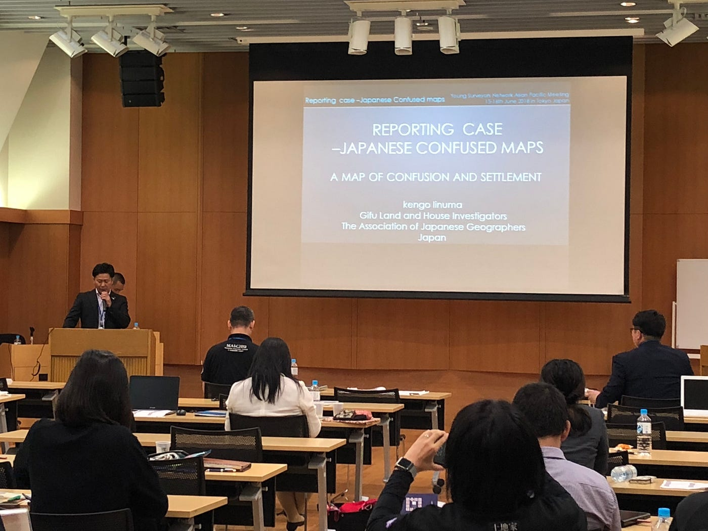
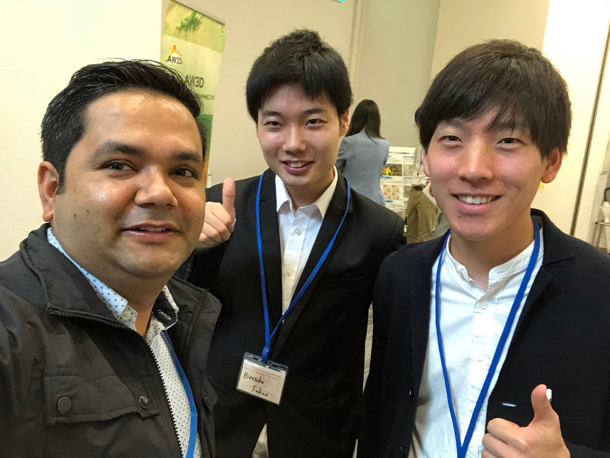

### FIG YSN 2018 in Japan Day2 report

日本での地図混乱地域について〜飯沼健悟〜

> **はじめに**

はじめまして。

古橋研究室三年の牧利亮（まきとしあき）と申します。

FIG YSN 2018 in Japan Day2に参加させていただいたので、報告をさせていただきます。

> **カンファレンスの目的と概要**

> **[Purpose of FIG Young Surveyors Network**](http://www.fig.net/organisation/networks/ys/)

・To improve the number of young professionals participating within the FIG

・To help young professionals in the beginning of their careers with contacts.

・To increase co-operation between the commissions and the students and young professionals network.

> 簡単にまとめると、

> 若い測量技術者の育成を目指して、現在の活動を報告し協働の可能性を見いだすことがカンファレンスの目的であると感じました。

> **セッションの内容解説**

土地家屋調査士の飯沼健悟さんによって、日本の地図混乱地域についてお話がありました。概要として、現在、日本で土地家屋調査のために用いられている地図は江戸時代に作られた絵図が用いられているため、実際の土地家屋の位置と誤差があるということでした。江戸時代には、年貢を納めるために、誰がどこにいるのかという情報のみ分かればよかったものの、現在は、土地や家屋も個人資産として定義されるようになったので、正確な土地家屋の領域を公図から詳細に把握できることが重要であるため、誤差があることは非常に問題であるとお話をされていました。その実態を「日本の地図混乱地域」をして説明されていました。

> 最後に

このカンファレンスでは、たくさんの国から、測量技術者がいらっしゃっていました。そのなかで、Nabin Paudelさんとお話をさせていただきました。Nabinさんは、現在ニュージランドのオークランドで働かれていているそうです。何をされているかお話をされていましたが、内容が難しくて何をされているのかわかりませんでした…カンファレンス全体を通して、私たちが暮らしている地域を地図として可視化し正確に把握すること求められる“こと”や“もの”が、まだまだたくさんこの世界に存在していることがわかりました。ゼミの研究テーマを考える上で考え方の幅を広げる貴重な機会になりました。
