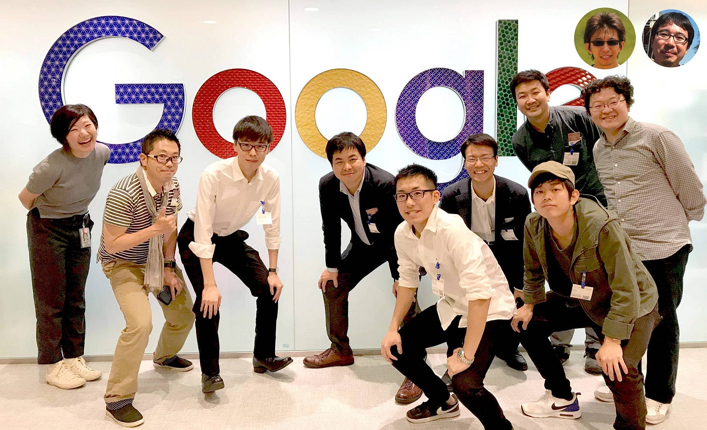

### Google Earth Engine のススメ

衝撃的な[Google Earth](https://www.google.co.jp/intl/ja/earth/)の登場から13年が経った。

> “Organize the world’s information and make it universally accessible and useful.”
この世界の情報を整理し、誰にでもアクセス可能で有用なものにする。

> [Google](https://www.google.com/about/our-company/)

1998年にガレージから始まり、多くの有用なウェブサービスを世に出してきたGoogleが MapsとEarth をローンチした2005年。先の言葉に付け加えるとすると **”この世界の地理空間情報を整理し、誰にでもアクセス可能で有用なものにする。”** ことを実現するためにGoogle Maps やGoogle Earth には様々な機能や拡張が加えられてきた。

Google Earthだけでみてもそのユニークダウンロード数は10億を超え(2011年10月に突破)、Google StreetViewと連携し都市部のウォークスルーが可能に、Google Ocean として海中にも潜れるようになり、三次元表現の高精細化、iOS/Android対応のモバイル版ローンチ、VR対応、マルチディスプレイによるパノラマ表現として[Google Earth Liquid Galaxy](http://liquidgalaxy.org/)の進化、そして[Google Earth Proの無料化](https://www.google.com/intl/ja/earth/desktop/)と[Google Earth Enterprise のオープンソース化](http://www.opengee.org/)までが一気にすすみ、Chrome限定とはいえブラウザのみでの [Google Earth ブラウザ](https://earth.google.com/web/)が現時点では最新のGoogle Earth だ。

とくに、蓄積された膨大なデータの総量もさることながら、その品質向上の結果、閲覧可能な衛星画像や航空写真、そして三次元データの精度と美しさが劇的に改善されている。「雲がない！」「こんなところまで三次元化されている！」と改めて閲覧しても都度驚きと発見がある。

ただ、一つ物足りないとすると、それらはあくまで閲覧用であって、膨大なGoogle Earthに蓄積された地理空間情報に直接アクセスし解析し、二次利用するような使い方が行いにくいことである。

そこで[Google Earth Engine](https://earthengine.google.com/)の出番である。Google Earth に蓄積されたすべてのデータではないけれども、NASAやJAXAなどの宇宙機関から提供された地球観測データが 17ペタバイト以上すでに格納されており(2018年3月現在)、約30年分もの歴史を持つLANDSATシリーズを含め、時間軸を自由に移動し、タイムラプスなどの地表面の変化を追ったり、雲が除去された扱いやすいデータを用いて自分なりの解析アルゴリズムを実装したり、いい意味でやりたい放題な自由がある。個人的には Google Earth はついにここまでやってきたかと感慨深く思うほどである。

個人的にGoogle Earth Engine に触れたのは 2014年ロンドンで行われた [Understanding Risk 会議](https://understandrisk.org/event/2014-ur-forum/)でのワークショップ。まさに自分のやりたかったことが実現できる驚きとともに少しずつ試し始めていたが、周りで使っている人が殆どおらず、英語のドキュメントとの格闘の日々であった。2017年のJpGu(日本地球惑星科学連合大会)にてGoogle Earth Engineのブース展示がされ、2018年には日本ではじめての [Google Earth Engine mini-summit Tokyo](https://events.withgoogle.com/earthengineminisummit2018tyo/) が開催。幸いにしてその場に参加でき、多くの Google Earth Engine ユーザーがリアルにつながりはじめた。

そこでの議論とその後のGoogleさんも交えた教育関係者同士の会合での結論は「今こそボトムアップ型でGoogle Earth Engineの日本語コンテンツを充実させていくタイミングではないか！」ということ。

そこで、[Google Earth Engine ブログ](https://medium.com/google-earth-engine)を非公式ながら立ち上げ、それぞれの興味、それぞれの視点、それぞれの使い方を自由に投稿し集約する形で、情報共有する場を用意し公開に至った。

[google-earth-engine
Google Earth Engine User community blog (Un-official)medium.com](https://medium.com/google-earth-engine)

我こそは Google Earth Engine について熱い想いがある！という方、ぜひ[こちらのGitHub Issue](https://github.com/googleearthengine/training/issues/1)にMEDIUMアカウントを記載いただければ、よほどの理由がない限り登録させていただき情報発信いただく。

唯一の条件は、このブログでの情報発信コンテンツのライセンスは、比較的自由にコンテンツの二次利用が可能な [CC BY 4.0 ライセンス](https://creativecommons.org/licenses/by/4.0/deed.ja)とさせていただく。著作権者は投稿者となる。

Happy Earth, and Happy Remo-thon!!

[© mapconcierge, CC BY 4.0](https://creativecommons.org/licenses/by/4.0/deed.ja)
