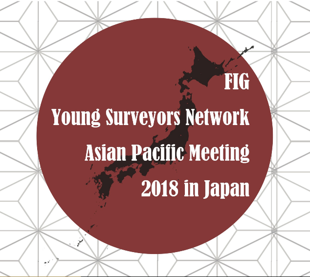
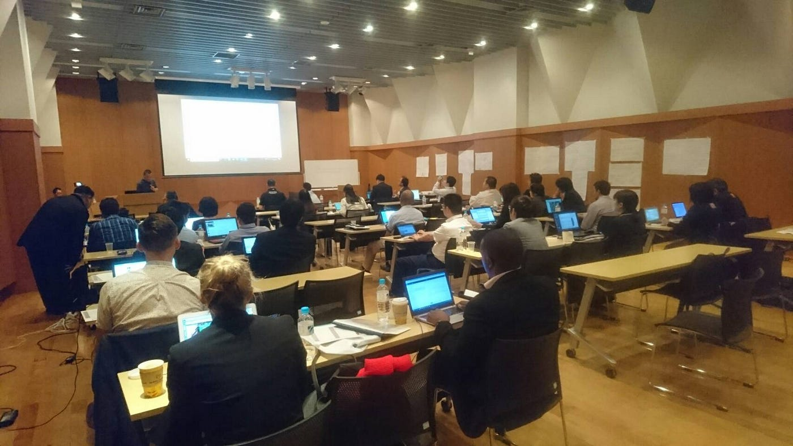
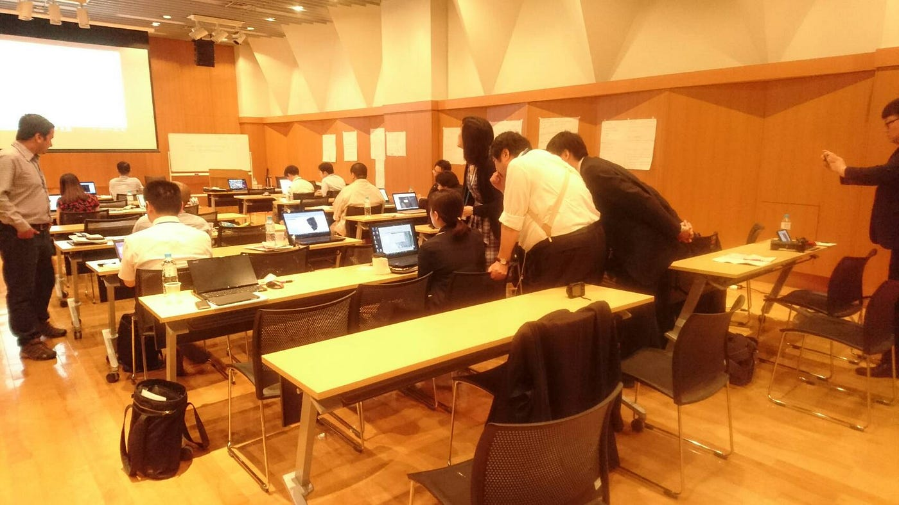

### 国連FIG×古橋研究室 DAY2

どうも皆さま、

#### _**おはようございます！_**

#### _**こんにちは！_**

#### _**こんばんは！_**

古橋研究室3年板垣勇渡です: )

2018/6/16(土)に、”_**FIG Young Surveyor Network Asian Pacific Meeting 2018 in Japan”_**に参加してきました！

今回はこのカンファレンスは一体何なのかということと、プログラムの一環で行われた、_**STDM Tainer of Traning_**に参加し感じた事を中心に書いていこうと思います！

> _**カンファレンスの目的_**

**Purpose of FIG Young Surveyors Network**

- To improve the number of young professionals participating within the FIG.

- To help young professionals in the beginning of their careers with contacts.

- To increase co-operation between the commissions and the students and young professionals network.

([http://www.fig.net/organisation/networks/ys/](http://www.fig.net/organisation/networks/ys/)より）

### → FIGに参加をする若者の育成およびコミュニティの形成し、いざという時の為のネットワークを築く。

> _**STDM Tainer of Traning で何を行ったか。_**

今回のカンファレンスでは、QGISを使い、STDMの使い手を育てるプログラムが行われた。私が参加をしたセッションでは、Build a Database Making Reports amd Documentsというテーマでトレーニングが行われた。

**・編集する画像を選択する。
・画像を編集する人の情報入力 。**

この二つのことをこのセッションで行った。

どうやらもう少しこのセッションで進む予定だったそうだが、いくつかの問題が発生し、うまく進まなかったようだ。

> **何が問題だったのか。**

このセッションでやったのは二つのことだけだ。なのに何故うまく進まなかったのだろうか。

①** 言語の問題**
カンファレンスには様々な国の方が参加をしていた。
従って、カンファレンスの説明は英語で行われていた。
その為、複雑な機能の説明になると中々、日本人の方は理解するのに苦労していたようだ。それを察してか、所々日本語での説明もあったがそれでも上手く扱うことができていないようだった。

日本人→日本語
海外の方→英語

での説明と結果としてなっていた。
それで皆が理解でき、スムーズに事が進めば良かったが、それでも上手くいかない方が多くいた。その為、全体がバラバラになってしまっていたように感じた。

②** 機器の問題
**今回のトレーニングで使ったソフトはWindows向けのものであった。その為、Macを使用している人が使えないという問題が発生していた。

③ **バージョンの問題**
ソフトをインストールした際、言語の選択ができるのだが、英語を選択すると何事もなく利用ができるのだが、日本語を選択すると上手く起動しないという問題が発生していた。その為、日本人の参加者の方は困惑をしていたように見えた。

このセッションに参加をしていた方々にお話を聞いて回った。
韓国から来られた方やニュージーランドから来られた方など、様々な国の方がいらっしゃったが、英語での説明がきちんとある事、周りの方の殆どが英語を話せるからとても助ると仰っていた。

> **今回参加した感想**

大変多くの国の方が参加をしていて驚いた。トレーニングの際、分からないところを違う国同士の人同士で教えあっていたところがとても印象的出あった。それと同時に、英語の重要性にも気づいた。英語ができなければ、分からないところがあっても相談ができないし、コミュニティの形成も中々できない。国際会議という貴重な機会を無駄にしない為に、今後は英語の勉強に力を入れていきたい。
