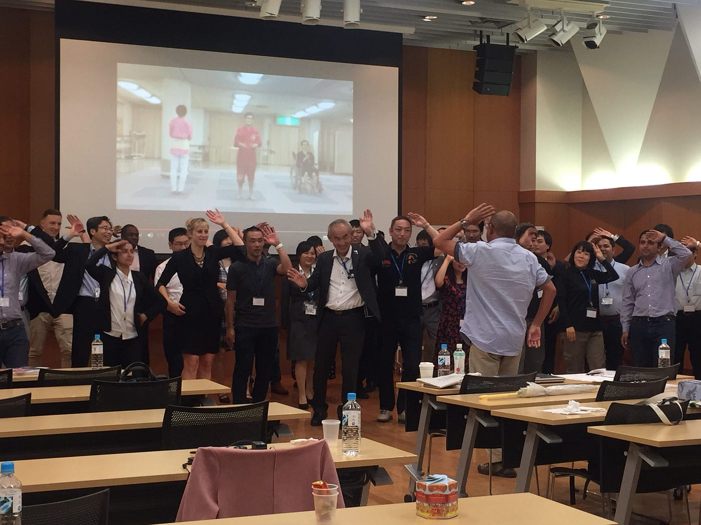
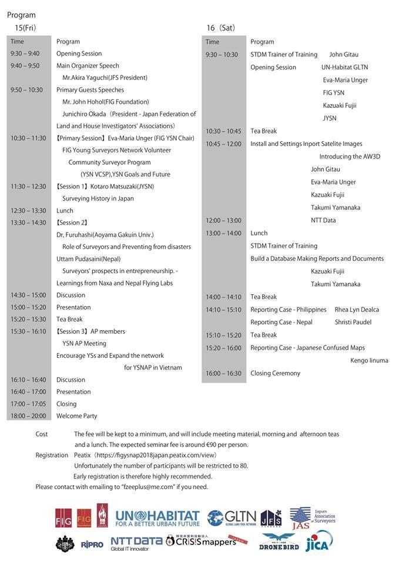
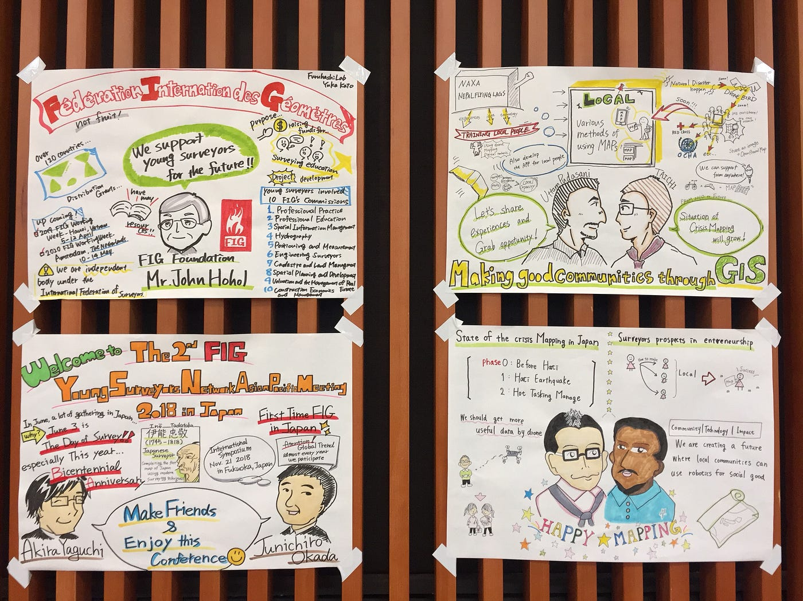

### FIG Young Surveyors Network Asian Pacific Meeting 2018 – Day 2 (6/16 Sat)

先週の6/16土曜日に、_**国連FIG×古橋研 Young Surveyors Network Asian Pacific Meeting 2018 in Tokyo-Day 2 _**に参加しました！

FIG:国連測量者連盟(http://www.fig.net/about/index.asp)による、主にアジア圏の若い測量士の育成とネットワーク形成を目的とした会議です。

開会式から皆で炭坑節を踊り、とてもにぎやかに始まりました！

プログラム↓

> Opening Session: **STDM Trainer of Training**

最初はJoan Gitauさんによるセッション。

まずは、Global Land Challengesとして

> only 30% cadastral coverage(70% need to secure tenure)

70%の土地が整備されていないという問題点があります。

生活の平等性や安全性という観点からこの土地を整備することが重要となるので、

これをSTDM(Social Tenure Domain Model)で手助けしよう！STDM Trainerを育てよう！ということで、セッションが始まりました。

QGISを使った実践的な講義もあり、多少の問題は起きながらもとてもわかりやすく、ソフトウェアの使い方を教えてもらえました。

> Reporting Case in Japan-飯沼健悟さん

日本の地図に起きている誤差について…

絵図を基にした現在の地図には土地や家の位置にずれがあり、正確な情報が必要だとお話をしていただけました。

日本の地図の変換の歴史は、知らないことばかりでとても貴重なお話でした。

> Reporting Case in Nepal

Shristi Paudelさんによる、実際に起きたネパール大地震時の事例…

STDMを使用し途上国の調査を行ったこと、使いやすさ等を事例を交えながら紹介していただきました。

> Reporting Case in Philippines

Rhea Lyn Dealcaさんによる、フィリピンでの事例紹介。

STDMの利用と更なる拡大のための調査やマッピング等を行い、

国、国外にもコミュニティが広がったことを紹介していただけました。

> まとめ

ポケモンgoをやりに行ってしまいお話を聞けなかった時間もあるのですが、どのお話もとても貴重なものでした。

このカンファレンスの目的の一つが「繋がりをつくる」ことであるように、この日のこの場もいつでも、地図を作ることは繋がりを作ることができると、とても感じました。

最後に…

今回もグラレコチームの作品は素晴らしかった‼︎

形に残すことで、より繋がりが強くなれる気がします。

以上、山口詩織でした。
