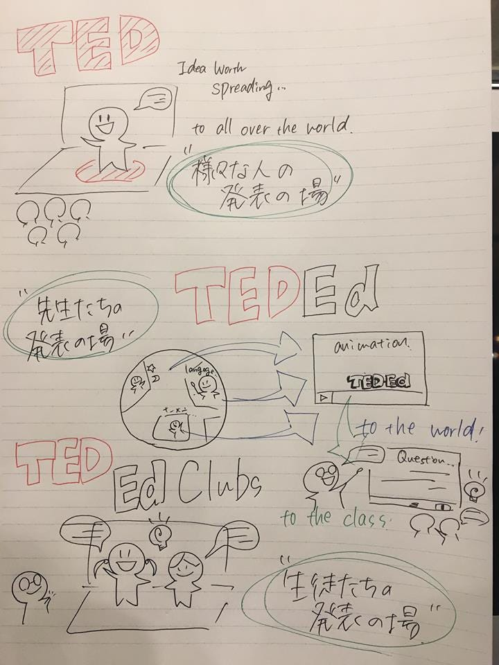

### TEDEdClub改訂版

前回のブログではいただいた機会を活かすため、TEDEdClubについての事前学習として少し紹介をさせて頂きました。

今回のブログは、そこからさらにより詳しい方や自分なりの勉強を加えたさらに詳しい内容を紹介させて頂きます。

写真は前回と同じものを。

より詳細版ということで、まずTEDEdClubのおおもとであるTEDがどういうポジションであるのか。

TEDはみなさんご存知のIdea worth spreadingの理念の元に価値あるアイディアを世の中に広めるため様々な分野の講演を開催している団体です。
このTEDカンファレンスの中ではスピーカーは自分の持つアイディアや広めるべきアイディアを発信することができます。
そしてこのカンファレンスは必ず動画として全世界に発信されます。

TEDは価値あるアイディアが世の中に広まるための発表の場所、プラットフォームと言えます。

このTEDが教育現場に目をつけつくったのがTEDEdです。
普段教室内でしか発信されることのない教師たちのアイディアの発信場所を作ることです。
ユニークなアイディアを持った教師たちの面白い授業をもっと多くの人に動画として届けることで、生涯学習者を世の中に広めて行きます。

こうした思いからTEDEdでは様々なTEDのコンテンツを元にした先生達の授業の活性化のための質問プラットフォームが発信されています。
この動画をみた先生達は実際の授業で子供達に質問を投げかけ、より深く授業を考えて行きます。

[Lessons Worth Sharing
Use engaging videos on TED-Ed to create customized lessons. You can use, tweak, or completely redo any lesson featured…ed.ted.com](https://ed.ted.com/)

[About
Use engaging videos on TED-Ed to create customized lessons. You can use, tweak, or completely redo any lesson featured…ed.ted.com](https://ed.ted.com/about)

ここからさらに学生たちに注目したのがTEDEdClubです。

こうした教育現場での価値あるアイディアを子供達からも発信できる場所としてTED公認の放課後クラブができました。
子供達はここから13回の授業を経て自分たちのプレゼンテーションを作り出して行きます。

最後に今回自分の中の整理をしたときのグラレコを晒して終わります。

