### モンクエ

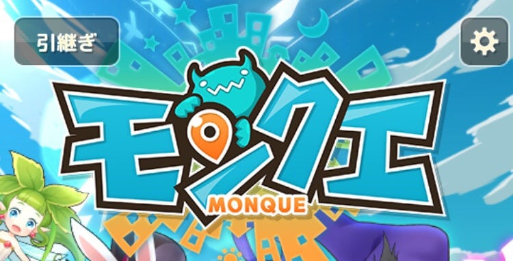

今回はモンクエを紹介していきます。

一見普通のRPGのようですが、なんと位置情報を利用して遊ぶRPGです。

早速見ていきましょう！

1. ストーリー

モンスターを味方につけて、人間界を征服しようとしているサタンへ立ち向かえ！

2. 遊び方

まずはマップへ！

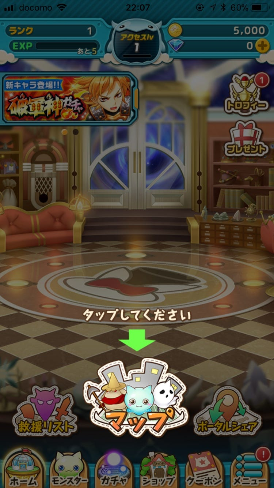

マップをタップするとこのように画面が切り替わります。

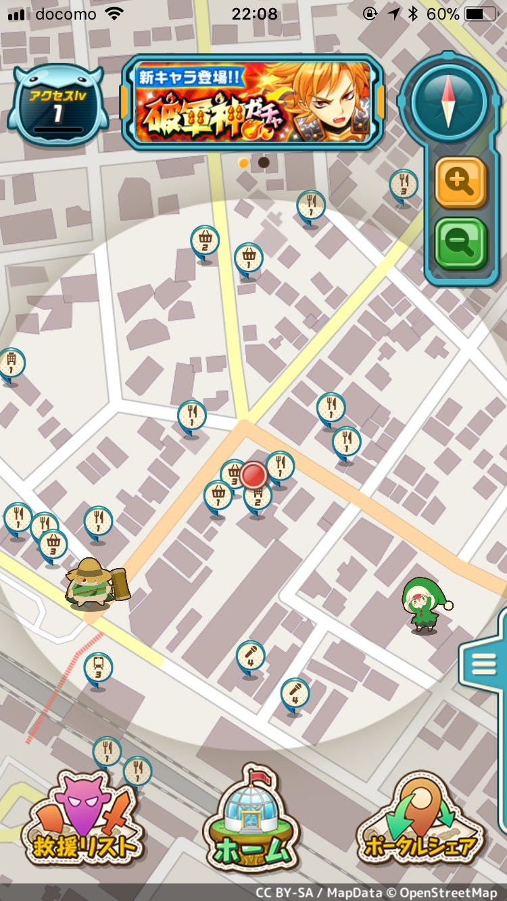

お気付きですか？この背景地図にはOpenStreetMapが使用されています。

下の画像の青い矢印で指した赤丸が現在地で、オレンジの線の中がアクティブエリアです。

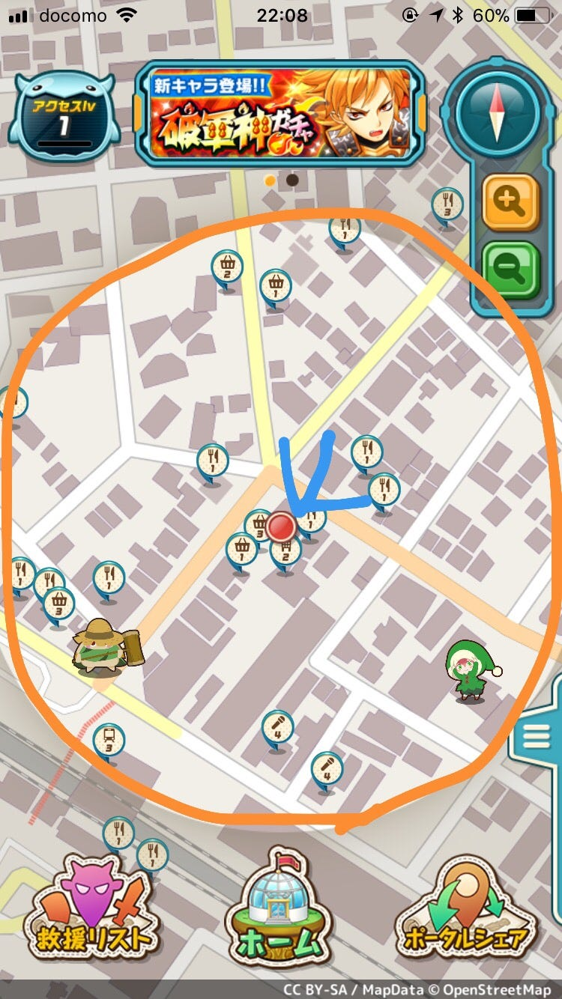

マップ上に表示されている可愛らしいキャラクターをタップしたらバトル開始です。

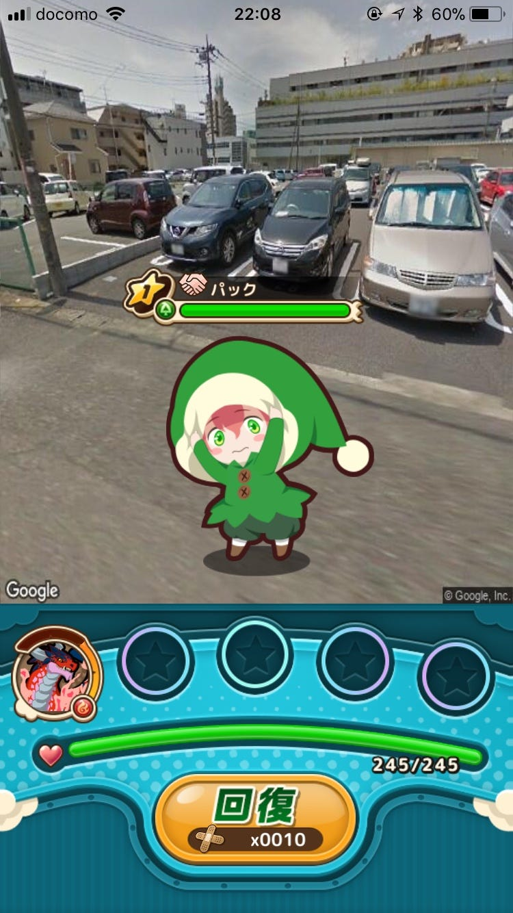

攻撃はオートです。

倒したらスカウトができます！

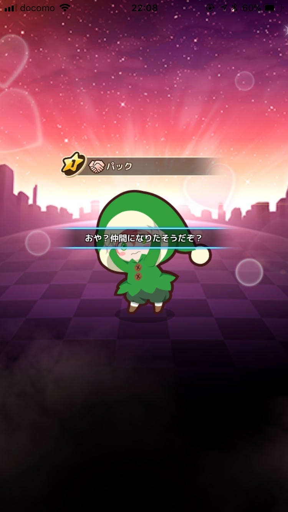

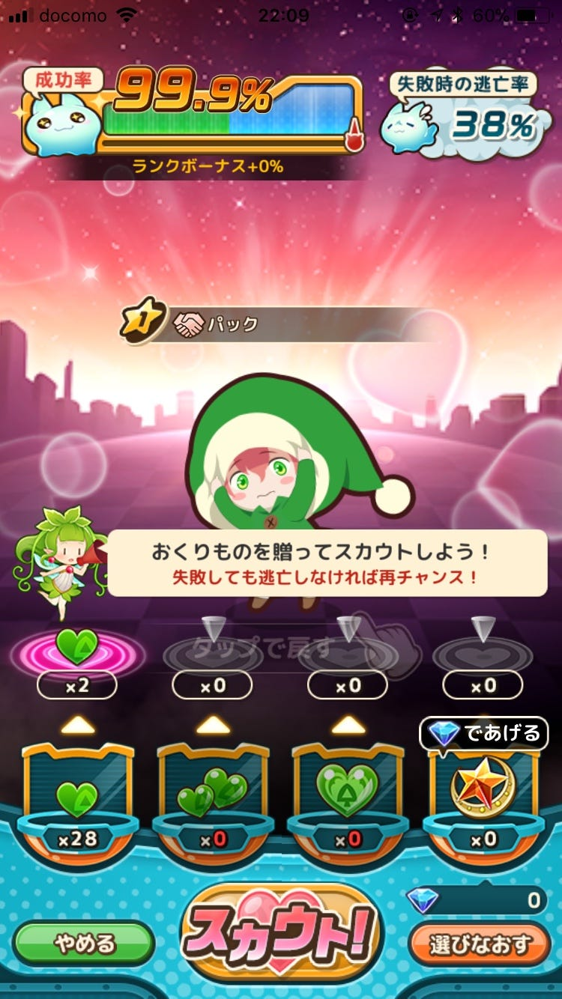

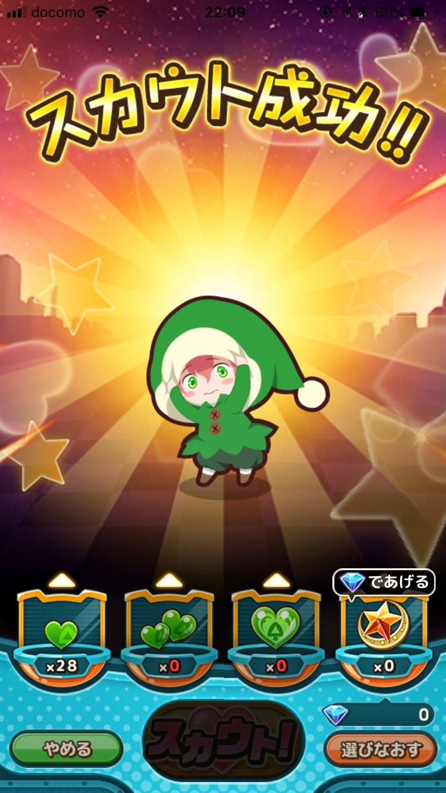

貢物をして気に入ってもらえればスカウト成功！

仲間モンスターとしてチームに入れることができます。

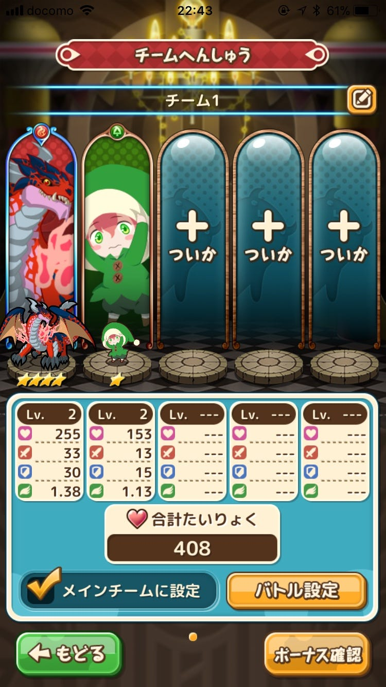

ちなみにスカウト以外にもガチャでモンスターを仲間にすることができます。

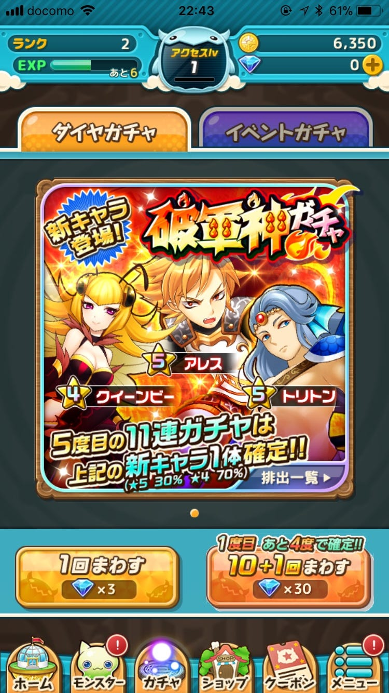

モンスターを仲間にして育てて戦わせましょう！

それから「ポータル」について、公式の説明画像を引っ張ってきました！

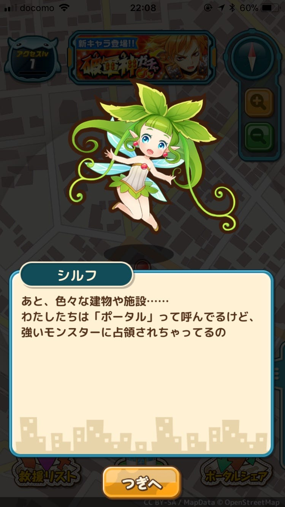

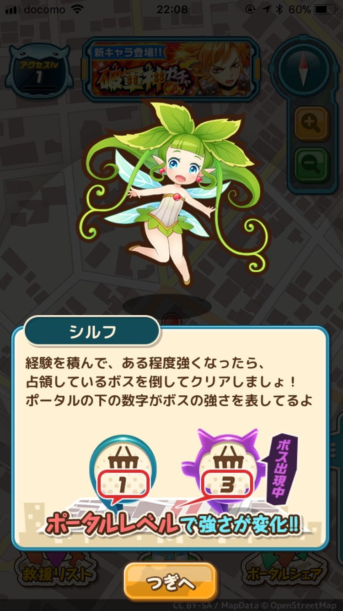

このゲームでは複数人でコミュニケーション&リアルタイムバトルも楽しめます。

友達やご近所さんと協力プレイで強大なポータルボスにも挑みましょう！

3. ここがおもしろい！

- キャラクターが可愛い

出てくるキャラクターがすごく可愛いです！地域によって出てくるキャラクターも違うようなので、遠出したときのお楽しみにもなりますね。

- バトルの背景画像

Googleストリートビューでしょうか？背景画像が実際の写真なんです。でも少し古いようですね。

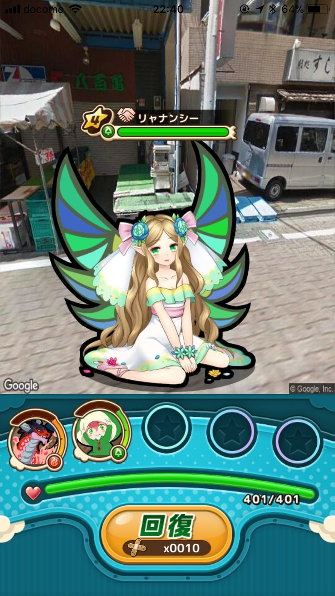

このバトル画面の背景にある八百屋さんは今はなくなっています。

日々変化していく現実世界に対応させるのはなかなか大変そうですね。

- 協力プレイ

他プレイヤーとの交流もあります。公式のアプリ説明を見ると、ご近所さんや友達とのプレイを推奨しているみたいですね。

仲間と一緒にプレイすることで楽しみも倍増間違いなしです！

4. まとめ

モンクエは位置情報を利用したRPGです。特徴としては、可愛いキャラクター、エリアマップや背景画像など現実世界で遊んでいるかのような臨場感が味わえること、協力プレイができることが挙げられます。

ぜひぜひ、友達を誘ってプレイしてみてください！
