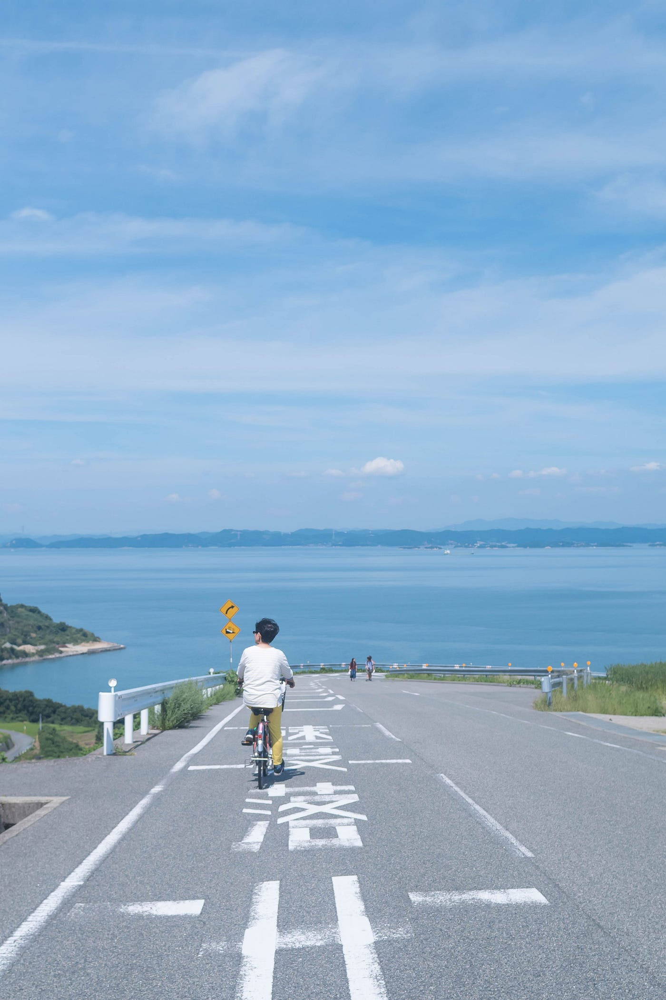

### 夏の思い出を残す地図作成をしてみようかい！

卒制テーマ進捗状況 #4

新コーナーとして『今週の一枚』を設けます。勝手に。上の写真は去年の夏、豊島で撮影した母のチャリこぎ姿です。島！海！行きたいですねぇ…

昨日まで雨が続いていたにも拘わらず、立葵がもう終わってしまいノウゼンカズラが満開で勝手に夏を始めてしまっているようでした。今日久々に晴れてとうとう夏！という感じでしたね。今週も晴れの予報が多く、暑くなりそうです。

### **# 夏祭りとイラストマップ**

この夏、わたしは東京の下町や地方の夏祭りや縁日を巡ってみたいと考えてます。卒制で地図を扱うことに決めるならば、この夏祭り訪問で下準備をしたいと思います。つまり、

①訪問して出店の位置や店の人と会話をして情報収集する。

②夏祭りの情報をグラフィックレコーディングのように描き起こす。

③その次の形としてアドビソフトを使って清書する（作り直す）。

イラストをデザインするにはやはり

- Photoshop

- Illustrator

は必須のようですね。まずはそこからの勉強です。

デザインのイメージを掴むには先週ご紹介したPinterestと新しく

### Behance

を利用しています。Behanceはアドビシステムズの子会社であり、サイトやアプリ内では世界中のクリエイターたちが作品を共有しているようです。ポートフォリオとして活用でき、これを経由して海外からの仕事を獲得することもできるようです。

今回は勉強不足でここまで。これからどのような工程で作っていくのか既往研究を行いながら練っていきたいと思います。
