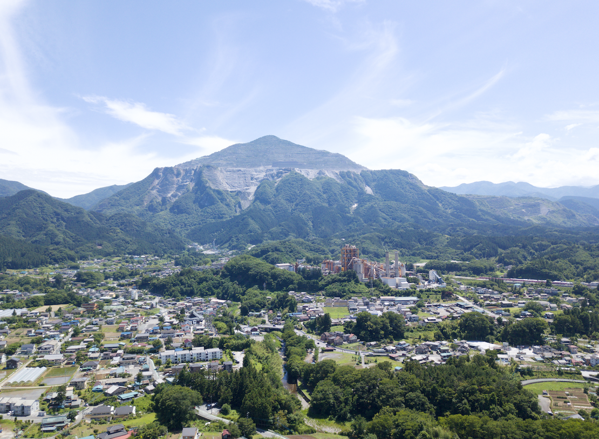
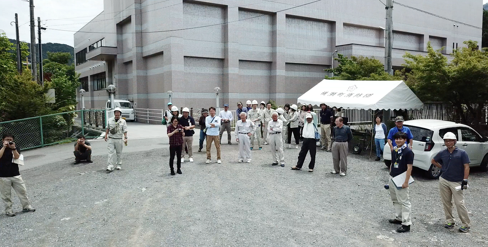

### 武甲山って知ってる？

武甲山とは埼玉県秩父地方の**秩父市**と**横瀬町**の境界に位置する山である。
この山、なんか見た目が不自然ではないか？ か、かけている？？
そう！この山には様々なストーリーがあるのだ！！

今日私は埼玉県横瀬町に行ってきた。そこで防災訓練の一環で、ドローンを飛ばして、町民や消防署の方に災害時にどのようにドローンが現状把握用として活用できるのかをレクチャーしてきた。

そんなこんなでレクチャーというより、横瀬町民の方達と触れ合ってきた。そこでおじぃさん方に武甲山のお話を聞いた。

もとよりゼミ合宿で何度か横瀬に来たことがあり、武甲山が**セメント**の材料に使われる**石灰岩**が北側に豊富にあるため、半分だけ採掘され山の形が変形していること、すぐ隣に工場があることは知っていた。

今回横瀬町に行き、町民の方と話して、実際にその武甲山のすぐ近くに住んでいる町民の声を生で聞くことで新しい気づきがあった。

# 採掘は30年で劇的に効率化され一気に変貌した
# ここ最近の一年の変貌は特にすごい
# 武甲山の標高が変わった(30mぐらい低くなった)
# 削られて近郊の家は日当たりがよくなった
# 平日は12:30頃に武甲山を削るためのダイナマイトの爆発音が非常に大きい、ゆれる
# 現在は露天掘りという方法で採掘されている
# 私の地元の泥水が横瀬町の工場でセメント作りに活用されていた
# 採掘された部分は崖崩れしないように段々に石で補強されている
# 採掘された部分では木も植えられている
# 武甲山が削られるのも悲しいが、地元ではそれで職を得ている人も多い

# 採掘されていない側からは登山可能(片道３時間らしい)

次回ゼミ合宿で横瀬町に行った際はぜひ武甲山に登ってみたいと思う。

ブラタモリの秩父編でも武甲山が取り上げられている。
武甲山から採掘された石灰岩を元に都内の道路も作られている、日本の多くの地域のインフラが作られていると思うと武甲山さまさまである。

がしかーし！毎年変貌する武甲山を見ると少し悲しい気持ちになる。。
山は偉大！そんな偉大な山がダイナマイトを使って無残削られていく姿は美しくも悲しい。

以上、今回は武甲山の豆知識でした！
下記は今日横瀬町の棚田で空撮した映像です。
