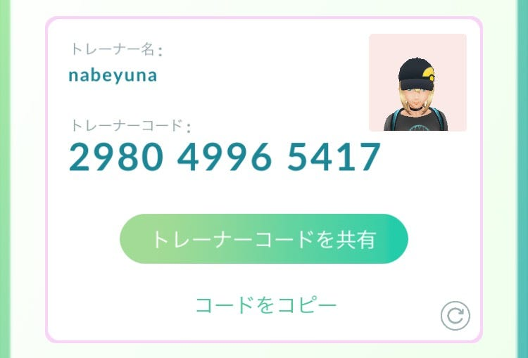

### PokemonGo フレンド機能

追加されましたね！こんにちは渡辺ゆうなです。

Pokemon Go にハマってはや１ヶ月ぐらい経つのですが、前々から「もうすぐ実装される」と噂されていたフレンド機能がようやくでてきましたね！さっそく私もゼミ生とIDを交換してギフト交換などを楽しんでいます。

このフレンド機能ですが、私が先ほど書いたように「ギフト交換」ができます。ギフトはポケストップでもらえて、１日１回自分のフレンドに送ることができるというものです。

そこで一部のポケモンGOユーザーの中で問題視されているのが、**プライバシ**ーの問題です。

実はこのギフトには、送り主がどこのポケストップでギフトをもらったかが書いてあるのです。また、ギフトを受け取った側がいつ空けたかも相手に通知される仕組みになっています。

送り主がいつそのポケストップを回したかまではわかりませんが、いつもルーティーンのような生活をしている人々にとっては、ある程度の生活範囲は特定できてしまう、と問題となっているのです。

どこでもらったギフトを誰に送るかは選択することができます。なので、掲示板などでIDを交換したような人にギフトを送る際は気をつけたほうがいいかもしれませんね。

ということでもしまだ私とフレンドになっていない人がいたら登録お願いします💗 IDだけだと誰だかわからないのでフレンド追加してくれた人は私に一言ください〜！
