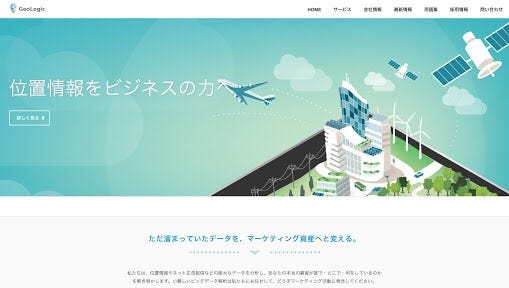

### 先生からのおまめ

はーい今日は先生にお題与えてもらったので先生からのおまめで投稿したいと思います！先生ありがとうございます！！

２２日に東急エージェンシーがgeologic adに対して出資を行った件に関してです。東急エージェンシーは多くの交通広告を出しており交通広告といえば駅や電車内に貼られているポスターは多く目につきますよね。

東急エージェンシーはこの交通関係や地域に関するポスター広告において多くの情報やコネも持っています。geologic adはすでに３００社もの広告主を持っており、現在急激に増加を図っているそう。そんな中東急エージェンシーがgeologic adと連携することでより地域、位置情報に特化した情報が入ってくるのと同時に、geologic ad側にも情報や分野の大幅な拡大が測れます。

これからはgeologic adで「今近くにいるユーザー」だけでなく大学やショッピングセンターなど施設の利用者、鉄道路線の利用者などにもターゲティングができるようになって行くみたいです。つまり「今現在」の位置情報だけでなく過去や普段のデータから推測できる情報も多く組み込まれた上で広告が打ち出されて行くみたいです。

正直この件で位置情報広告に関してはgeologic adが一番注目すべきサービスになったなあという感じです。スピード感を持って進化していますしね。

これから先このようにどんどん情報量も技術も増えてできるコンテンツや利用方法も進化して行くんでしょうねーー楽しみです！でも正直なところ、あまり今急激に発展されすぎてしまうと私の卒業制作の難易度も上がってしまうので、複雑な気持ちではあります笑

geologic側としては今後、O2Oの分野での協業も検討しているみたいです。O2Oに関しては今私もあまり知識を持っていないので、次回はそのO2Oに関して投稿したいと思います！！
