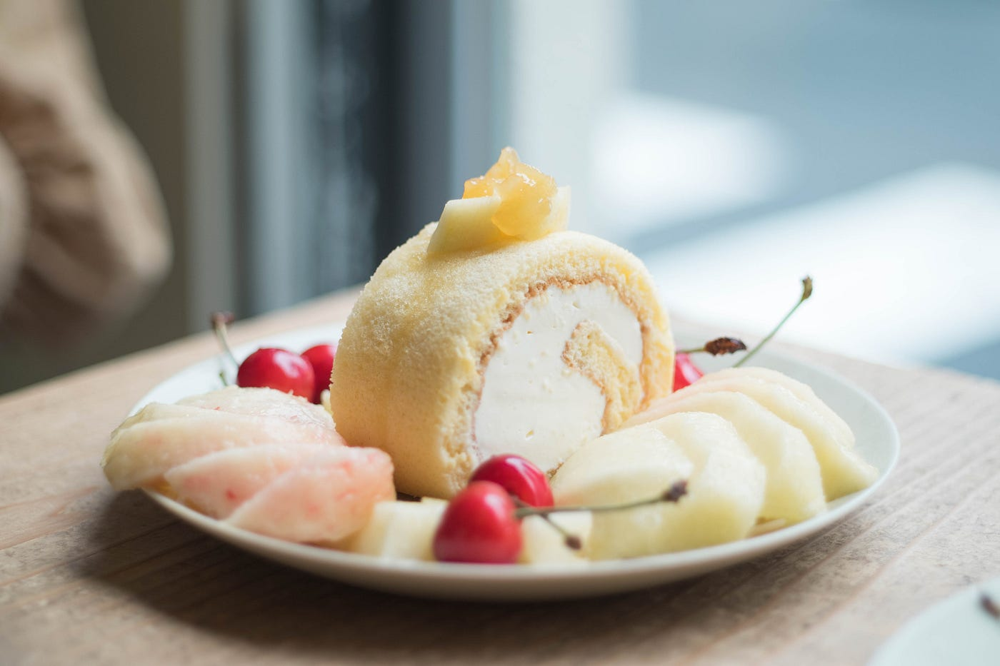
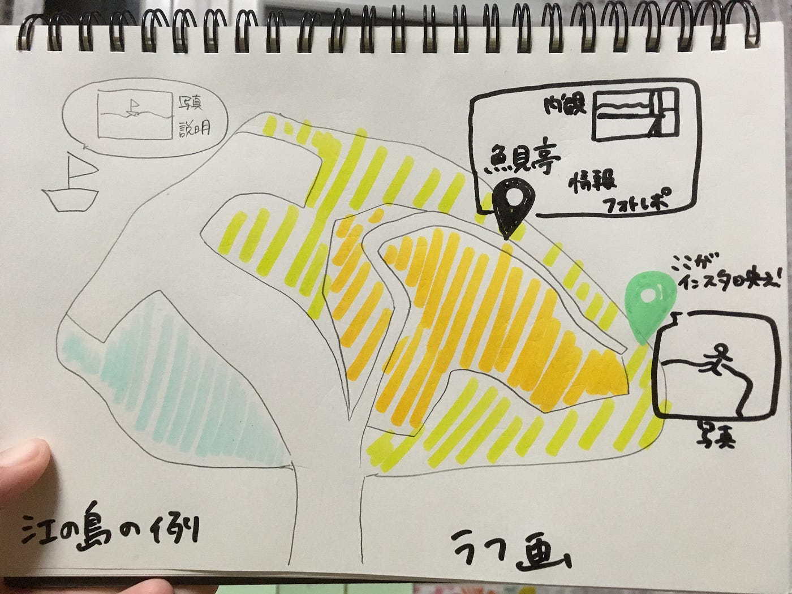
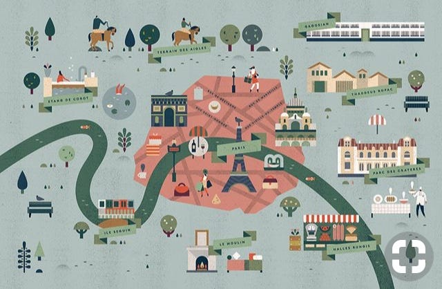
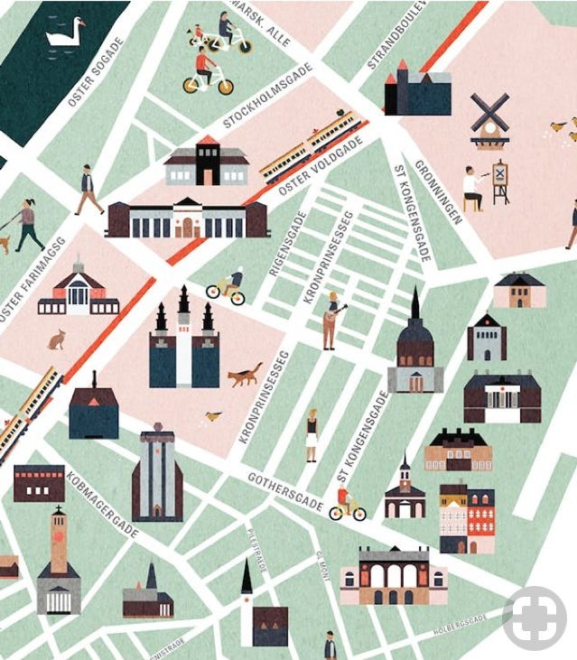
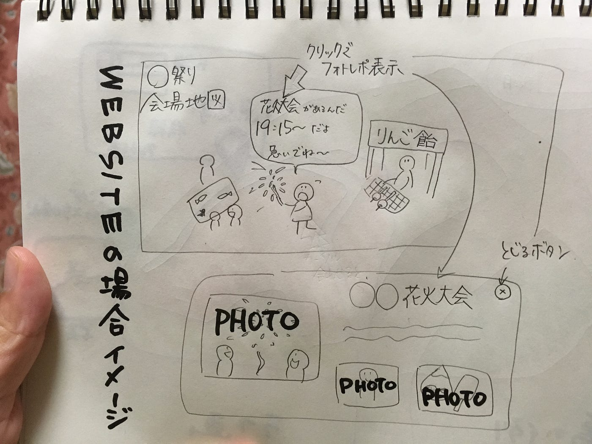
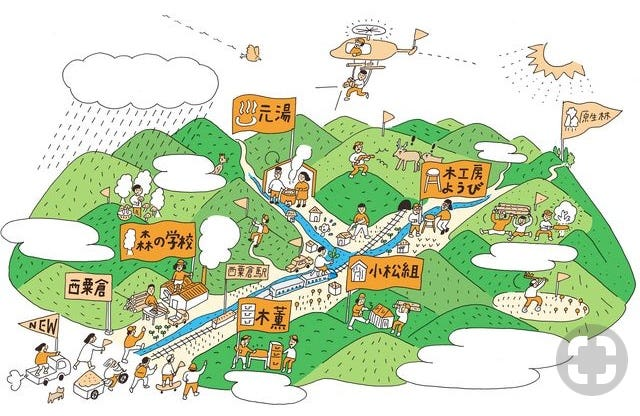

### 少しまとめ：結局どんなウェブ作る？

卒制テーマ進捗状況 #5

『今週の一枚』は趣味のカフェ巡りから。浅草近くにあるインスタでは有名なItonowaさん。さくらんぼと桃もりだくさんのロールケーキ。デザテロです。おなか空きましたか？

ところで、梅雨明けちゃったんですってね。

どうしましょう、明日から７月です。

さて、卒業制作について今まで挑戦してみたいことだけわちゃわちゃ書いてきてしまったので、整理したいと思います。

### 【その地域の地図を作成】

イラストでおしゃれなレイアウトにする。色も赤や茶、白色だけの構成などコンセプトもしっかり絞る。

### 【タグ分けで趣味嗜好に合わせたチョイス】

『インスタ映えスポット』、『雰囲気落ち着いた和カフェ』、『デートスポット』などレイヤーやハッシュタグなどで分けておき、ユーザーの目的に合わせたスポット情報だけを見やすく表示できるようにする。

その２つを具体化してみると…

江ノ島マップとしてラフすぎる画を描いてみました。商店街エリア、自然エリア、海辺などは色分けします。これは大雑把で良いと考えています。デザイン性のために含めても良い情報かなという候補です。色のバランスが難しければ撤廃するかもしれないものです。スポットに関しては色分けしてカフェやレストランは黄色、インスタ映えスポットは緑色など分けて表示しクリックできるようにしておきます。クリックすると正面に写真や基本情報など出てくるようになります。

江ノ島の場合、島の形と道路で木のように見立ててデザインしても面白いかなと思いました。

※エリア分けアイディアはこのへんから

### 【フォトレポを載せる】

スポットのモデルさん込みの自然な写真をロケ＆撮影。食べ物や店内写真、綺麗な自然が撮れる位置など情報収集して載せる。写真はとにかくたくさん撮っておく。

練習として行う予定の夏祭り地図のイメージを描いてみました。その上、ウェブサイトではこうしたいというアイディアもちょこちょこメモしてあります。

夏の課題はずばり、

- アドビのソフトの勉強をしておく。

- 絵の練習をしておく。

- 写真の技術を上げておく。

- WEBサイトの作り方を調べて、素人でもできる範疇を知っておく。

それを元に、

①夏祭りか商店街のマップを手書きで作ってみる。地元の夏祭りでは多少の取材練習もしてみる。

②そのマップを今度はソフトを使って綺麗に作れるのかを検証する。（ペンタブを購入検討中）

③本番。島や小さな地域での取材を行う。写真や店舗情報くまなく取材。

④ラフマップ描き、ソフトで清書する。

⑤WEBでどのように表示できるようか検証、デザイン。

大まかな工程を書きましたが、間違いなく順調には行かないと考えられます。特に⑤が一番未知なので勉強は必須。広告デザインを経験している家族や友人の手を借りたり、書籍やインターネットで学びたりしながら作り上げられたらと思っています。あとはオリジナリティーをいかに出すか…作業中に編み出していけるかなぁ…まずは取りかかることだと思います。やったります。

このくらいシンプルなのも見やすくて良いな、とも。

安藤
