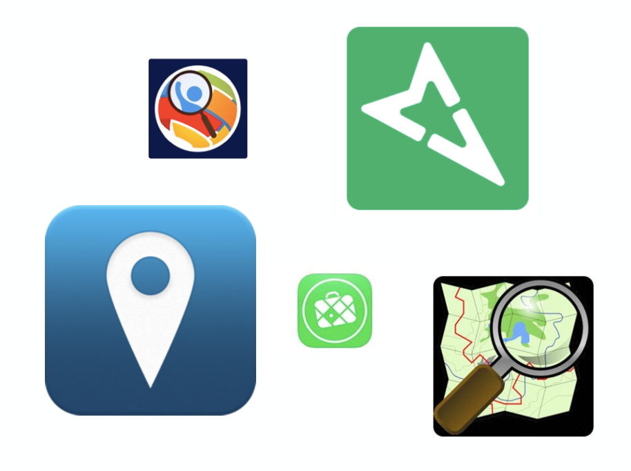

### OSMの編集ツール、もくじ

OpenStreetMapのエディタ、つまり編集ツールについて語る。
PC用のツールとスマホ用のツールの大きく分けて２パターンある。
みんなは何を使ったことがある？

ところで、

7月こんにちは。

最近ほんとうに暑い。

そして夏休みが始まる！ダイビングしたい

7月になって夏休みが近づいてきてわくわくがとまらぬ。

そして夏休みには**卒業作品**を開発し始める予定だ。

卒業作品について下記にスライド作った。
[https://github.com/AyameO/GraduationWork/blob/master/sotugyou.pdf](https://github.com/AyameO/GraduationWork/blob/master/sotugyou.pdf)

私はスマホ、とりわけiPhone用のOSM編集ツールを開発する。
「Building」を入力するのに特化したアプリ。
ゆえに今までOSM上の建物のデータ量を分析してきた。
これからはOSMの編集ツールについて分析をする。

はじめに述べたように、PC用とスマホ用に２分できる。
さらにPC用にはスタンドアローンタイプとブラウザタイプに別れるがそれは次回説明する。

### 今回は**編集ツールのもくじ**

どんなOSMの編集ツールがあるのかを箇条書きでかく。
そして次回からはこのツールを少しづつ説明してゆく。

私が作ろうとしているツールを紹介する前の、事前知識だと思ってぜひ見て欲しい。私は今PCでやっていることのほとんどが早くスマホでできる世界にもっと近づいてほしいと考えている。しかもただできるだけじゃなくて、わかりやすく便利に。

そんな理想論をぶつけながら私もそれに少しでも貢献できるように勤めようと思う。あとは今までお世話になりまくったOSMにも貢献したくて今回の卒業作品はOSMの編集ツールにした。

# PC用

- JOSM

- iDeditor

- Field Papers

# スマホ用

- maps.me

- (Pushpin)

- Mapillary

- Go Map!!

- Mapswipe

- OpenStreetCam

他にもあるが主要なここら辺を次回から紹介する。
ひと世代昔のスタンドアローンタイプ等は省く。

**今NOW**使われているものに限定する。

以前に書いたブログで、実際にOSMが編集された時にどんなツールが使われているのかをグラフをもちいて説明しているので、気になって方はぜひとんで見ていただければと思う。

[地図に建物って載ってる？
地図に載っているモノって、何だろう。山や川、地名や国境線！
では建物って載っているのかな。ん〜、地図による気がする。。medium.com](https://medium.com/furuhashilab/%E5%9C%B0%E5%9B%B3%E3%81%AB%E5%BB%BA%E7%89%A9%E3%81%A3%E3%81%A6%E8%BC%89%E3%81%A3%E3%81%A6%E3%81%9F%E3%81%A3%E3%81%91-4c78e7bb5fab)

それではまた来週〜
