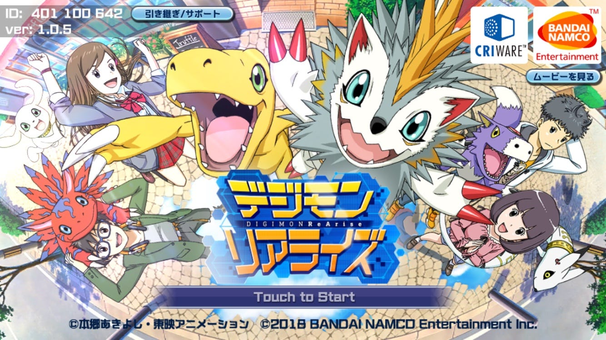

### ちょっと休憩

ここまでイロイロな位置情報ゲームを紹介してきました！

Ingress、駅メモ！、城めぐり、国盗り合戦、モンクエ……これらを見てきて私自身が思ったのが、位置ゲーって継続してやりたくなるおもしろさがない！

私が1番楽しんでいるPokémonGoでさえ最近少しサボり気味です。

何故こんなに楽しめないのか考えてみました。

レベルアップに応じた成長が感じられないんですよね。

ポケモン、ドラクエ、デジモンはどんなワザを覚えさせるか、どのタイミングで進化させるか、より効果的なパーティ編成は？などなど、考えるのが楽しいんです！

レベルが上がれば敵のレベルも上がる、倒すことが難しくなるから戦略を立てる、その過程が楽しいんです。

ただガチャをひいてレアがでた〜！とか、個体値によって覚えてるワザがすでに決められてて好きなものを覚えさせられないとか、そもそも育成を前提としてないところとか、すごくおもしろくないです。ただの暇つぶしなら世界地図パズルの方が楽しいです。

駅メモ！、城めぐり、国盗り合戦はその点において私には不向きだなって感じました。

あれってコレクション、旅の記録ですよね。そういうのが好きな人にはいいと思いますが私はあんまり興味を持てませんでした。

Ingressはぶっちゃけ意味がわからないです。ストーリーはわかりにくいし、レベルがあがったからといってストーリーが進むわけでもないし、ゲームを進めても変化がないので楽しくないです。

レベルが低い段階でおもしろいと思えないと続けられません。

折角現実世界を舞台にしているのに、ストーリーやゲームの設定で利点を無駄にしている感じかあります。

PokémonGoもどうせやるならここまで再現してほしいです↓

位置情報ゲームとして楽しむのはいいんですけど、ポケモンは元ネタがあるじゃないですか。元の方を大切にしないとファンは離れていきますよ！

それから上の世代の方に言いたい！

前回ポケモンの表示がドット絵に戻りましたよね？あれってポケモン世代としては胸熱な仕様だったんです！

見にくいとか文句言う前に初代からポケモンやってみてください。あのドット絵にはロマンがつまってます。

パーティは6匹、技と進化はレベルに応じて、技は4つまで！2つしか覚えられないってなに！ARやストーリーにそこまで力を入れなくてもいいからポケモン世代のハートをしっかり掴んで！

全く関係ないのですが、育成に飢えてて最近デジモンリアライズというゲームを始めました。

いつかデジモンも位置情報ゲーム化してほしいですね〜。

特定の場所にしかいない敵を倒して少しずつデータを集めてデジコンバートとかそういうのがほしいです！

とりあえずその辺にデジモン出現させてスカウトとかオートバトルなんてことにはしてほしくないですね〜

しっかり自分の足で歩いて、データを集めて、モンスターを復元して、育成するための道具を取りに行って、育成して、強い敵と戦わせる！そんな位置情報RPGがほしいです。

文句ばかりになってしまいましたが来週からは位置情報×育成ゲームでみていきます！
