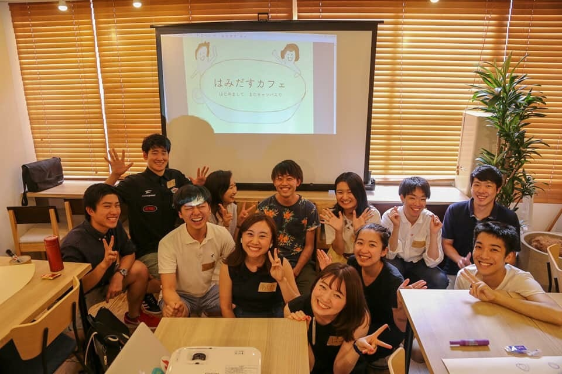
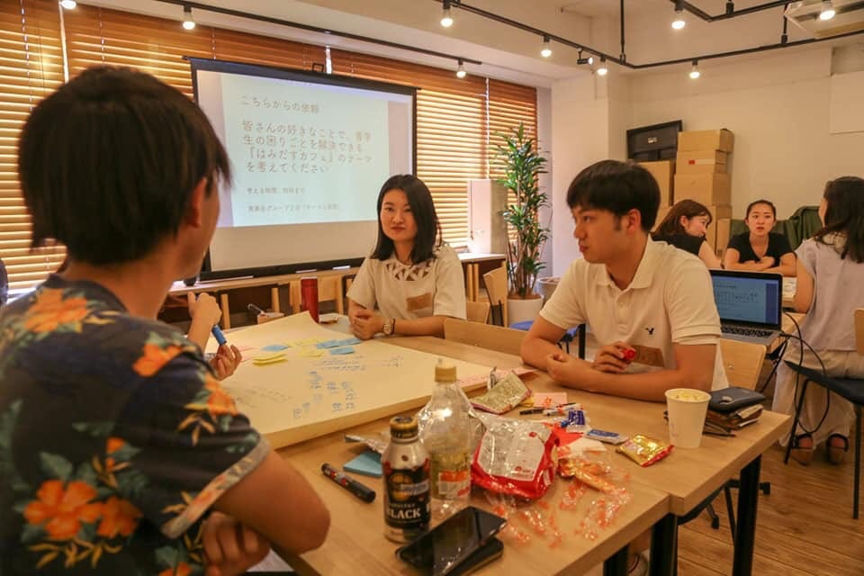
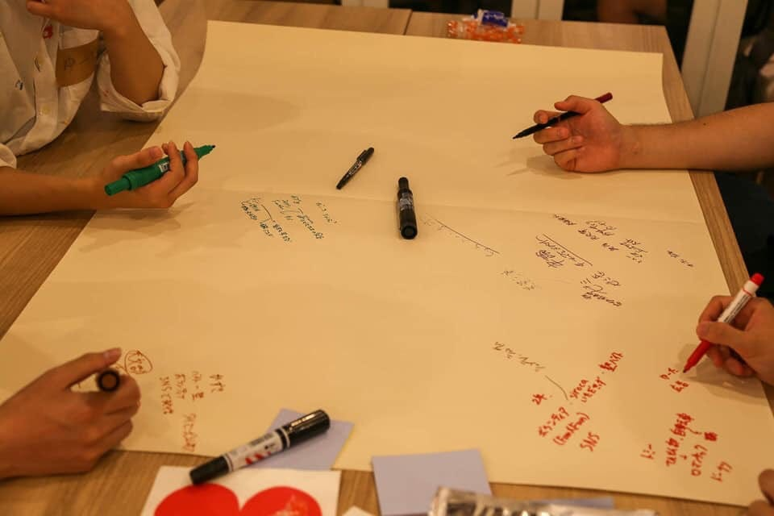

### **はみ出すカフェ**

…に、参加してきました！！

はみ出すカフェとは何かというと、青学について考える会です。ざっくり！

このブログでもご紹介している通り、私も現在TEDxAouamaGakuinUの開催に向けて青学に関していろいろ考えることが多かったため、今回このイベントに参加してきました。

主催は青学会議のみなさんです。

そもそもなぜこの会をやっているかと言うと、青学生で、青学の中で何か熱中出来ることがある人はどれほどいるのかという疑問からだそう。

ゼミの活動でもサークルの活動でも、青学生として熱中出来るものがある人もいれば、青学でやれることがわからなくて外に出て活動をする人も多い。

どちらにしろ、青学生としてのコミュニティは狭いものになってしまう。せっかく入った学校で、この学校入って本当に楽しい、よかったと思えることがないのは悲しい。

そういった想いを持った人たちが集まり、青学生として今出来ることを考えてみる、というきっかけづくりの場所としてこの会をつくられたそうです。

私はもともと青学が嫌いで、自分なりにこの学校を好きになりたいという想いからいろいろ活動してきましたが、この会の趣旨にとても共感し、

このカフェイベントを通して話した人の同じような話や全く違う境遇の話などは、聞いていて同じ青学生としてとても面白かったです。

内容は様々！

自己紹介から「たけのこたけぞう」という謎のアイスブレイクで盛り上がり、

そしてワールドカフェのやり方にのっとり各机で雑談、

青学生でよかったこと、悪かったこと…

ここだけ聞いても同じ青学生なのに相模原キャンパスの人と青山キャンパスの人で全く違った意見を持っていたり…

また違う大学から青学の大学院へ入学した人と話していても、良いところ悪いところは様々でした！

そして次のカフェのテーマの募集になると、みなさんの青学への感じ方がとても顕著に表れていて面白かったです。

私たちのグループは青学生で他にこのようなおもしろい企画や考えを持っている人とこういう機会に交流出来るのは面白い、という意見でした。

実際今回のイベントによって映画好きによる青学の中庭で映画上映会が出来れば、青学生も来やすいし共通の話題で盛り上がることによってまた新たなコミュニティが出来るよね、といった企画も生まれました。

今回様々な分野の青学生やOBOGの方が集まりましたが、今後もこのような面白いアイディアを持った人達で交流をしていきたいということで、このようなイベントをどんどん拡大していきたいそうです。

こういう場所で、TEDxAoyamaGakuinUにも興味を持ってくれそうな人ととも、出会えるといいなぁ…

ここで書かせていただくことで、その拡大のお手伝いが少しでも出来ますように！
