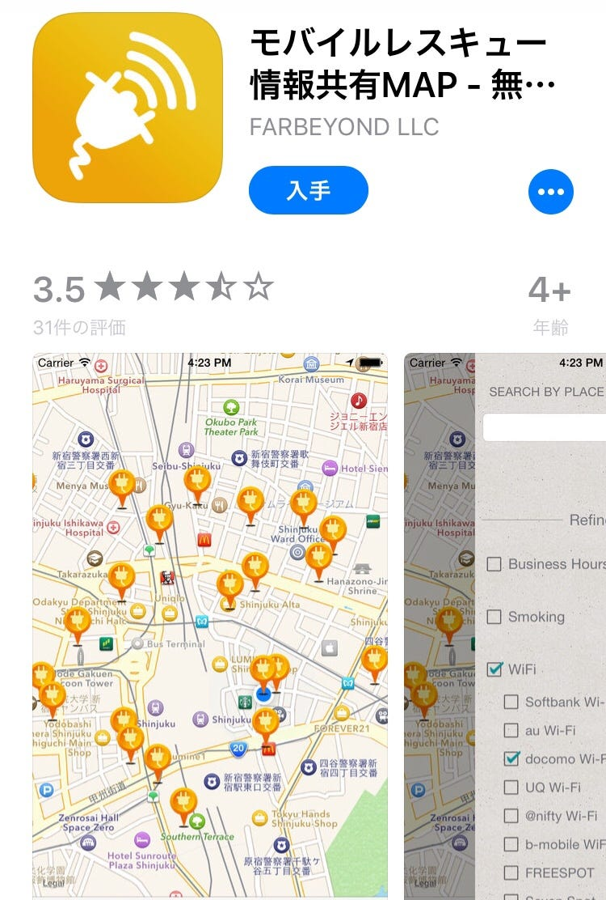

### 今日はこのアプリ

今回使ってみたアプリは、「モバイルレスキュー」！

災害時は電気が止まって使えない〜ってことも起きるかもだけど、

遊びに出かけたりしてる時は助かりそうなアプリ。 コンセントがある位置がわかります！

wifiも検索できるのは便利ですね。

自分のiPhoneがバッテリーが早くなくなっちゃうので、充電器は持っててもコンセントがあると

うれしいと思います！

実際に使いたいとき、このアプリで探して使ってみましょう。
