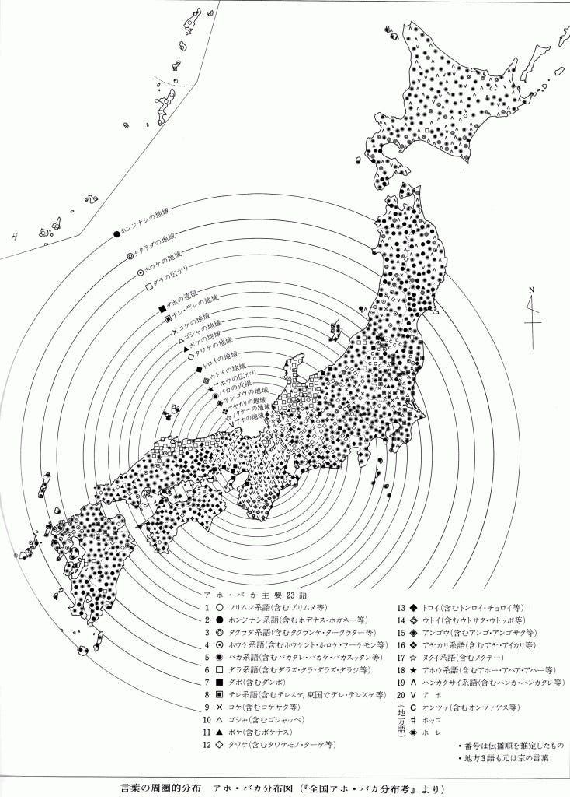

方言周園論 Part.1

ナイトスクープという番組の内容は、視聴者から寄せられた謎や疑問に関する依頼を受けて、探偵局に所属するタレントや芸人が探偵として調査を行い、真相の究明にあたるというバラエティー番組です。

その探偵局に、平成2年（1990）この番組にある新婚サラリーマンからの依頼が舞い込みます。

「私は大阪生まれ、妻は東京出身です。二人で言い争うとき、私は『アホ』といい、妻は『バカ』と言います。耳慣れない言葉で、お互いに大変傷つきます。ふと東京と大阪の間に、『アホ』と『バカ』の境界線があるのではないか？と気づきました。地味な調査で申しわけありませんが、東京からどこまでが『バカ』で、どこからが『アホ』なのか、調べてください」（『全国アホ・バカ分布考』（著・松本修／新潮文庫）p．21より）

これに対して当時の局長であった上岡龍太郎氏が「なるほど。これは一見バカバカしそうに見えますが、実はこの、フォークロアと言いますか、民俗学ね。文化の境界線を探るというのは重要な調査です。これをなんと、北野誠探偵で行きますが、彼にできるでしょうか？」と言い終わるとすかさず顧問のキダ・タロー氏が「失敗ですね」と言い会場は大爆笑。北野探偵は調査が中途半端で問題が解決に至らないケースがよくあるからです。

なにはともあれ、北野探偵は調査に乗り出します。その調査方法は、東京から人に「バカ！」と言われるような行動をとってアンケート調査をしながら西に向かうという単純明快なものでした。

そんな中、松本氏は方言分布図の成り立ちを理解しようと、再び調べます。書店で『日本の方言地図』（徳川宗賢編・中公新書）という本を手にします。松本氏曰く、こちらの方は難解な柳田國男の『蝸牛考』に比べ大変理解しやすかったようです。

これによれば、方言の様々なパターンが示されており、その例として日本アルプスの鈴鹿山脈を境にし、東西に言葉が分かれることがある。これは、自然の障壁が人の行き来を阻むためです。さらに、近畿をはさんで同じ方言が東西に分かれて分布する場合には〈方言周圏論〉を考えなければならないといいます。例えばAという言葉が東京と九州に分布し、近畿のBという言葉をはさみ込んでいるのならば、Aという言葉は古い時代の京都の言葉だったことが推測されるといいます。

一つの魅力的な言葉が流行すると、地方に向かって「言葉は旅をした」ということです。「古語は辺境に残る」ということは昔から分かっていたようですが、柳田國男はその規則性に注目し、古い時代に都で使われていた言葉ほど遠い地方に残り、順々に新しい言葉ほど都に近いところに残っていることを「蝸牛考」で示したのでした。

「若し日本が此様な長細い島でなかったら、方言は大凡近畿をぶんまわし（コンパスのこと）の中心として、段々に幾つかの圏を描いたことであらう。」と「蝸牛考」の一文にあります。

言葉が時間を掛けて地を這うようにして旅をしたとするならば、どのぐらいのスピードかと申しますと、言語学者の徳川宗賢氏の調査、計算によると1年間に930メートル。1日換算でいくと２メートル55センチという、奇しくも柳田が方言周圏論で着目したカタツムリの進むスピードぐらいなのでした。

番組で作成した日本全国アホ・バカ分布図をご覧になった徳川宗賢氏は「もし柳田先生がこの地図をご覧になったら、きっとお喜びになったことだろうと思います」と仰ったといいます。
