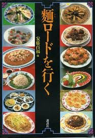

### 「麺ロードを行く」

始めてこんなにブログの投稿が遅れてしまいました、反省・・・

今回のブログでは、以前も記事に載せた「麺ロードを行く」著：安藤百福についてを書きたいと思います。

この本は、"麺に取つかれた" 安藤百福氏が、麺のふるさと中国に訪れ、その際に食した「麺ロード」の旅についてが書かれています。 これは昭和62年1月から13ヶ月間、日本経済新聞の企画として掲載されたそうなのですが、紙面に掲載できなかった多くの情報もここには全て書いてあるそう！豪華ですね〜

主な内容としては

麺の名前、地域、作り方、写真 そこから考えられる日本との麺の繋がりに関してが書いてあります。

また、コラムのようなものとして、「饅頭や餃子も麺類である」や「箸の歴史は麺の歴史である」など、歴史などから考えた安藤百福氏の見解なども書いてあります。

私が個人的に興味深かったのが、この本が書かれた当時、安藤百福が「麺とは何か」と北京市食品工業研究所の副所長に聞いたところ

**「今の中国に麺の定義はまだない」**

と答えたというところです。例えば、工業的には小麦粉製品すべてを麺と言っていた（つまり餃子も饅頭も麺）ということなんだとか。さらに広義の解釈として、穀物を線状にしたものは全て麺（小麦、米粉、とうもろこしでできたものも含む）なのだそうです。「麦」に「面」とかいて「麺」であるのにも関わらず、中国語の略語で「麺」が「面」と書かれるのは、麺の材料が麦に限らないからなのかもしれないと百福氏は書いていました。

まだ流し読みしかしてないので興味があるところはもっとしっかり読んで行きたいです！

あと、参考文献なのですが、見た所参考文献は見当たりませんでした・・・

あと！7/5に「秘密のケンミンショー」という番組で「日本最大のラーメン県 岩手県」についての特集が組まれていました！独特なラーメンばかりでおもしろかったです！食べて見たい！これについては次のブログネタにしようかな〜

秘密のケンミンショーでは都道府県別に様々なものを紹介するコーナーが主なので、卒業研究をしていくにあたって役立つ情報が気軽に得られそうだなと思いました。 今まで全く見てなかったので、毎週録画して暇な時間に見ることにします！笑
