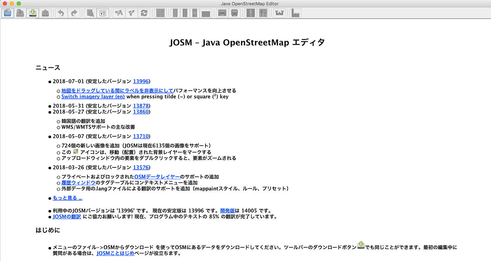
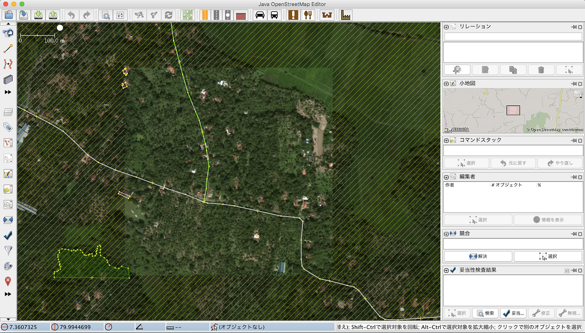
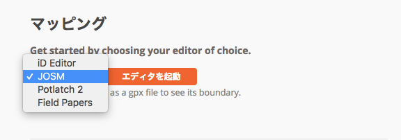
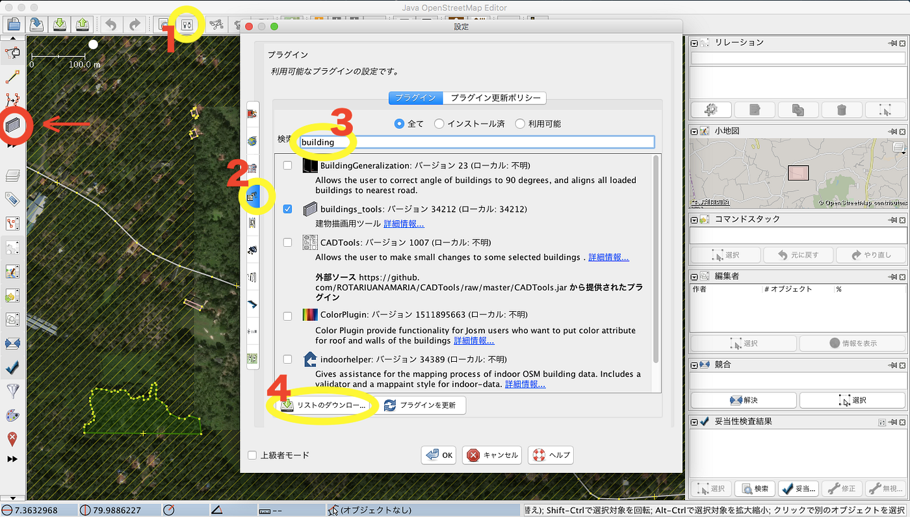

### JOSMというツール

「JOSM=Java OpenStreetMap」という PC用のOSMエディタ(編集ツール)
一度にたくさん編集する時に便利で、オフラインでも編集可能。

JOSMはJava実行環境がインストールされている必要がある。すなわち自分のPCにオラクル社のJavaをインストールしなければならない。

自分のPCにインストールするタイプをスタンドアローンと呼ぶ。
それに対してブラウザタイプといものがあるが、それはインターネット上で編集するツールのことだ。

スタンドアローンタイプ、とりわけJOSMの利点はオフラインでもOSMの編集が可能なところ。オフラインで編集して変更データをアップロードする時だけオンラインになれば良い。またJOSMにはプラグインという機能あり、自分が使いようにエディタをカスタムすることができる。

もっと個人的なユーザー目線でいうと、他のデータに対して平行や直線といったように地図の地物データが描きやすくなっている。特に建物は２箇所クリックするだけで四角に一軒分描けてしまうので簡単だ。

JOSMの欠点は時折アップデートを自分でしなければならないことだ。ブラウザタイプはその都度ブラウザを開くため、毎回デフォルトで最新版になっているが、インストールタイプは自分でやらなくてはならないのが少しだけ面倒だ、、。

インターフェースとしては画像編集ツールみたいに左の列に編集ツールが一列に並んでいる。初めてJOSMを使った時に個人的にはなれているインターフェースですぐになじめた。プラグインの機能を自分にあった適応なモノを入れるのがコツがいる。

JOSMで編集する時にはOSMサーバからデータをダウンロードする必要がある。データをダウンロードしてから、自分が編集したデータをアップロードするまでオフラインで作業できるが、その期間に他者と編集している箇所が被らないことが重要だ。

複数人で同じエリアを編集するときはしばしばあらかじめ作業箇所を明確に割り振って行うことが多い。

HOT TaskingManager というOSMを編集する人道支援のサイトがあるが、このサイトでもOSMを編集する時にJOSMを選ぶことができる。

HOT TaskingManager ではこのようにマッピングをする時にどのエディタを使うか選べるようになっている。

ちなみに他に選べるものとして「Potlatch2」があるが、私は使ったことがない。どうやらPotlatch2は中級利用者のエディタらしい。

詳しくは、[https://ja.wikipedia.org/wiki/Potlatch](https://ja.wikipedia.org/wiki/Potlatch)
[https://wiki.openstreetmap.org/wiki/Potlatch_2](https://wiki.openstreetmap.org/wiki/Potlatch_2)

大量に編集したい！という時にはぜひまだ使ったことがない方はJOSMを使ってみてほしいと思う。１時間で数百の建物をガッと集中して入れる時とかに私は使っている。使いやすくておすすめ。

以上今回はJOSMの紹介。

[OSMの編集ツール、もくじ
OpenStreetMapのエディタ、つまり編集ツールについて語る。
PC用のツールとスマホ用のツールの大きく分けて２パターンある。
みんなは何を使ったことがある？medium.com](https://medium.com/furuhashilab/osm%E3%81%AE%E7%B7%A8%E9%9B%86%E3%83%84%E3%83%BC%E3%83%AB-%E3%82%82%E3%81%8F%E3%81%98-b47d3410fe4f)

このもくじの通り、次回はiDeditorについて紹介しようと思ったが、次回はゼミ合宿＠伊豆大島編にする！

iDeditorは次の次でやる〜〜

それでは来週は伊豆大島にいってきまーす！！
