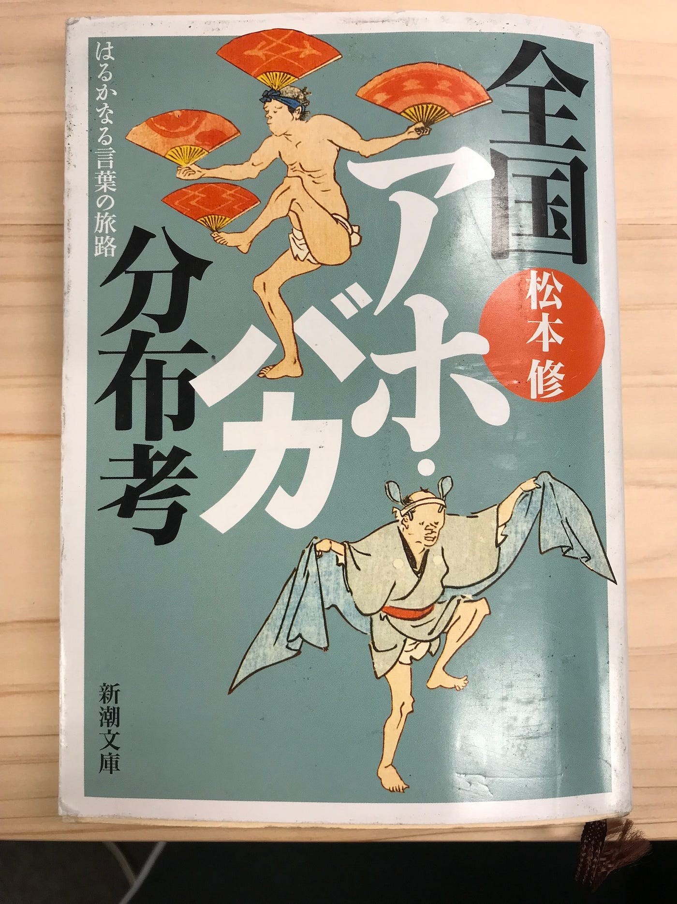

### アホ・バカ分布考

東京の人は「バカ」と言い、大阪の人は「アホ」と言う。

私は本の前書きの最初の文を読んで既に「確かに〜」と腑に落ちました。

今まで何気なく使っていた「アホ」や「バカ」出身地によって違ったことはわかってはいたが この本を通して綺麗にまとめられていました。著者の松本さんは番組プロデューサーでもあり普通の本とはまた違ったテイストで話しが進むところが非常に面白いかったです。

各地の「アホ」や「バカ」言い方というのは、日本列島が細長くなければ、コンパスで描いたように京都が中心になった同心円状に分布していることが浮かび上がりました。

柳田國男の「方言周圏論」を検証した形となりました。

京都でほとんどの言葉がつくられ、それが近世になるにしたがってどんどん流行り言葉が生まれ、古い時代の言葉が周辺部に向かって円周的に押しやられたということです。

江戸中期あたりで「アホ」が上方で新たに生まれ、それ以前の「バカ」を追い払い、その「アホ」が東京に辿り着くまでに、年間９３０ｍのスピードで外へ外へと伝播していくという研究まであるようです。

一度は絶対に人から「アホ」や「バカ」などと罵られた経験はあると思う。そう私もよく叱れていた。母親、友達や先生にしょっちゅう「アホ」や「バカ」などといわれてきたことがあった。しかし、私の祖母はよく私にむかって「ターケ」と言っていた。これは本書にも似たように書かれていた名古屋での「アホ」や「バカ」にあたる言葉「タワケ」とだった。

私の祖母の出身は愛知県の三河の方でかなり汚い方言である。それが「タワケ」の延長線で「ターケ」となまった言い方になっていたことにこの本を読んで気づくことができました。

さらに面白かったのは、「アホ」や「バカ」表現が、決して直截的に他者を罵倒するような差別語や罵詈雑言ではないということでした。

先ほどのように、親が子を叱るときに使うことも多いため、遠回しな比喩を交えて相手に愚かさを伝えるという言葉だということです。いわば京都人のいやらしさと言うのかが残っているような気がしました。

典型として、アンゴウはぼうっとした魚の鮟鱇のこと、フーケは「惚（ほう）け」、沖縄のフリムンは、「ほれもの（ぼんやり者）」ハンカクサイは「半可くさい」、茨城のゴジャは「ごじゃごじゃ言う」、などから来ているそうです。

この本書を通じて言葉は、生きてるんだなあと思いました。生きているからこそ、どんどん変化してゆく。「正しい日本語はこうあるべき」ということがもはや意味のないようなきもしました。
