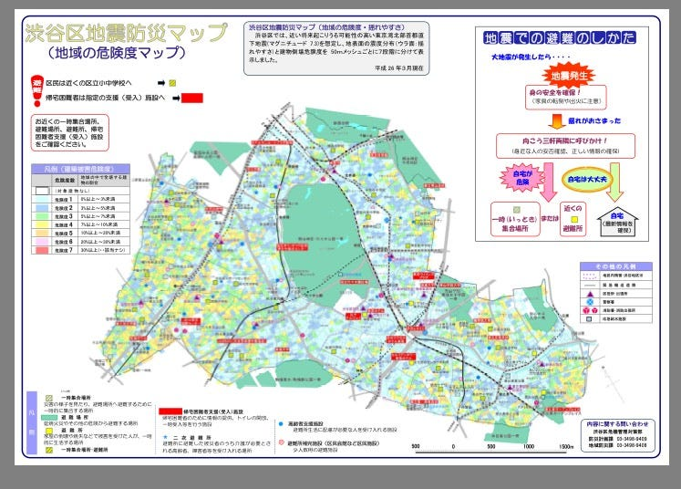
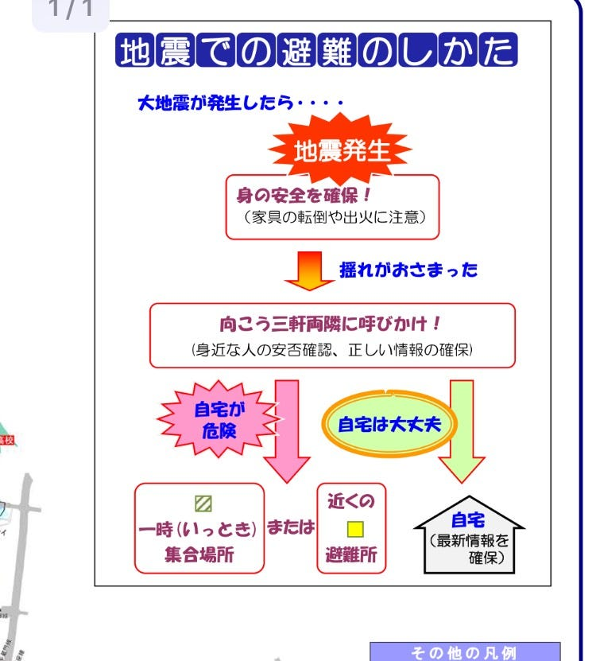

### シブヤディビジョン危険度マップ

卒論制作のマップに載せたいことを少しずつ検証していきます。

渋谷区は防災に関して様々な情報を発信していますが、

#### わたしが注目したのは、渋谷区が二つ公開しているマップ
・渋谷区危険度マップ
・渋谷区揺れやすさマップ

上記二つです。

本日のブログでは
**「渋谷区危険度マップ」**について詳しく見ていきたいと思います。考察の上、自分の作成するマップの参考としていきます。

**危険度を7段階に分け**て、マップ上で**色分け**がされています。また、避難場所についてはビビットな赤色で**強調**されています。

必要な情報がぎゅっと詰まっており、大変有効な地図であると思いますが、地図が広域で建物や目印の記載が大まかなので、正直私が見ても正確な**場所が分かりにくい**と感じました。
渋谷に慣れていない学生向けに作成を考えているので、そこは改善していかないと、と感じます。

また、右上に記載があります、

(地震での避難の仕方)

これについては、もう少し**ビジュアライズ化**出来たら良いなと考えています
