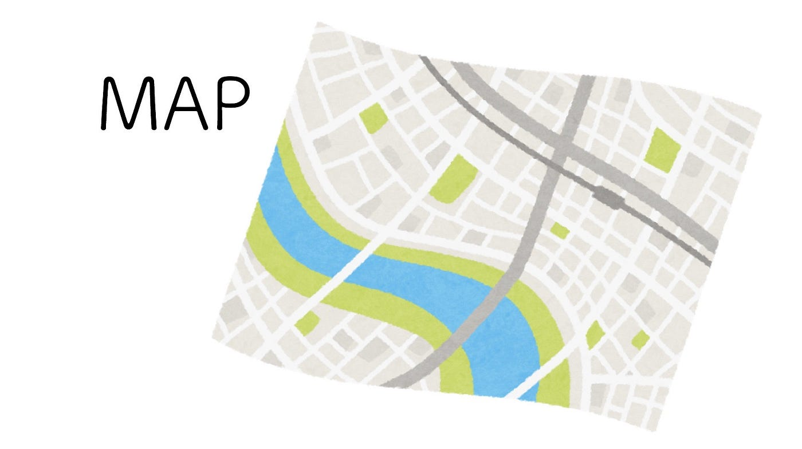
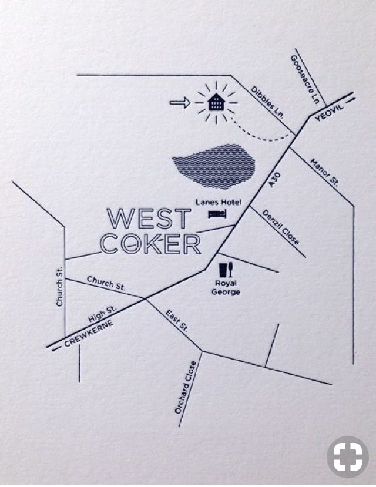
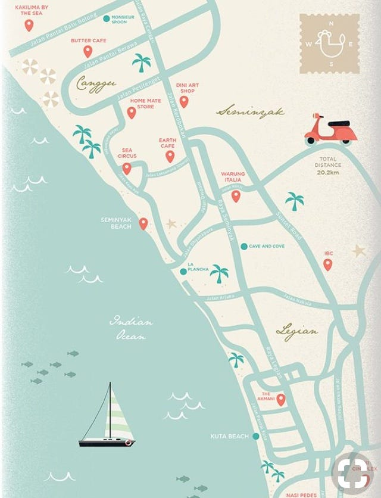
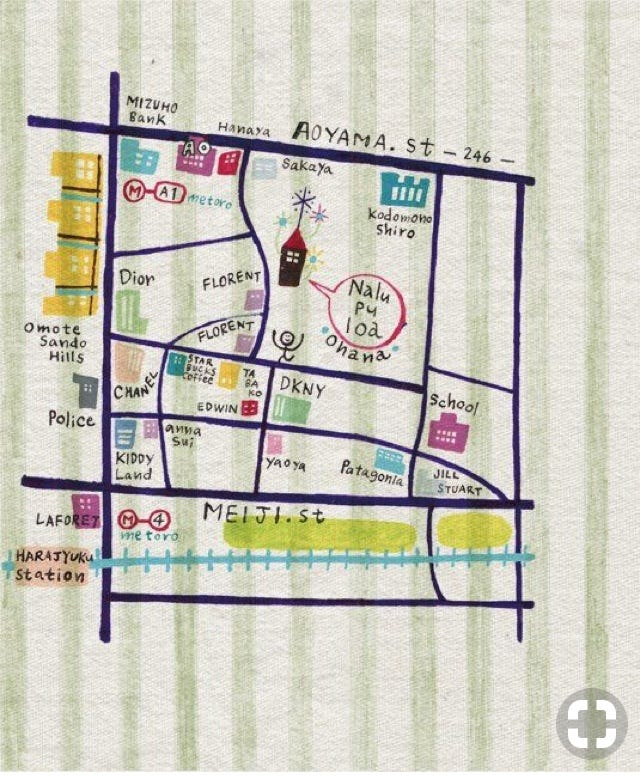
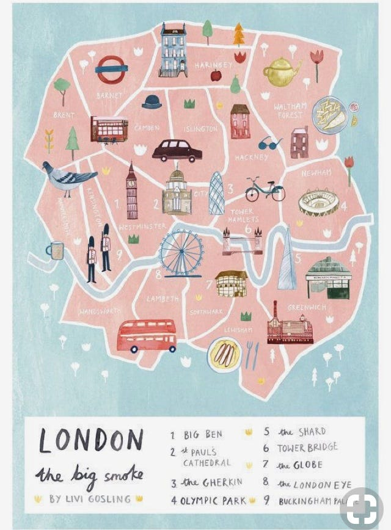

### 地図アイディアの検証①

卒制テーマ進捗状況 #6

こんばんは。

先週、就職活動のためゼミを欠席したら「手書き地図作れ」ってメッセージ入ってて驚いて、でもわくわくしていた安藤です。

いきなり手書き地図って難しいですね…

『今週の一枚』は先日わたしの従姉妹に子どもが生まれたので会ってきたときの写真です。手は赤ちゃんのお兄ちゃんのもの。お兄ちゃんもまだ2歳くらいなのですが、たまに妹が気になって様子を見に行くさまが微笑ましかったです。

さて、

とにかく知識も経験もゼロのところから始めるってのは大変です。同時に非常に興味深いことです！

最近いろいろ地図を入手したり分析したりしてます。こんな地図がいいな。このフォント見やすいな。イラスト入れるといいな。3色のみで色分けするのもいいな…など。

ちょこちょこと分析やメモを残していきます。

### # シンプルな地図

上の2つはとてもシンプルなもの。全体の色も一色に統一して、必要な情報だけぽんぽんと載せたもの。ただ私がつくる予定の地図とは合わない。スポットは細かく記載するつもりだからだ。だがそれをいかに見やすくするかという点においてはこの2つの地図は参考にできそう。

これもお店のアクセスをわかりやすくするための情報だけを載せた地図になる。だが、色づかいもカラフルなのにぐちゃぐちゃしすぎてない。女性に受けそうなかわいいデザインとなっている。

### # 道標としての地図ではなく、楽しむための地図

今までのとは少し異質なこちらの地図。道の情報はラフ。行き方はまったくわからない。だが、その地域の名所がわかって、イラストが「行きたい」欲をそそる。

どっち寄りの地図にするべきかやはり一度作ってみる必要が大いにあります。7月中に1つ夏祭りかマーケットに参加して2パターン描いてみようと思います。

（今日、入谷の朝顔市に行ったのに会場地図ももらってこなかったことに反省…）

今回はここまで。

安藤
