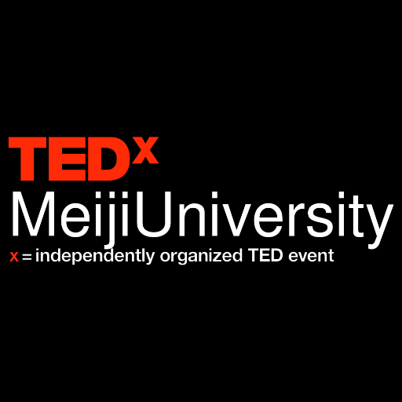
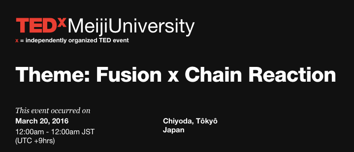
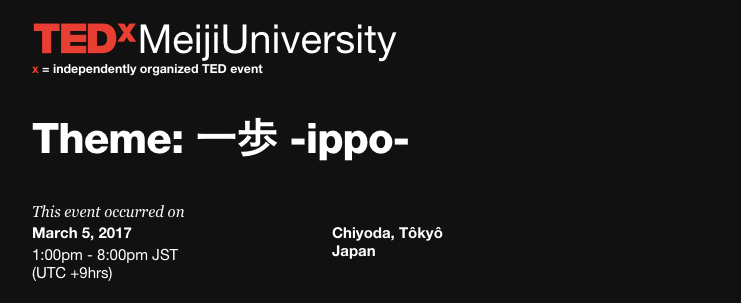
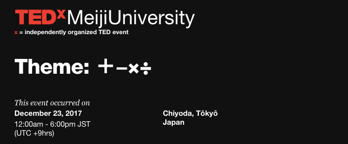
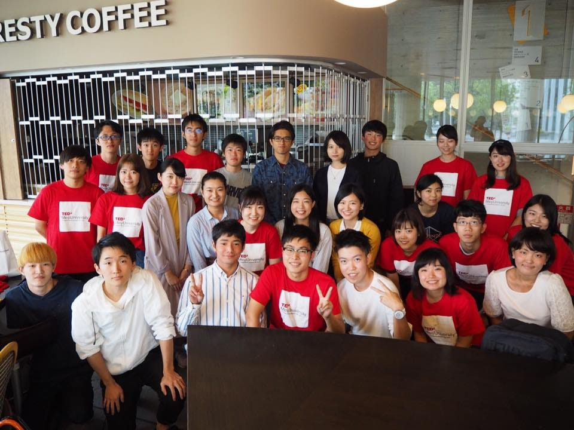

### 身近な大学でも！

今週はまた他団体のTEDxのご紹介第二弾です！

今回は明治大学のTEDxMeijiUniversityについてご紹介させていただきます。

TEDxMeijiUniversityのみなさんとは私たちも普段から仲良くさせていただいています。
設立されてから３年ほど経つそう。

2016年最初のオーガナイザーがMineki Kazunoriさん。
この方、個人的にラーメン巡りさせていただく仲なのですが毎度とても面白い話を聞かせてくれる博識な方です。
TEDxAoyamaGakuinUのライセンスの獲得にも様々なアドバイスをいただいた方です。

こういった人たちのもとに集まるメンバーのみなさんも面白い人が多いのか、毎年のイベントのテーマがユニークで面白いのです。

2016年最初のテーマが
「Fusion x Chain Reaction」
御茶ノ水の駿河台キャンパスで開催されました。

2017年3月のテーマが

「一歩 -ippo-」（デザインが可愛い、、、）

そして2017年12月のテーマが
「＋−×÷」

思わず「これはどういう意味？」と聴きたくなるようなユニークさが素敵です！

現在のオーガナイザーはNakamura Yurikoさん。
今年のイベントはまだ公式サイトに乗っていませんが楽しみですね！

登壇者も明治大学のOBOGの方や現役の学生さんから、書道のパフォーマーの方など多種多様です。

[TEDxMeijiUniversity Official Website
TEDxMeijiUniversity Official Websitewww.tedxmeijiuniversity.com](http://www.tedxmeijiuniversity.com/)

（TEDxMeijiUniversity 公式Webサイト）

いつかはTEDxのGMARCHの集まりもやってみたいね、なんて話しています。
これからのTEDx界隈でもこのような横の繋がりも大切にしていけたらいいなあ

最後にTEDxMeijiUniversityのスピーカーコンテストにお邪魔させていただいた時の写真で終わります。

