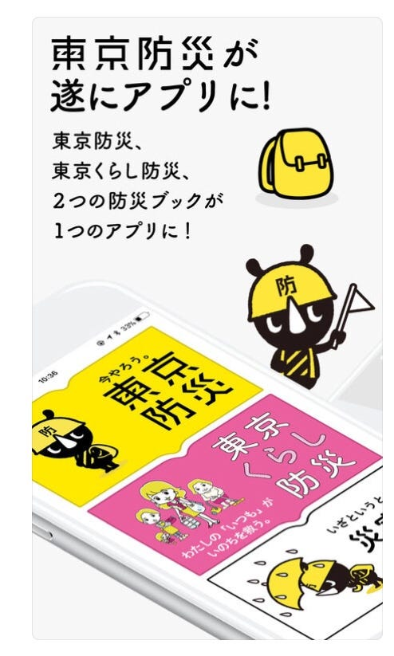
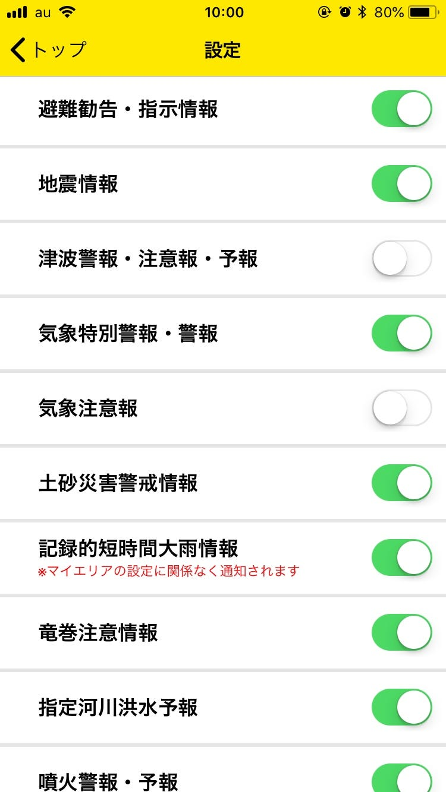

### 今日のアプリ

いよいよ紹介するアプリも無くなったてきたところですが…

#### 今日はこの、「東京防災アプリ」を紹介させていただきます！

運営元は ”Tokyo Metropolitan Government” 東京都公式アプリです。

ちなみにios/android両方利用できます。

皆さんも、東京防災等の本を見たことはあるのではないでしょうか？どんなアプリか紹介しましょう！

まず、機能として三つのモードに分けられてその時に必要な知識を選びやすいのが特徴です。

#### ①東京防災モード…

#### **防災の基礎知識や災害時のアレコレを学べる。**

すごいと思ったのは、災害時にこうすべきとかこんな準備しよう！みたいな知識系だけで終わらず、

「シミュレーション」というのがあって実際の災害を行動選択式で体験できるところ。 地震知識のアウトプットもできるところがすごい！！

あと「もしもマニュアル」では、傷の手当てから傷病者への対応、ライフラインが止まったあとの生活法ナドナド… 情報量が多くてすごい！！

全部説明すると大変なくらいの情報量なので、実際に使って学びを体験してください。

#### ②東京くらし防災モード…

#### くらしの中でできる防災対策を学べる。

①と同様に基礎知識やシミュレーションがありますが、より私たちの日常に関わっているのがこのモード。

ほんのちょっとしたことでも、これくらいならやってみよう…のようにもしもの為への行動ができる知識があります。

#### ③災害時モード…

#### 災害時に役立つ機能を搭載！

自分のいる市町村区を設定し、災害や避難情報が確認できます。

色んな情報を通知してくれるところも驚きました！↓

また、災害情報のすぐ下には 「防災マップ」や「安否連絡と情報収集」があり 、

災害を確認した後すぐに見れるようになっているのもすごい良いと思いました！

その他

#### 安否連絡

家族や友人に安否連絡をパーソンファインダーやメール、ライン等で送れる。

#### オンライン/オフライン対応の防災マップ

#### 緊急ブザー

など、防災に必要なモノをこれでもかというくらい詰めたアプリでした。

アプリ自体がかわいいので、見ていて楽しいところもあります。何よりイラストが多く読みやすい…防サイくんかわいい…

まだまだ紹介できてないモノもあるので是非使ってみてくださーい！
