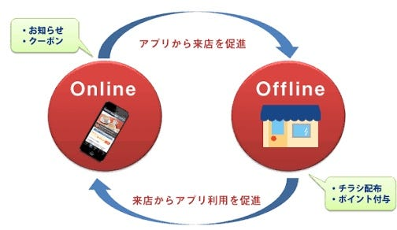

### 今週のおまめ

最近は少し涼しくて嬉しいです、こんばんは☺︎今日は前回お伝えした通りO2Oについて簡単にお話できたらと思います

O2Oは「Online to Offline」の略で「On2Off」と表現されることもあるみたいです。

ネット上からネット外の実地での行動へと促す施策のことや、オンラインでの情報接触行動をもってオフラインでの購買行動に影響を与えるような施策のことを意味し、例えば実店舗をもつ飲食店や販売店などがオンラインで割引クーポンやサービス追加クーポンを提供したり、foursquareなどの位置情報サービスによって積極的に店舗の認知や来店を促したりすることなどがO2Oのわかりやすいものです。

また、O2Oの特徴として、マーケティング施策の効果測定がしやすいこともあり、オンラインマーケティングの多くはその効果を測定するのに難しい作業が必要になってしまい、自分でウェブもまとめて見るしかないITやウェブに詳しくない店舗オーナーにとっては難しくてよくわからないみたいです、、

それに対してO2Oでは実店舗に客が持ってきたクーポンの枚数を数えればいいので、ITに詳しくない店舗オーナーでもその効果を実感・把握しやすいものになっているそうです。
